Красить волосы в домашних условиях - не такая простая задача, как кажется на
первый взгляд. Поэтому, недолго думая о том, стоит ли делить информацию на
отдельные посты, я решила собрать в одном месте важную информацию, с которой
желательно было бы ознакомится прежде, чем вы решитесь изменить цвет ваших
волос. Данный материал будет полезен и тем, кто доверяет процедуру окрашивания
специалистам.

###### Убедиться, что у Вас нет аллергии на краску

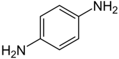

Чаще всего аллергеном является **фенилендиамин** (p-Phenylenediamine), который
содержится почти во всех красках. Аллергия проявляется не сразу, имеет
накопительный эффект: может возникнуть спустя 2-3 суток после теста или после
нескольких процессов окрашивания. Также может наблюдаться у чувствительных к
[сульфаниламидам](https://www.net-bolezniam.ru/publ/khimioterapevticheskie_preparaty/khimioterapevticheskie_preparaty_primenjaemye_v_rossijskoj_federacii/sulfanilamidnye_preparaty_sulfanilamidy/53-1-0-931)
(стрептоцид, бисептол). Степень опасности варьируется от умеренной до
смертельной. Также аллергенами могут быть: 6-hydroxyindole, Isatin и
p-Methylaminophenol.

Поэтому **ВСЕГДА** выполняйте тест по инструкции, приложенной к каждой коробке с
краской, даже если предыдущие тесты не показали видимого результата!!! Хочу
отметить, что часто в салонах тест не делают, поэтому требуйте его обязательного
проведения за 48-72 часов до окрашивания!

Список брендов и натуральных красителей, в которых нет фенилендиамина:

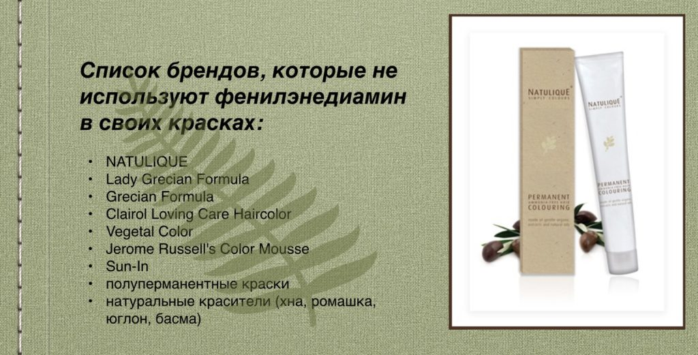

###### Узнать какое у Вас состояние волос

1. Изучите кончики волос. Возьмите небольшую прядь волос и поднесите ее к
   источнику света, для того чтобы проверить нет ли посеченных волосков, похожих
   на вилочки. Если есть, то вашим волосам не хватает питания и увлажнения, но,
   если основная часть волос выглядит достаточно ухоженной, их все еще можно
   спасти. Посеченные волосы заметны невооруженным взглядом: пряди выглядят
   неухоженными, неопрятными и лишенными жизненной силы.

   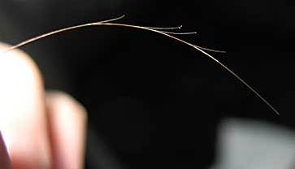

2. Изучите свою расческу. Расчески, на которых нет волосков, существуют только в
   магазине в запакованном виде. Во всех других ситуациях избежать выпадения
   просто невозможно. Трихологи доказали, что, если за сутки у вас выпадает 100
   волосков, - это норма. Но они должны иметь основание, а не быть обломанными.
   Возьмите волосинки с расчески и присмотритесь: если с одной стороны есть
   небольшая точечка, а длина волоска приблизительно такая, как основная часть
   вашей шевелюры, значит, все нормально и переживать не стоит. Но, если вы
   заметили, что на расческе огромное количество мелких кусочков, клубков и
   обломков - срочно необходимо начинать комплексное лечение. Причиной такой
   проблемы является частое окрашивание или обесцвечивание, использование плоек
   и фена. Если волосинки на расчески с обеих сторон имеют тупые концы, значит,
   они сильно повреждены.

   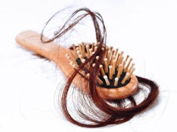

3. Проведите эксперимент с погружением. Возьмите небольшую посудину и налейте в
   нее холодную воду. Погрузите в жидкость несколько крупных прядей и
   понаблюдайте. Здоровые крепкие волосы не будут слишком быстро набирать в себя
   влагу, поэтому они всплывут на поверхность. Если же ваши волосы сухие и
   пористые, они достаточно быстро опустятся на дно емкости. Чтоб избежать такой
   неприятности, необходимо регулярно делать маски и использовать качественные
   профессиональные шампуни.

   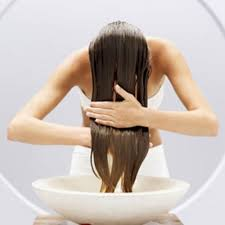

4. Обратите внимание на внешний вид волос и потрогайте их пальцами. Здоровые
   волосы имеют выраженный блеск, который особенно заметный при ярком
   искусственном освещении или на солнце. Обратите внимание на наличие такого
   блеска, чтоб получить представление о состоянии ваших волос. Если ваши пряди
   выглядят матовыми и тусклыми, значит, им не хватает питания. Такое может
   происходить из-за отсутствия в вашем рационе полезных продуктов, частого
   окрашивания агрессивными красителями или злоупотребления плойкой, феном или
   термобигудями. Если прикоснуться к здоровым волосам, вы ощутите мягкость и
   гладкость, а если это будут поврежденные волосы, вы ощутите жесткость,
   сухость и шероховатости. Некоторые женщины жалуются на то, что у них много
   прикорневых волос, но тут есть два варианта: либо эти волосы новые, либо это
   остатки обломившихся волос. Для того, чтоб определить это, просто посмотрите
   на их концы: если они острые - это новые здоровые волосы, а если ровные, как
   бы обрезанные, - это обломанные.

   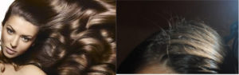

5. Проследите, как ваши волосы поддаются укладке. Попробуйте их накрутить или
   выровнять. Здоровые волосы быстро принимают форму, которую вы стремитесь
   создать. А поврежденные требуют значительно больше времени, а порой даже не
   получается создать прическу, которая вам нравится.

   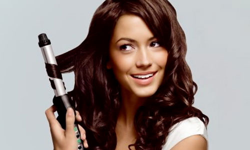

###### Определить натуральный или текущий уровень светлости волос

То есть на сколько ваши волосы светлые или темные (никаких оттенков тут не
подразумевается). В этом вопросе Вам может помочь вот такая шкала, которая
является международной (The International Colour Chart (ICC)), **запомните свой
номер (далее объясню почему)**:

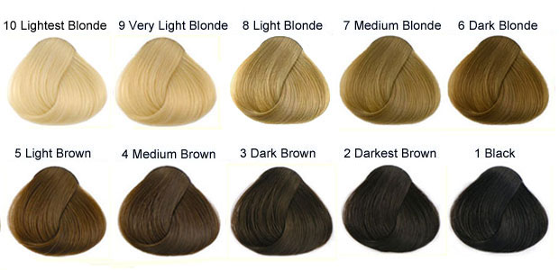

1 - черный  
2 - очень темный коричневый  
3 - темно-коричневый  
4 - средний коричневый  
5 - светло-коричневый  
6 - темный блонд  
7 - средний блонд  
8 - светлый блонд  
9 - очень светлый блонд  
10 - бледный (обесцвеченный) блонд  
11-12 - седые или волосы как у альбиносов.

Если Вы все же не уверены какой у вас уровень светлости, то можно уточнить в
салоне/парикмахерской; там есть специальные книжечки с локонами разных
натуральных цветов. Типа того:

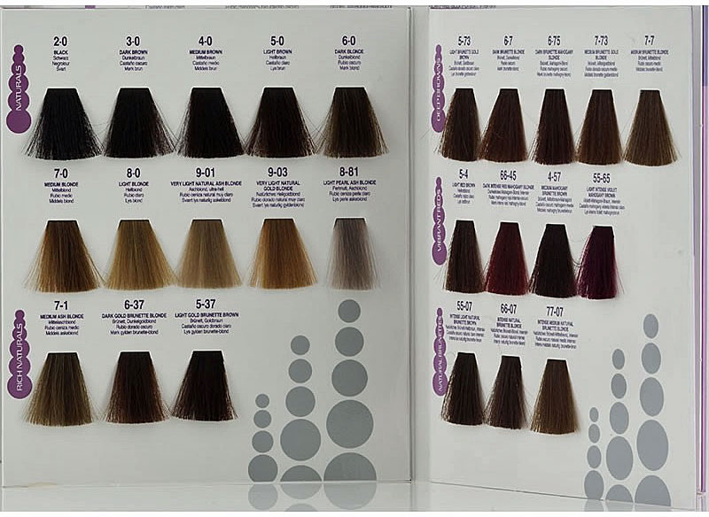

Возможно, вот такие изображения будут вам полезны. Это шкала Фишера-Заллера
(обратите внимание: везде используется одна и та же скрепляющая локоны нить: на
локоне А нить кажется очень тёмной, на локоне Y достаточно светлой, а на локоне
N нить совпадает по уровню светлости, говоря нам о том, что этот локон среднего
уровня светлости):

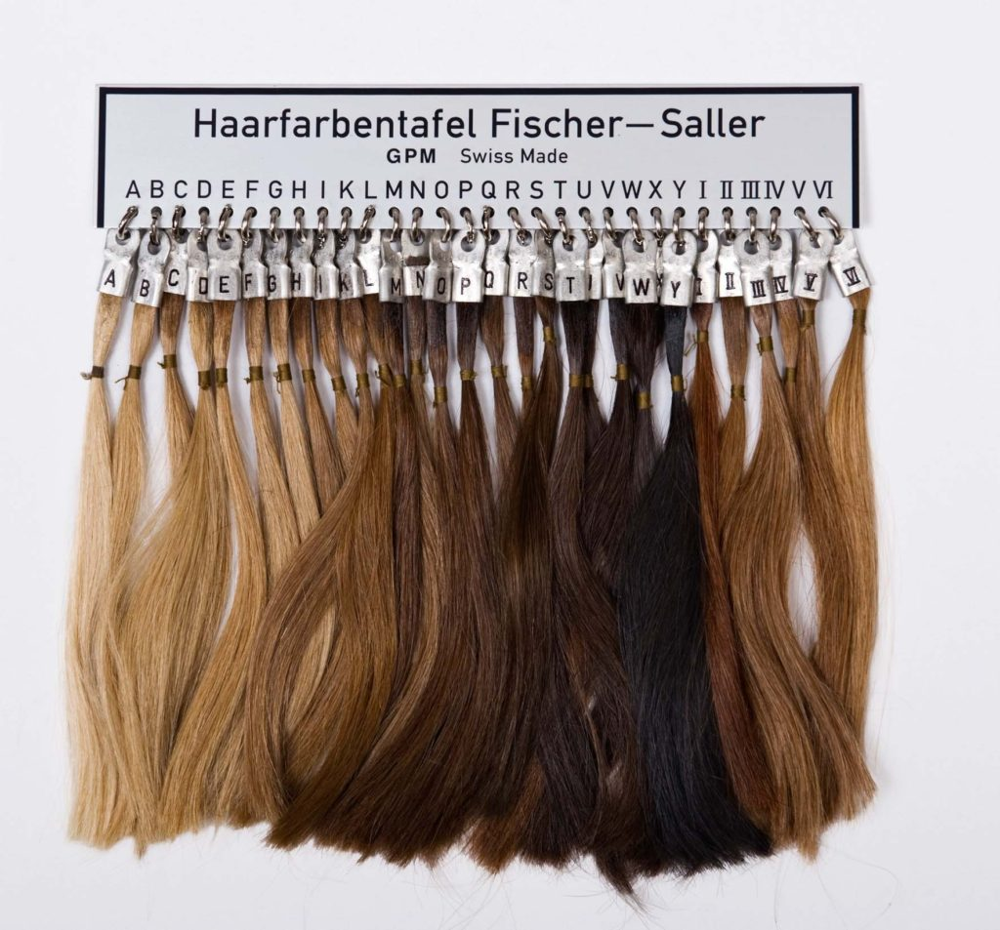

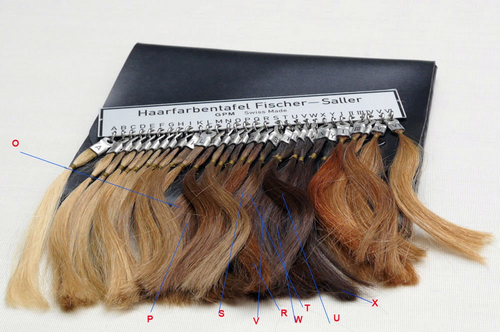

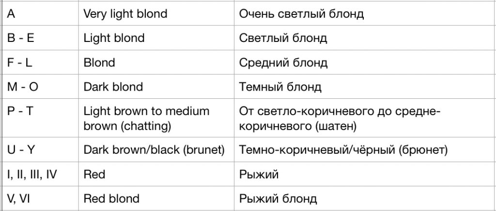

#### _Как  выбрать  краску  и  определить, какой результат вы получите, если нанесете краску на ранее окрашенные волосы?_

Вы убедились в том, что у вас нет аллергии, ваши волосы в удовлетворительном
состоянии и заодно определили свой номер по шкале светлости. Ну что, пора идти
покупать краску? Но и на этом этапе есть свои нюансы:

###### Как выбрать нужный оттенок?

Бывало ли у вас так, что вы шли в магазин за одной краской, а возвращались с
другим оттенком? Или вот настроение такое, что "перемен требуют наши сердца", и
вы уже в магазине берете краску, которая вам нравится, и решительно красите
волосы тем же вечером? Каков был результат? Получался ли желаемый оттенок?

Сама я ратую за более рациональный подход к окрашиванию волос, поэтому пытаюсь
вам дать больше подсказок.

Итак, сначала, мы смотрим, конечно же, на картинку, она полезна в случае, если
мы, например, ищем рыжий, поэтому мы не будем искать его среди "баклажанов". Но
больше информации нам даст код, который прячется чаще всего в уголках коробки,
рядом с ним есть и название краски. Код состоит из цифр и букв. Он нам расскажет
и про уровень светлости, и про основной и дополнительный оттенки краски (теплый,
холодный, нейтральный). Иногда на упаковке с краской нет кода, и красуется там
только название или просто 3 цифры, и это усложняет нам задачу. Так как название
мало о чем говорит и не понятно, какая цифра на что намекает - сплошные загадки.
В таких случаях, идем искать информацию на сайте производителя.

Как мы можем узнать **уровень светлости**? Уровень определяется всегда цифрой,
которая берется из международной шкалы светлости волос. Да-да, та же самая
шкала, что мы использовали для определения своего уровня светлости волос
(см.выше). В коде это **самая левая** цифра до всяких букв (**7**W), точек
(**7.**14), дробей (**7**/35); но, например, в краске **Palette** (М**7**), эта
цифра будет стоять после букв, т.е. будет самой правой. Далее будут еще примеры,
чтобы это стало немного понятнее. Иногда вместо уровня светлости используют
словосочетание _натуральный цвет_.

Снова шкала (можете и на верхние ориентироваться), она принадлежит компании
**Wella**. Хорошая шкала, соответствует стандарту ))) Но бывает, что в русских
переводах встречается **русый** (вместо темно2го блонда, к примеру) или шатен,
что добавляет путаницы. Русый и шатен - это какие уровни?

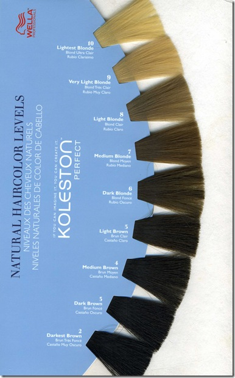

1 - черный  
2 - очень темный коричневый  
3 - темно-коричневый  
4 - средний коричневый  
5 - светло-коричневый  
6 - темный блонд  
7 - средний блонд  
8 - светлый блонд  
9 - очень светлый блонд 10 - бледный (обесцвеченный) блонд  
11-12 - седые или волосы как у альбиносов.

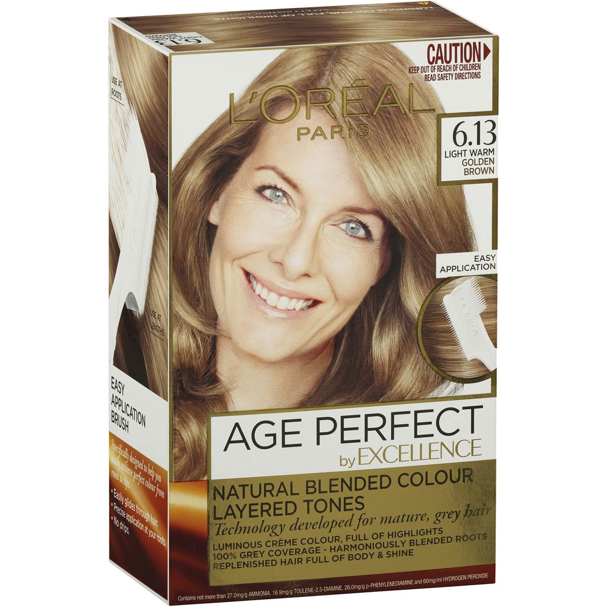

Что еще примечательно, строгого контроля по соответствию названия и номера
уровня светлости - нет. К примеру, **L'oreal** берет и смещает названия уровней
светлости на одну единицу (например, 6 - это светлый коричневый, а не темный
блонд, и так со всем остальным). И это не только у них встречается. **Поэтому
ориентируйтесь только на цифры.**

Где прячется **оттенок?** Оттенок дает представление о тепло-холодности краски и
на какие цвета сделана ставка (синий, красный, желто-оранжевый и т.п.). Есть
основной оттенок и бывает еще дополнительный, который составляет 25-35% от
основного оттенка. В коде оттенок - то, что идет после цифры уровня светлости,
либо в виде букв (7**W**), либо в виде цифр после точки (7.**14**), дроби
(7/**35**). Как ранее уже говорилось, в краске **Palette** (**М**7) это первые
буквы кода. И здесь тоже путаница та еще: везде по-разному трактуют и буквы, и
цифры. Вот международный цветовой чарт (надеюсь, переводить не надо? если надо,
пишите в комментариях). Тут логика цифровой последовательности цветов плохо
улавливается:

| ICC Number | Tone      | Actual Color | Cool or Warm            |
|:-----------|:----------|:-------------|:------------------------|
| 0.1        | Blue Ash  | Blue         | Cool                    |
| 0.2        | Mauve Ash | Purple       | Cool                    |
| 0.3        | Gold      | Yellow       | Warm                    |
| 0.4        | Copper    | Orange       | Warm                    |
| 0.5        | Mahogany  | Violet Red   | Neutral                 |
| 0.6        | Red       | Red          | Warm                    |
| 0.7        | Khaki     | Green        | Cool                    |
| 0.8        | Pearl Ash |              | Cool                    |
| 0.9        | Soft Ash  |              | Cool                    |
| .0x        | -         | -            | Cool                    |
| .x0        | -         | -            | Depends on primary tone |

Далее пример: таблица, где колонка слева с цифровым рядом - это Wella. Логика
более-менее хорошо улавливается, т.к. цифровая последовательность основана на
последовательности цветов на цветовом круге, кроме 7 и 9 (см. картинку ниже,
ссори за качество). Правая же часть таблицы отображает буквенные значения во
многих компаниях, и тут тоже с оговорками, к примеру:

- М может трактоваться как матовый (зелёный), либо как махагон (красное дерево),
  чаще всего **второе**.
- С - как медный или пепельный, чаще всего **первое**.

Оранжевым цветом выделен тёплый оттенок  
Синим - холодный оттенок  
Белым - нейтральный оттенок

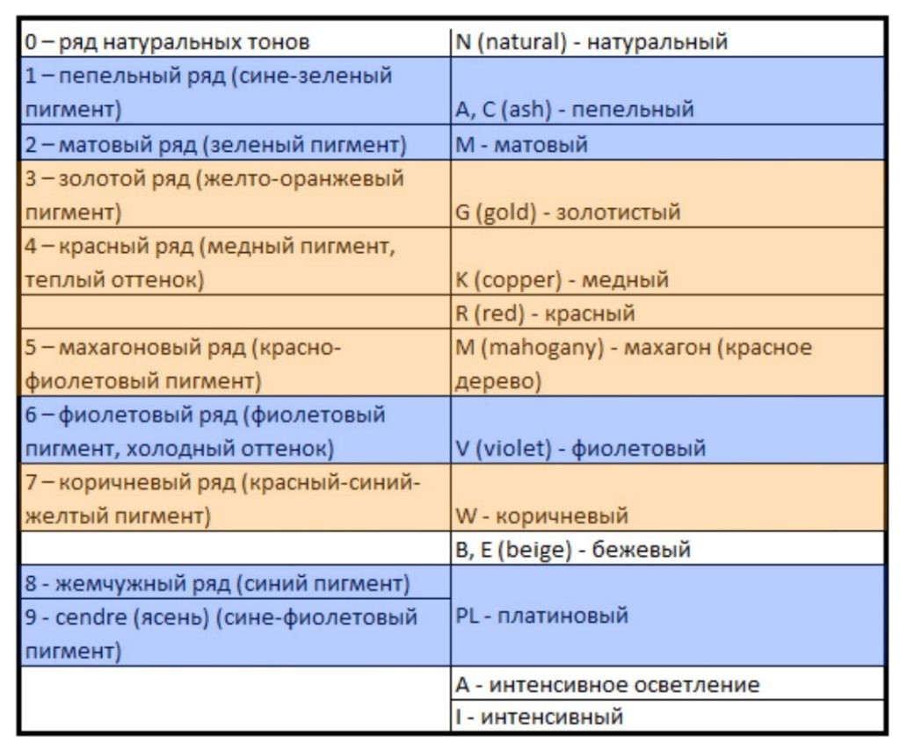

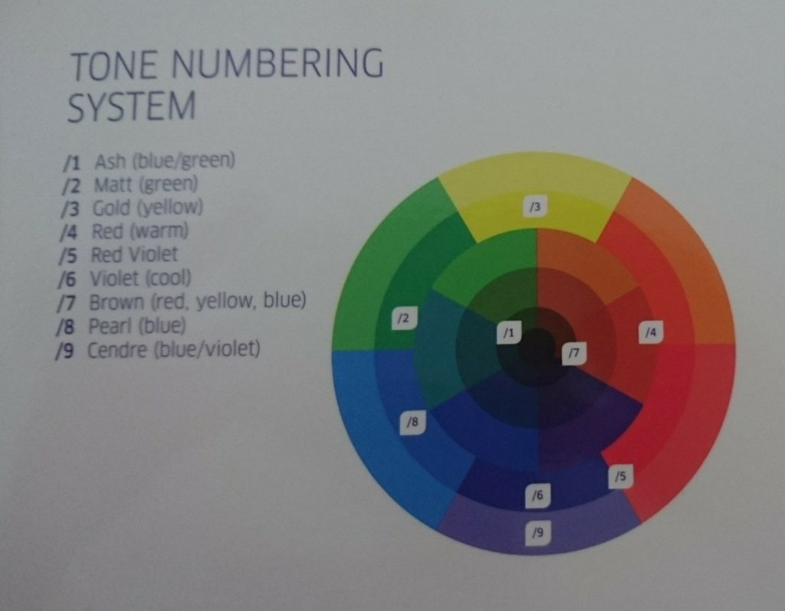

На следующем изображении можно посмотреть на пряди ярких оттенков (без
натуральной добавки).

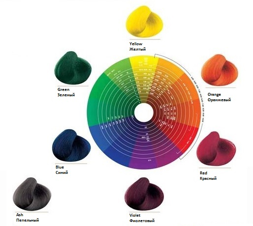

Есть и такая таблица (качество изображения страдает, для четкой картинки
[можно заглянуть по ссылке](https://static.necy.eu/i/gw/13/2000x2000/53980.jpg)):

**Теперь рассмотрим примеры:**

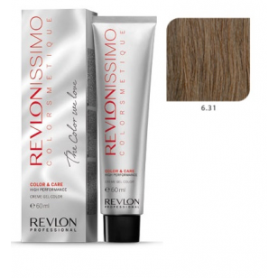

1. Краска с кодом **6.31**:

- первая цифра говорит об _уровне светлости_ (6 - темный блонд);
- вторая – об _основном оттенке_ (3 - золотой оттенок);
- третья – о _дополнительном оттенке_ (1 - сине-пепельный оттенок).

Получилось: золотистый темный блонд с добавлением пепельного оттенка.

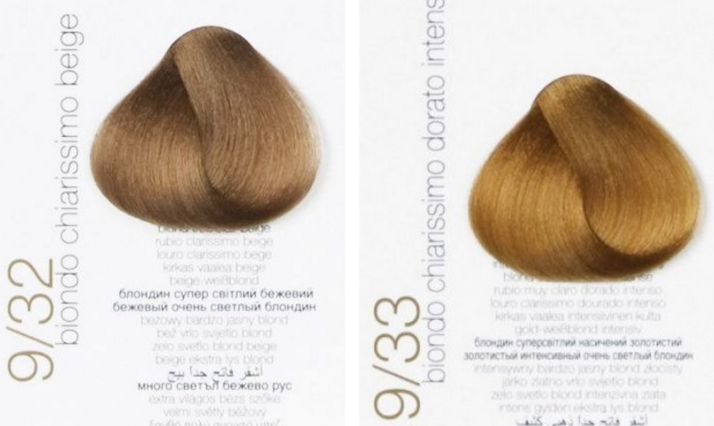

2. Еще один пример - **9/32**, где:

- _уровень светлости_ - 9 (очень светлый блонд),
- _основной оттенок_ - 3 (золотистый),
- _дополнительный оттенок_ - 2 (фиолетовый).

Вы видите разницу в этих оттенках, очень светлый блонд бежевый и очень светлый
блонд золотистый?

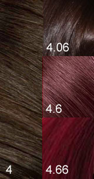

3. И еще для тренировки глаз.

Что мы видим? Везде один и тот же уровень светлости - 4 (средний коричневый),
тут еще присутствует красный - 6, но в разных количествах, что меняет яркость
краски:

* 4 - натуральный цвет, свое родное, с таким цветом родились.
* 4.06 - чутка добавили красного, но основную массу все же составляет 
  натуральный оттенок.
* 4.6 - теперь у нас в красный, как основной оттенок (дополнительным можно 
  считать натуральный).
* 4.66 - красный тут на всех фронтах, про натуральный не слыхали. Полностью
  искусственный оттенок.

###### Что еще нужно знать о краске?

_Первое_, какими они бывают:
- Перманентные красители – агрессивные средства, которые полностью заменяют
  натуральный пигмент волос.
- Полуперманентные красители – по сравнению с перманентными действуют менее 
  агрессивно, при этом не затрагивают природный оттенок шевелюры.
- Осветляющие красители – их функция осветлить темные локоны, полностью удаляя
натуральный пигмент. Очень травмируют волосы, делая их ломкими и сухими. Но это
касается старых осветляющих красок (bleach), сейчас в салонах используют новый
тип красок, который более эффективный и менее травматичный, чем старый вариант
(lift color).
- Оттеночные средства (муссы, тоники) – замечательный вариант для
всех, кто желает изменить оттенок на короткое время. Локоны при этом остаются в
прежнем состоянии, а окрашиванию подвергается только верхняя оболочка волоса.
- Натуральные красители – с их помощью можно добиться легких оттенков, а локоны
при этом еще и подпитаются полезными веществами. К натуральным красителям
относят ромашку, хну, чайный лист, басму, шалфей, кофе, луковая шелуха и др.

_Второе,_ определить требуется ли осветление волос и какой процент окислителя
должен быть в краске, чтобы достичь нужного результата. Процент окисления в
краске составляет **от 3 до 12%** :

- Если вы хотите получить более темный цвет или любой оттенок, но в пределах
  вашего уровня светлоты – используйте 3%-ный окислитель;
- Если вы хотите осветлить волосы на 1-2 тона – используйте 6%-ный окислитель;
- Если вы хотите осветлить волосы на 2-3 тона – используйте 9%-ный окислитель;
- Если вы хотите осветлить волосы на 3-4 тона – используйте 12%-ный проявитель;
- Если вы хотите осветлить волосы более чем на 4 тона – используйте специальные
  блондирующие средства, а лучше обращаться сразу к специалистам.

- Для волос светлого уровня 8-10 (светлые блондины) осветление, как и 
  затемнение, как и добавление оттенка, проблем не вызывает (подойдет низкий 
  процент окислителя до 6% включительно).
- Для волос среднего уровня 5-7 с затемнением проблем тоже не должно быть (3%
окислитель). Но, чтобы получить достаточно светлые оттенки, надо будет
предварительно пройти процедуру осветления волос, либо использовать окислитель
не ниже 6%. Например, вас привлек вот такой цвет - 8.хх (Светлый блонд), а на
текущий момент цвет ваших волос находится на 5 уровне (Светло-коричневый),
тогда: либо использовать краску с 9% окислителем, либо осветление на 3 уровня
вверх станет первым шагом перед основным окрашиванием.
- Для волос темного уровня 1-4: брюнетам придется немного попотеть, особенно
тем, у кого уровень светлости 1-2 и хочется более светлых оттенков. Если Вы
желаете добиться цвета блонд (уровень 8-10), придется осветлять волосы поэтапно
и/или применять специальные средства, поэтому подумайте, нужна ли вам такая
радикализация?

_Нужна ли нейтрализация цвета волос?_

Если вы нацелились на краску с холодным оттенком, а у вас сейчас тёплый оттенок
волос. Понятно, что без нейтрализации дело не обойдется. Чтобы выбрать
нейтрализующий тон, понадобится знания колористики. Вспомним детство, и как мы
смешивали краски :)

Для этого используется цветовой круг Иттена (цветовая система Пранга) с
первичными, вторичными и третичными цветами, которые делят круг на 12 секторов.

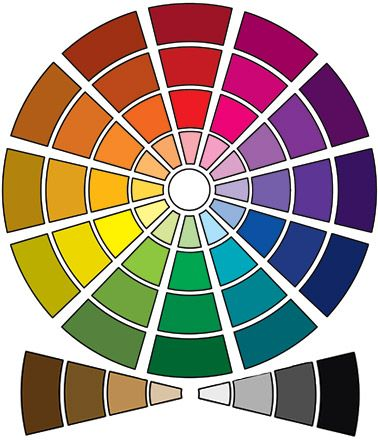

_**Согласно
[теории цвета](http://haircolor.org.ua/koloristika/101-teoriya-tsveta.html
"Теория цвета") в своей основе цветовой круг имеет три первичных цвета (синий,
желтый и красный), из которых путем смешения можно получить все остальные
цвета.**_  
**Синий** является самым сильным из основных цветов и единственным
основным холодным цветом (с точки зрения психологии и физиологии). Его
добавление в любой из цветов может привнести глубину и темноту любому цвету.  
**Красный** — средний по силе воздействия первичный цвет. Его добавление к
цветам на основе синего заставляет их казаться более светлыми. Добавление
красного в цвета на основе желтого делают их более темными.  
**Желтый** самый
слабый из первичных цветов. Его добавление во все цвета придаст им яркость и
светлоту.

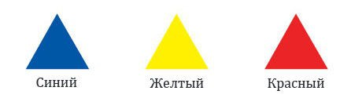

**Вторичные цвета** образуются путем смешения в равной пропорции двух первичных
цветов. Таким образом: желтый с красным дадут в результате оранжевый цвет,
красный с синим — фиолетовый, а синий с желтым — зеленый.

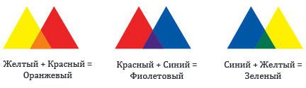

**Третичные цвета** получают путем смешения в равных пропорциях одного
вторичного и одного первичного цвета. Благодаря этому образуются такие цвета,
как: желто-оранжевый, красно-оранжевый, красно-фиолетовый, сине-фиолетовый,
сине-зеленый и желто-зеленый.

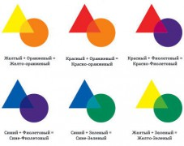

Смешение трех первичных цветов (желтый, синий, красный) в одинаковой пропорции
дает образование натурального цвета (нейтрального серо-коричневого или taupe).
Происходит нейтрализация цветов. Нейтрализации можно добиться и путем смешивания
комплементарных (дополнительных) цветов. Комплементарные цвета - это пара
цветов, диаметрально расположенных относительно друг друга на цветовом круге,
т.е. они противоположные, например, красный и зеленый. И результатом смешения
фиолетового цвета с желтым, красного с зеленым, синего с оранжевым будет
нейтральный цвет.

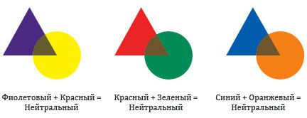

_Стоит отметить, что в колористике используют и другой цветовой круг - круг
Манселла или дерево Манселла, где основными цветами выступают: желтый, зеленый,
синий, фиолетовый и красный; именно они дают ахроматический - чистый серый цвет
без примесей. Комплементарные цвета на круге Манселла при смешении в равных
пропорциях дают также чистый серый._

**Нейтрализация цветов** используется при борьбе с нежелательными оттенками на
волосах, однако стоит отметить, что на практике никто не добавляет равное
количество дополняющего цвета. Добавляются всегда малые количества, которые
просто приглушают яркость нежелательного оттенка.

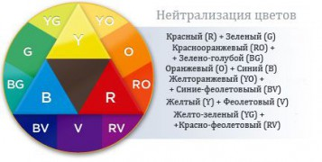

В помощь вам вот такая таблица, где

1 колонка - уровень светлости, 2 - описание уровня светлости, 3 - подтон цвета
на данный момент, 4- подтон получаемый при осветлении, 5 - нейтрализующие цвета,
6 - усиление цвета:

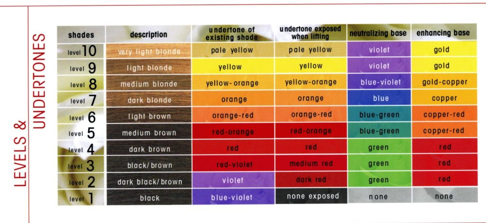

- Как технически окрашивать волосы, закрашивать седину и отросшие корни можно
  узнать из инструкции к краске, которая есть в каждой упаковке с краской.
- Для тех,
  [кто хочет быть блондинкой, можно почитать еще тут.](http://pl-yum.livejournal.com/44745.html)
- **Еще много полезного можно почитать
  [здесь](http://pl-yum.livejournal.com/44745.html) и
  [здесь](http://haircolor.org.ua/koloristika/202-kak-ne-isportit-okrashivanie-volos-ili-masterstvo-kolorista-chast-2.html)
  .**
- ну и немного философии: поразмышлять зачем вы красите волосы? какова цель?

* * *

Если же Вы не уверены в своем цветотипе, оттенке волос и их состоянии, лучше
всего обращаться в салон к профессионалам, где кроме ответов на вопросы, Вы
сможете сделать и технически сложное окрашивание. Со специалистами будьте
бдительны, и в случае неудачного результата не дайте себя обмануть: _«Сложность
для России в том, что далеко не все мастера являются действительно Мастерами. Им
вот кажется, что они супру научились разводить и кисточкой по волосам водить и
сразу все - можно бабки стричь. Поэтому ходят у нас и белые мочалки и желтые
блондинки, и зеленые брюнетки и красно-рыжие. А мастер (фломастер) стоит,
ручками разводит - как же так, я все сделала по правилам, может у Вас, уважаемый
клиент, гормональные изменения? клиент свято верит, что прилично одетая девушка
в приличном месте за 200 долларов не может же не уметь, поэтому честно ищет
оправдания такой милой девушке - да, может и гормональное. (гормоны, такие
гормоны). Это я своими ушами слышала. Главное - что все довольны этим
объяснением. И мастер в ус не дует, раз такой гормональный клиент попался
(наверное, через одного у нее), и клиент вполне Щастлив, не фиолетовая же,
подумаешь - желтая, таких много._

_Еще слышала (и не раз), когда растерянно-желтенькой блондинке начинают
впаривать заговорщическим шепотом, что де "краска-то не очень на самом деле, но
директор на такой только разрешает работать, но я знаю одну краску и одно место,
там все очень профессиональное, да-да, самое что ни на есть
про-фес-си-о-наль-но-е… и я бы могла вам купить" Мне в такие моменты хочется
ответить, чтобы в том самом месте еще бы и мозгов прикупила, или сходила бы куда
подучиться.»_

* * *

Для создания данного поста были использованы материалы из следующих
интернет-источников:

pl-yum.livejournal.com  
www.haircolour.ru  
meduniver.com  
haircolor.org.ua  
shpilki.net

Картинки для иллюстраций - все, что выдал google по запросам, а также с сайта
haircolor.org.ua
