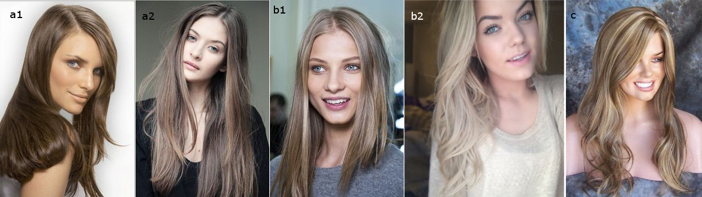

Сегодня я начинаю небольшой цикл "Цвет волос по рекомендациям Кибби" и начну я с
Драматиков.

Кто такой Кибби рассказывать не надо; те, кто интересуется вопросами
собственного стиля уже знакомы с ним, это имя на слуху в России уже лет 5-6 и
его популярность набирает обороты с каждым годом. За что я люблю Кибби? За то,
что он хорош не только в плане подсказки с выбором цвета волос, но и даст советы
по макияжу, по выбору предметов одежды, аксессуаров и как это все совмещать для
каждого типажа.

Для тех, кто первый раз слышит о нем или мало знаком с его интерпретацией
"проявления Инь/Янь во внешнем облике" (пионером была
[Belle Northrup, 1934 г.](../2017-09-05-истоки-теории-о-проявлении-иньян-во-вн)),
но хотел бы побольше узнать про него или определиться со своим типом, предлагаю
заглянуть на любой из сайтов:

- [Эстетическая медицина](http://its-possible.ru/tags-search/?tags=%C4%FD%E2%E8%E4%20%CA%E8%E1%E1%E8);
- [Колор-хармони](http://color-harmony.livejournal.com/);
- [а также группа ВКонтакте](https://vk.com/kibbe?w=wall-76498034_4063).

Если у вас возникло желание изменить цвет волос, но не знаете в какую сторону
идти и с каким цветом экспериментировать? Помощником в этом вопросе может стать
определение цветотипа или воспользоваться советами стилистов. Со своей стороны
могу дать несколько подсказок для решившихся:

1. [**здесь**](../2016-09-18-как-выбрать-правильную-краску-и-что-ну) вы узнаете,
   как окрашивать волосы, чтобы добиться нужного результата, и на какие моменты
   стоит обратить внимание;
2. [**здесь**](../2017-03-29-кое-что-еще-о-цвете-волос-highlights-lights) про
   понятие highlight/light и как его "едят".

Известно всем, что бывают блондины, брюнеты, рыжие, а вот какой оттенок и
светлота/темнота цвета волос не каждый сможет сказать или определить. Какой цвет
у вас?

(Изображение из статьи в Википедии
["разнообразие натуральных оттенков волос человека").](https://en.wikipedia.org/wiki/Human_hair_color)

Если вы знаете свой цветотип, а также типаж Кибби, то его рекомендации вам
помогут выстроить полноценную стилевую фигуру.

#### **Зима (Winter) и Лето (Summer)**

###### _Высокий контраст внешности (High-Contrast coloring)_

a) Черный (Black)  
b) Темный пепельно-коричневый (Dark Ash Brown)  
c) Серебристый/белый (Silver/White)  
d) Седину можно оставить, если только она в виде ярких прядок (Gray may be left
if it’s dramatically streaked)

###### _Низкий контраст внешности  (Low-Contrast Coloring)_

###### __

a) От среднего до мягкого коричневого с пепельным оттенком (Medium to Soft Ash
Brown)  
b) От насыщенного до светлого пепельного блондина (Deep to Light Ash Blond)  
c) Крупные пряди пепельного блонда (Bold streaks of Ash Blond)  
d) Седину закрашивать полностью (Cover Gray completely)

#### Весна (Spring) и  **Осень (Autumn)**

###### _Высокий контраст внешности (High-Contrast coloring)_

###### __

a) От темного до средне-каштанового (Deep to Medium Chestnut Brown)  
b) Красное дерево/Темный рыжий (красновато-коричневый) (Mahogany/Deep Auburn)  
c) Теплый белый (с желтоватым тоном) (Warm White)  
d) Седину закрашивать полностью (Cover Gray completely)

###### _Низкий контраст внешности  (Low-Contrast Coloring)_

a) От средне-коричневого до светло-коричневого с золотистым отливом (Medium to
Light Golden Brown)  
b) От светлого/яркого рыжего до медно-красного (Light/Bright Auburn to Copper)  
c) Насыщенный медовый блондин (Deep Honey Blond)  
d) Теплый белый (с желтоватым тоном) (Warm White)  
e) Седину закрашивать полностью (Cover Gray completely)

Лучше красить волосы полностью в один цвет, исключение составляют подчеркнутые
яркие пряди или омбре (вытягивание цвета). (In general, overall haircolor
processes are best unless you are highlighting a dramatic streak or sweep of
color).

Избегать: Тех цветов, которые создают смягчающий образ (щадящее мелирование) -
они не подходят Вашей величественной и королевской внешности, если только вы не
хотите выглядеть как старушка. (AVOID: Haircolors designed to “soften” your look
\- they are out of keeping with your majesty and power, and will tend to be very
aging on you).

* * *

Перевод текста из книги Д. Кибби "Метаморфозы", 1987 г.

Картинки - все, что выдал Google по запросам.
