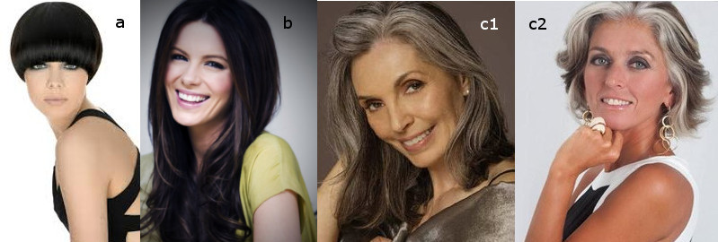
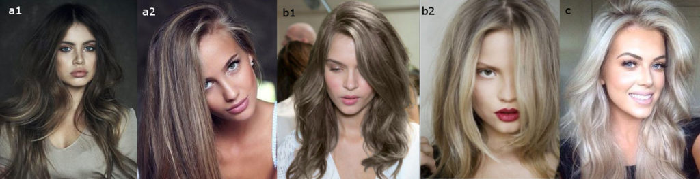
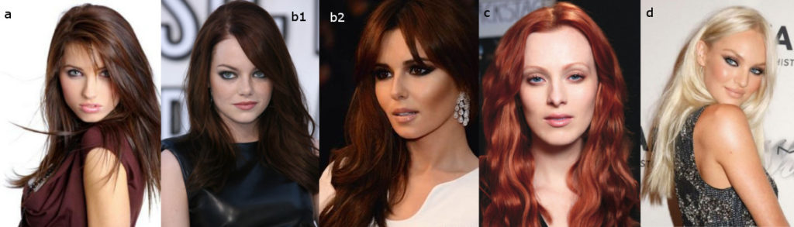
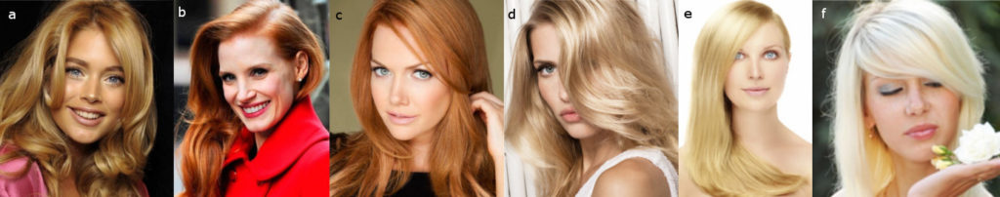

Сегодня у нас Мягкий (Софт) Драматик и рекомендации по цвету волос согласно
Кибби.

Кто такой Кибби рассказывать не надо; те, кто интересуется вопросами
собственного стиля уже знакомы с ним, это имя на слуху в России уже лет 5-6 и
его популярность набирает обороты с каждым годом. За что я люблю Кибби? За то,
что он хорош не только в плане подсказки с выбором цвета волос, но и даст советы
по макияжу, по выбору предметов одежды, аксессуаров и как это все совмещать для
каждого типажа.

Для тех, кто первый раз слышит о нем или мало знаком с его интерпретацией
"проявления Инь/Янь во внешнем облике" (пионером была
[Belle Northrup, 1934 г.](../2017-09-05-истоки-теории-о-проявлении-иньян-во-вн)),
но хотел бы побольше узнать про него или определиться со своим типом, предлагаю
заглянуть на любой из сайтов:

- [Эстетическая медицина](http://its-possible.ru/tags-search/?tags=%C4%FD%E2%E8%E4%20%CA%E8%E1%E1%E8);
- [Колор-хармони](http://color-harmony.livejournal.com/);
- [а также группа ВКонтакте](https://vk.com/kibbe?w=wall-76498034_4063).

Если у вас возникло желание изменить цвет волос, но не знаете в какую сторону
идти и с каким цветом экспериментировать? Помощником в этом вопросе может стать
определение цветотипа или воспользоваться советами стилистов. Со своей стороны
могу дать несколько подсказок для решившихся:

1. [**здесь**](../2016-09-18-как-выбрать-правильную-краску-и-что-ну) вы узнаете,
   как окрашивать волосы, чтобы добиться нужного результата, и на какие моменты
   стоит обратить внимание;
2. [**здесь**](../2017-03-29-кое-что-еще-о-цвете-волос-highlights-lights) про
   понятие highlight/light и как его "едят".

Известно всем, что бывают блондины, брюнеты, рыжие, а вот какой оттенок и
светлота/темнота цвета волос не каждый сможет сказать или определить. Какой цвет
у вас?

(Изображение из статьи в Википедии
["разнообразие натуральных оттенков волос человека").](https://en.wikipedia.org/wiki/Human_hair_color)

Если вы знаете свой цветотип, а также типаж Кибби, то его рекомендации вам
помогут выстроить полноценную стилевую фигуру.

#### **Зима (Winter) и Лето (Summer)**

###### _Высокий контраст внешности (High-Contrast coloring)_

a) Черный (Black)  
b) Темный пепельно-коричневый, без мелирования (Dark Ash Brown (no
highlights))  
c) Серебристые/белые пряди около лица (Silver/White sprays around the face)  
d) Седину закрашивать полностью, если только она не покрывает всю голову (Cover
Gray until hair is completely Gray)

###### _Низкий контраст внешности  (Low-Contrast Coloring)_

a) От среднего до мягкого пепельно-коричневого с нежными пепельными бликами
(Medium to Soft Ash Brown with subtle Ash lights)  
b) Любой оттенок пепельного блондина (от насыщенного до тусклого), с нежными
пепельными бликами (Any shade of Ash Blond (deep to pale), with subtle Ash
lights)  
c) Платиновый (Platinum)  
d) Седину закрашивать полностью, если только она не проявляется
ярко-серебристым/белым оттенком (Cover Gray completely unless it’s a dramatic
shade of Silver or White)

#### Весна (Spring) и  **Осень (Autumn)**

###### _Высокий контраст внешности (High-Contrast coloring)_

a) Насыщенный каштановый с рыжими бликами (Deep Chestnut Brown with Red
lights)  
b) От насыщенного до яркого рыжего (красновато-коричневого) (Deep to Bright
Auburn)  
c) Яркий медно-красный (Vivid Copper)  
d) Теплый белый (с желтоватым тоном) (Warm White)  
e) Седину закрашивать полностью (Cover Gray completely)

###### _Низкий контраст внешности  (Low-Contrast Coloring)_

a) Интенсивный медовый блонд с золотистыми бликами (Rich Honey Blond with golden
lights)  
b) Яркий рыжий (Bright Red)  
c) Яркий рыжеватый (с небольшим добавлением розового) (Bright Strawberry)  
d) Яркий золотистый блонд (Bright Golden Blond)  
e) Яркий льняной, соломенный (светло-желтый) (Bright Flaxen (Yellow))  
f) Теплый белый (с желтоватым тоном) (Warm White)  
g) Седину закрашивать полностью (Cover Gray completely)

Лучше всего красить волосы полностью в один цвет, можно добавить после этого
едва заметное мелирование для небольшого осветления цвета волос. (In general,
overall haircolor processes are best, with the possible addition of very subtle
highlights added afterward to simply “lift” the color slightly).

Избегать: Очень приглушенных (мягких) цветов, а также чрезмерного осветления без
интенсивной или яркой базы (исключая Платиновый). (AVOID: Overly muted
haircolors, and overly lightened haircolors that are too pale, without a rich
and vibrant base color (except platinum where appropriate)).

* * *

Перевод текста из книги Д. Кибби «Метаморфозы», 1987 г.

Картинки — все, что выдал Google по запросам.
