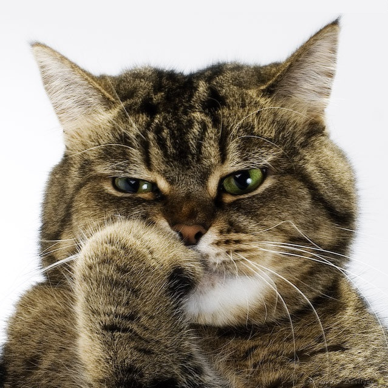
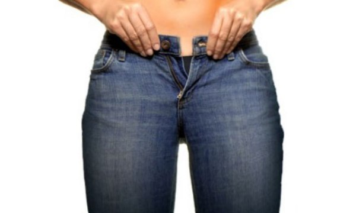

#### **Почему лучше тест проводить с друзьями**

Если вы все же склоняетесь к тому, чтобы пройти следующий тест самостоятельно
без помощи друзей, то здесь хочется привести несколько примеров для размышления:

На одном из занятий FYF участники были поделены на группы, чтобы провести тест
на определение особенностей. Одна из участниц, привлекательная девушка, около 30
лет, была недовольна тем, что группа сказала, что у неё нет проблем с бёдрами.
Глядя на её стройные бёдра, проводивший занятие, инструктор поинтересовался в
чем заключается проблема. Участница объяснила, что у неё всегда есть трудности в
том, чтобы найти подходящую одежду, потому что верх она носит 48 размер, а низ -
46\. Инструктор, улыбнувшись, объяснил, что, если бёдра чуть уже, чем плечи, то
\- это является достоинством фигуры и не является проблемой. У неё была
проблема, относящаяся не к ее особенностям строения тела, а _проблема с размером
подходящей одежды_.

Через 2 минуты эта же участница была шокирована очередным открытием, оказалось,
что у нее нет сутулости. Инструктор подтвердил слова группы. После этого
участница пояснила, что ее мать постоянно твердила ей, чтобы она сидела прямо.
Надо отдать должное, мать добилась положительного результата: у участницы была
великолепная осанка. Через несколько недель инструктор и та участница
встретились вновь. Участница поведала о том, что ее мать была возмущена тем, что
на занятиях не увидели проблемы со спиной. После этого стало очевидно, что у
данной участницы проблема заключается не в фигуре, а в _определённом
представлении об ее фигуре у матери_.

Была так же участница, которая шьёт. Она думала, что у неё длинная талия лишь
потому, что ей приходилось в выкройке добавлять 5 см в области талии или
подгонять купленную одежду по фигуре. На самом деле у неё была средняя талия и
высокий рост (175 см), т.е. она была выше, чем среднестатистическая женщина (164
см). Поэтому проблема была не в фигуре, а в том, что ей нужно было _подгонять
изделие по фигуре_, т.к. она шила по стандартным выкройкам и покупала то, что
подходит женщинам среднего роста. (Надо сказать, что сейчас у многих
масс-маркетов есть одежда как для высоких женщин (tall), так и для девушек с
маленьким ростом (petite), поэтому проблем с подгонкой по талии не должно
возникать).

#### **Как влияют внешние факторы на то, как вы оцениваете собственную фигуру, или Проблемы внешнего мира и фигуры**

Есть проблемы, **связанные с посторонними факторами**, заставляющими думать, что
проблемы с фигурой есть. Среди них:

**Проблема с подходящей одеждой**. Подходящая одежда - это, когда размер и форма
одежды соответствует размеру и форме тела. Явные признаки неподходящей одежды -
теснота в плечах, груди или в бёдрах, провисание материи, которое не
предусмотрено конструкцией изделия. P.S. Только потому что одежда подходит вашей
фигуре, не означает, что стиль изделия вам к лицу. Например, дизайн линий
фантастически подходящего наряда может утяжелять внешний облик или привлекать
внимание к вашим проблемам.

**Проблема подгонки одежды по фигуре**. Готовая одежда и стандартные выкройки
могут нуждаться в дополнительных изменениях, в таких, как удлинение рукавов или
штанин, или подгонка по размеру или форме. Если изделие необходимо подгонять, то
это не значит, что у вас есть проблемы, связанные с фигурой.

**Проблема с размером, указанном на изделии**. Производители одежды, а также
компании, которые разрабатывают выкройки, предлагают свои собственные размеры
одежды. Поэтому мы можем в одном магазине встреть размер 44 с одними
параметрами, в другом магазине этим параметрам может соответствовать размер 46,
например. Так же существует ещё такая вещь, что при изготовлении дешевой одежды
производители пытаются сэкономить: они используют по максимуму площадь материи.
При изготовлении изделия, которое стоит дорого, чаще всего все наоборот -
производители используют щедро ткань и изделие садится намного лучше. Не
ориентируетесь на размер, указанный на этикетке, примеряя изделие, смотрите
всегда в зеркало.

**Проблема мнений родителей/близких людей.** Критика со стороны родителей,
близких и их неправильные утверждения о том, как должна выглядеть фигура,
создают у вас ошибочное мнение о вашем телосложении. Не позволяйте негативным
мыслям, возникших в прошлом, заглушать мнение ваших друзей, которые вас
поддерживают и помогают вам не только сейчас и сегодня.

**Выдуманные проблемы.** Это проблема, которая, как вы думаете, у вас есть, но
почему-то никто ее не видит, т.к. ее на самом деле и нет. (Не удивляйтесь, если
вам придётся расстаться с вашими "любимыми" проблемами).

А теперь все, что **связано непосредственно с фигурой**:

**Проблема с весом.** Когда вес выходит за пределы нормального, т.е. превышает,
то это может послужить поводом для беспокойства даже если у вас прекрасные
пропорции фигуры. Понятно, что надо больше заниматься спортом, а если это не
помогает? В следующих постах читайте о том, как выглядеть "тоньше и звонче" с
помощью одежды.

**Незначительная проблема.** Проблема, которая не бросается сразу в глаза и не
привлекает внимание при взгляде на вашу фигуру, но, если присмотреться, можно
заметить.

**Заметная проблема.** Проблема, которая сразу привлекает к себе внимание
окружающих и выбивается из общей картины; когда при первом взгляде на фигуру,
взор упирается в неё.

#### **Заметная проблема vs. Незначительная проблема**

Комментарий от себя: какие возникают у вас ассоциации при слове "проблема"? У
меня - то, что надо решать, тяжесть, грусть, сложность, недостаток и т.п.
Поэтому в дальнейшем переводе я заменю это слово на слово "особенность", т.к. у
нас в жизни и так проблем хватает. Почему автор, следуя ее общей концепции, не
сделала так же - для меня вопрос. Но особенность напрашивается больше по смыслу,
чем проблема (problem). Мне кажется, так звучит лучше, вы не согласны? :-)
поэтому меняю заголовок на:

#### **Особенности фигуры. Заметные** **vs****. Незначительные**

В следующих постах я представлю вам тест, а также карточки с изображениями 19
особенностей фигуры: 5 первых относятся к общим пропорциям фигуры, остальные - к
отдельным частям тела. Большинство женщин имеют около 3 - 7 особенностей.
Некоторые из них _Незначительные_. _Незначительную_ особенность замечает скорее
ее обладатель. Например, ваша талия стала шире, чем была 5 лет назад. Не
сравнивайте своё сегодняшнее тело с тем, каким оно было в прошлом. Вместо этого
_используйте предложенные изображения как сравнительную базу для определения
Заметных и Незначительных особенностей_. _Заметные_ особенности - те, которые
определятся без проблем, сразу бросаются в глаза и совпадают с изображением на
карточке.

Будьте осторожны, если вы делаете тест самостоятельно, вы можете поддаться
собственным иллюзиям и увидеть в _Незначительной_ особенности - _Заметную_,
особенно, если долго и упорно ее рассматривать.

До встречи в следующем посте, где начнется тест :-)
