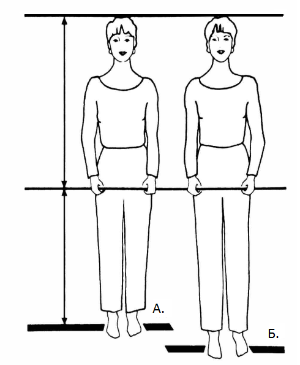

Что нам потребуется для проведения теста:

1. 2 ровные планки/палки, около 1 м. Как пример, карниз, лыжи, линейки, метр для
   выкраивания.
2. Веревка, не короче 1,2 м (ремешок, шнурок, лента).
3. Друзья-помощники. Зеркало в полный рост, если у вас только один помощник.
4. Карандаш и карточки, чтобы отмечать особенности.
5. И вот такая табличка, где нужно будет обвести только **Заметные особенности**
   (Незначительные не включаем) в конце теста:

P.s. тест неприхотлив в выборе одежды, поэтому не нужны купальники и спортивное
трико, достаточно одеть что-то простое и удобное.

Как альтернатива: можно провести этот тест на компьютере/планшете с помощью
графического редактора (Paint). Тогда для этого нужны фото в купальнике в трёх
проекциях: вид спереди (руки спрятать за спину), сбоку (руки вдоль тела) и сзади
(руки слегка отвести в сторону). Фотоаппарат должен находится на уровне груди в
2,5 - 3 м от модели съемки. Далее я покажу реализацию этого метода в примере
разбора.

Итак,

- если особенность фигуры такая же, как на изображении, то обводим _Заметная_;
- если отдаленно похожа, т.е. не так очевидна, то _Незначительная_;
- если не можете решить между _Заметной_ и _Незначительной_, то без сомнений это
  _Незначительная_ особенность.

В каждой карточке вы найдёте: Картинку, Вид особенности, Название особенности,
Номер карточки, Цель и Совет при _Незначительных_ особенностях. Для _Заметных_
особенностей _Советы_ с иллюстрациями будут после теста в отдельных статьях.

Обращение к помощникам: пожалуйста, будьте честны в оценке фигуры, не нужно
притворяться, что все идеально; вы этим не поможете. Говорите так, как вы
видите, пусть это может и огорчить тестируемого. Ведь этот тест и нужен для
того, чтобы найти слабые стороны и, используя правильные советы, выглядеть
лучше.

## **Тест 1. Длина ног и туловища.**

**Модель**: снять обувь и встать на расстояние 1,5 м (можно дальше) от группы
помощников или зеркала. Поднять и согнуть ногу в колене под прямым углом
(представьте цаплю :-)). Положить планку на сгиб бёдра и, держа её двумя руками,
зафиксировать положение параллельно полу, т.е. горизонтально; опустить ногу.

**Помощники**: помочь выровнять планку, если она не параллельна. Вторую планку,
как показано на рисунке ниже, положить сверху на голову модели, она должна быть
также параллельна полу (плечам). Сравните верхнюю половину тела с нижней.

**_А._** _Короткие ноги._

- Нижняя половина слегка короче верхней: обведите _Незначительная_ в Карточке 1.
- Нижняя половина явно короче верхней: обведите _Заметная_ в Карточке 1.

**_Б_**_. Верхняя и нижняя часть сбалансированы_.

- Длина ног, равная или больше длины туловища, является достоинством фигуры.

Небольшое дополнение: бывает так, что девушки среднего роста (около 163 см)
обладают короткими ногами, тогда выбор низа (штаны, джинсы) лучше осуществлять в
магазинах, где есть специальные секции для девушек с маленьким ростом (petite).

## **Тест 2. Ширина бёдер и плеч.**

В идеале ширина плеч равна или слегка больше ширины бёдер.

Модель: спрятать руки сзади, встать лицом к группе помощников/зеркалу.

Помощники:

1. Найдите угол плеча (где встречается плечо и рука) как показано на рисунке.

   

2. Положите один конец планки на угол плеча спереди, а другой конец - на самую
   широкую часть бёдер (см. рисунок ниже). Оцените, под каким углом расположена
   планка в пространстве, выберите соответствующее изображение и следуйте
   инструкциям под ним.

   

   

   
