Продолжение теста Определение особенностей фигуры (Первая часть -
[тут](../2017-02-15-определение-особенностей-фигуры-ч-1):

## Тест 3. Высота талии.

Ваше туловище можно визуально разделить по линии талии на верхнюю и нижнюю
половину. _В идеале верхняя половина должна быть чуть длиннее нижней_.

P.s. В некоторых случаях бывает так, что талия кажется завышенной, если
посмотреть на фигуру спереди. Но на самом деле такую иллюзию создаёт грудь,
расположенная физически довольно низко, либо которая не поддерживается хорошим
бюстгальтером.

**Модель**:

1. Повяжите веревочку на талии, повернитесь боком и посмотрите на направление
   линии веревки. Если она почти параллельна полу, переходите к п.2. Если
   диагональна, то есть 2 варианта:

   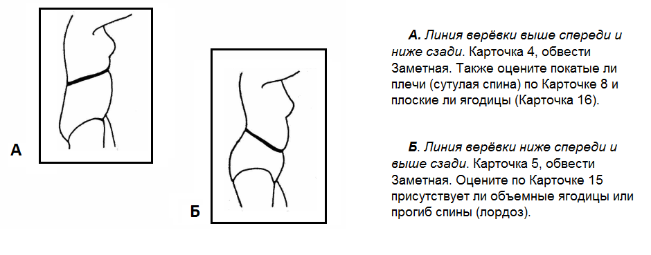

3. Повернитесь спиной к зеркалу/помощникам, держа планку так, как будто вы
   сидите на ней, т.е. под ягодицами.

**Помощники**: Расположите вторую планку на плечах от одного угла до другого.
Сравните с иллюстрацией.

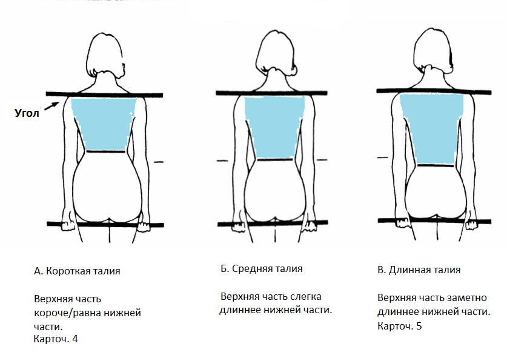

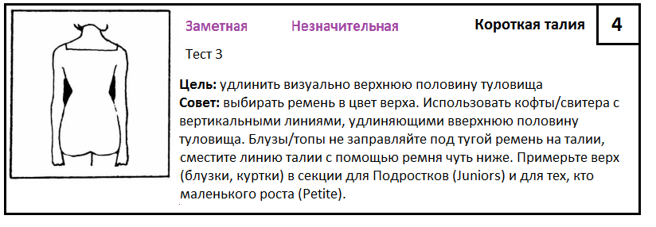

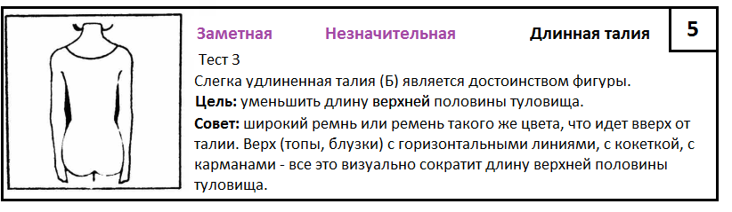

## 4. Особенности верхней части фигуры.

### Шея, плечи, руки

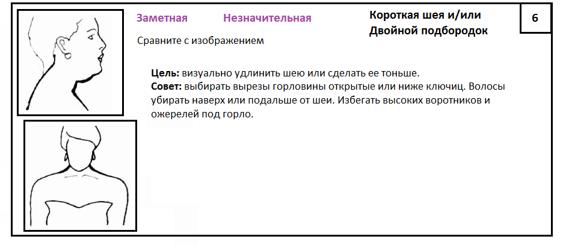

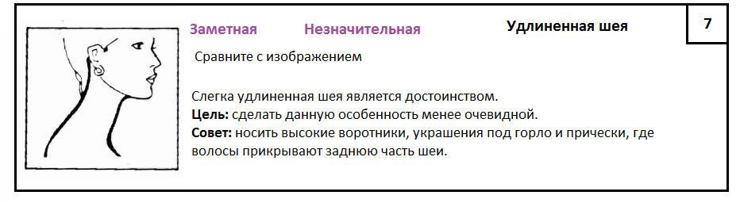

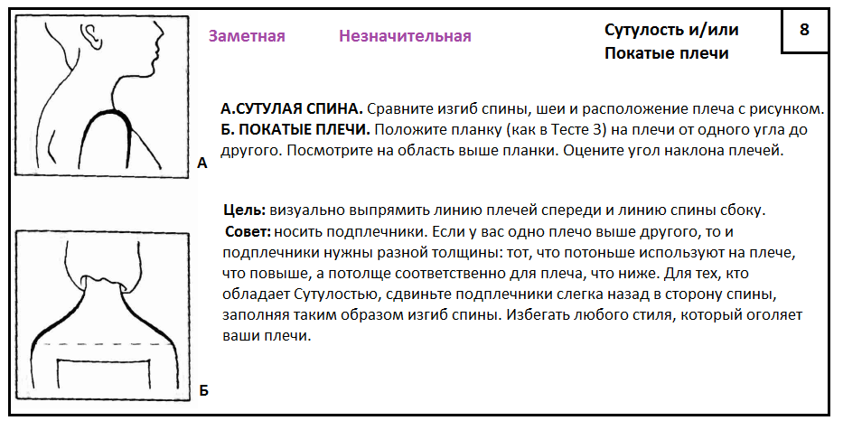

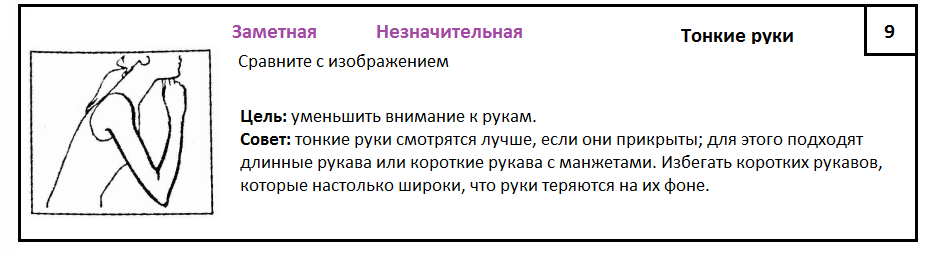

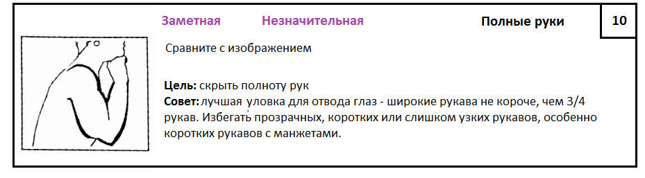

### Грудь, талия

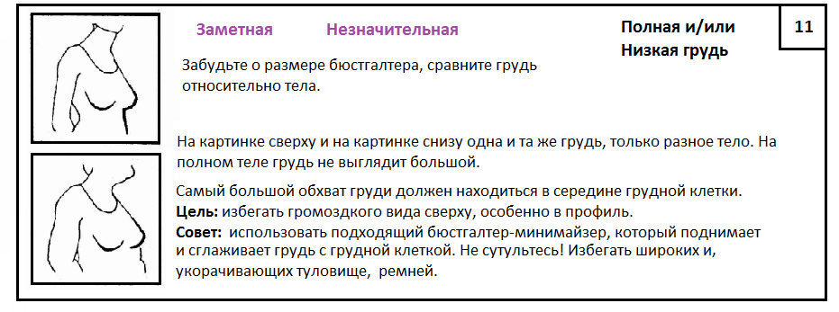

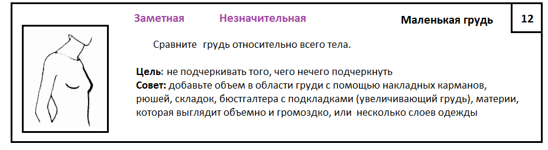

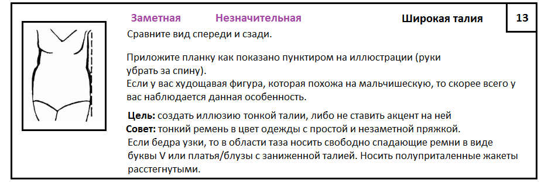
