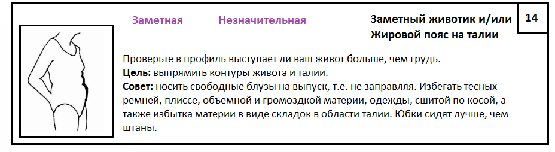
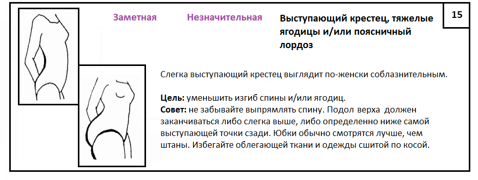
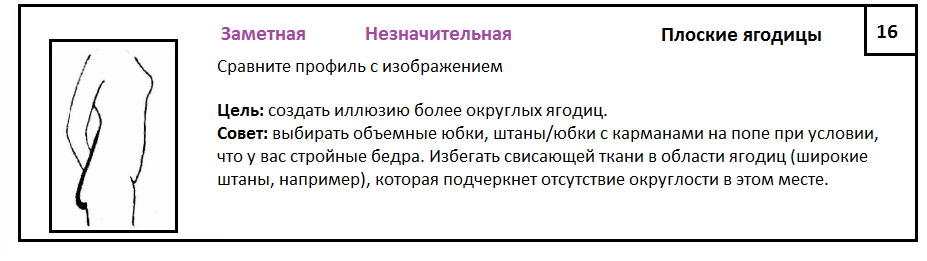
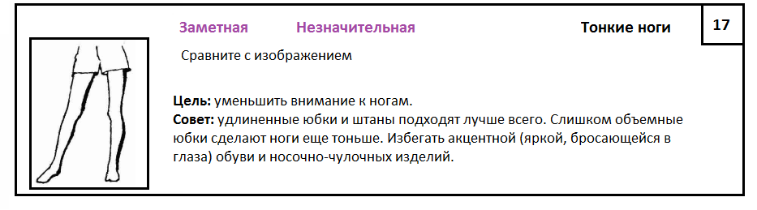
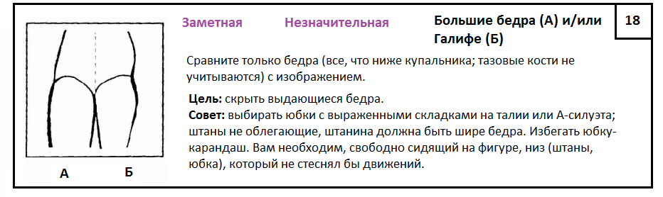
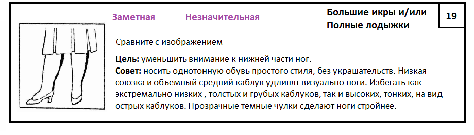

У нас осталась последняя часть, которой мы завершаем наш Большой тест на
определение особенностей.

Первые и вторые части теста соответственно -
[1часть](../2017-02-15-определение-особенностей-фигуры-ч-1) и
[2часть](../2017-02-19-определение-особенностей-фигуры-ч-2). "Вкусняшки" 
начнутся дальше со следующей темы "Определение подходящих фасонов"
(там мы будем рассматривать все детали, т.е. воротники, рукава и пр., поэтому
картинок будет очень много) + вспомним, что такое Оптические иллюзии в одежде, с
чего и начнем.

## 5. Особенности нижней части фигуры

