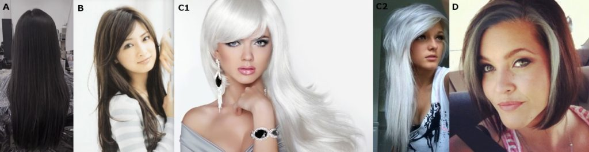
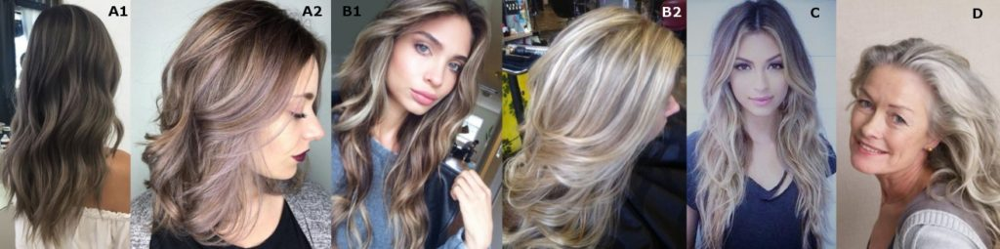
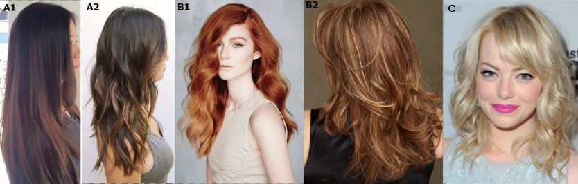
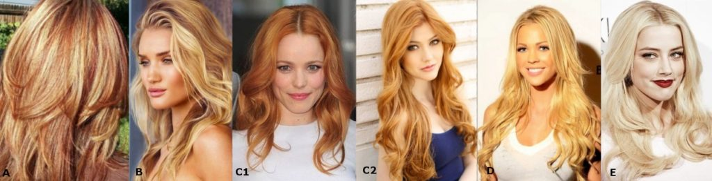

Сегодня на очереди рекомендации по цвету волос для Романтиков.

Кто такой Кибби рассказывать не надо; те, кто интересуется вопросами
собственного стиля уже знакомы с ним, это имя на слуху в России уже лет 5-6 и
его популярность набирает обороты с каждым годом. За что я люблю Кибби? За то,
что он хорош не только в плане подсказки с выбором цвета волос, но и даст советы
по макияжу, по выбору предметов одежды, аксессуаров и как это все совмещать для
каждого типажа.

Для тех, кто первый раз слышит о нем или мало знаком с его интерпретацией
"проявления Инь/Янь во внешнем облике" (пионером была
[Belle Northrup, 1934 г.](../2017-09-05-истоки-теории-о-проявлении-иньян-во-вн)),
но хотел бы побольше узнать про него или определиться со своим типом, предлагаю
заглянуть на любой из сайтов:

- [Эстетическая медицина](http://its-possible.ru/tags-search/?tags=%C4%FD%E2%E8%E4%20%CA%E8%E1%E1%E8);
- [Колор-хармони](http://color-harmony.livejournal.com/);
- [а также группа ВКонтакте](https://vk.com/kibbe?w=wall-76498034_4063).

Если у вас возникло желание изменить цвет волос, но не знаете в какую сторону
идти и с каким цветом экспериментировать? Помощником в этом вопросе может стать
определение цветотипа или воспользоваться советами стилистов. Со своей стороны
могу дать несколько подсказок для решившихся:

1. [**здесь**](../2016-09-18-как-выбрать-правильную-краску-и-что-ну) вы узнаете,
   как окрашивать волосы, чтобы добиться нужного результата, и на какие моменты
   стоит обратить внимание;
2. [**здесь**](../2017-03-29-кое-что-еще-о-цвете-волос-highlights-lights) про
   понятие highlight/light и как его "едят".

Известно всем, что бывают блондины, брюнеты, рыжие, а вот какой оттенок и
светлота/темнота цвета волос не каждый сможет сказать или определить. Какой цвет
у вас?

(Изображение из статьи в Википедии
["разнообразие натуральных оттенков волос человека").](https://en.wikipedia.org/wiki/Human_hair_color)

Если вы знаете свой цветотип, а также типаж Кибби, то его рекомендации вам
помогут выстроить полноценную стилевую фигуру.

#### **Зима (Winter) и Лето (Summer)**

###### _Высокий контраст внешности (High-Contrast coloring)_

a) Темный пепельно-коричневый, без мелирования (Dark Ash Brown (no highlights)  
b) Средний пепельно-коричневый, без мелирования (Medium Ash Brown (no
highlights)  
c) Cеребряный/белый (Silver/White)  
d) Серебряные пряди, обрамляющие лицо (Silver sprays around the face)  
e) Седину закрашивать, кроме тех случаев, когда появляются седые пряди около
лица (Cover Gray unless it’s sprayed around the face)

###### _Низкий контраст внешности  (Low-Contrast Coloring)_

a) От среднего до мягкого пепельно-коричневого с едва заметными пепельными
бликами (Medium to Soft Ash Brown with subtle Ash lights)  
b) От среднего до светлого пепельного блонда с пепельными бликами (Medium to
Light Ash Blond with Ash lights)  
c) Очень тонкие пряди мягких оттенков ("подернутые инеем"), обрамляющие лицо
(Soft frosting around the face)  
d) Седину закрашивать полностью, если только она не проявляется виде смягченного
серебристого оттенка (Cover Gray unless it’s a very soft Silver)

#### Весна (Spring) и  **Осень (Autumn)**

###### _Высокий контраст внешности (High-Contrast coloring)_

a) От среднего до мягко-каштанового с рыжеватыми бликами (Medium to Soft
Chestnut Brown with Red lights)  
b) Насыщенный рыжий/Медный с золотистыми бликами (Rich Auburn/Copper with golden
lights)  
c) Теплый белый (с желтоватым тоном) (Warm White)  
d) Седину закрашивать полностью (Cover Gray completely)

###### _Низкий контраст внешности  (Low-Contrast Coloring)_

a) Интенсивный медовый блонд с едва заметными рыжеватыми бликами (Rich Honey
Blond with subtle Red lights)  
b) Интенсивный золотистый блонд с едва заметными желтыми бликами (Rich Golden
Blond with subtle Yellow lights)  
c) Яркий рыжий (с небольшим добавлением розового)/Светло-рыжий (Bright
Strawberry/ Light Auburn)  
d) Яркий желтый блонд (Bright Yellow Blond)  
e) Теплый белый (с желтоватым тоном) (Warm White)  
f) Седину закрашивать полностью (Cover Gray completely)

Вам необходимо придерживаться интенсивного цвета волос, приемлемо добавление
едва заметного мелирования (соответствующих вашему цветотипу), чтобы волосы
выглядели сияющими, сверкающими. (In general, you require the richness of an
overall haircolor, with the possible addition of subtle highlights to add a
shimmer to the color).

* * *

Перевод текста из книги Д. Кибби «Метаморфозы», 1987 г.

Картинки — все, что выдал Google по запросам.
