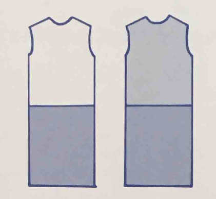

Мы не могли пройти мимо оптических иллюзий в одежде, хотя они набили оскомину
уже - в рунете полно статей на эту тему. Но так заложено в книге, и потому,
чтобы не терять логическую связь, включается и этот топик. Как говорится:
повторенье – мать ученья! Хочу сразу сказать, что в книжке по теме иллюзий не
так много (книга по тэгу - [`fyf`](/tags/fyf/)). Прошло уже более 20 лет с момента издания
данной работы, череда открытий не остановима, и я хочу добавить то, чего не
хватает, и развернуть немного мысль. Итак, вольная композиция на заданную тему,
многабукаф.

Оптическая иллюзия - ошибка в зрительном восприятии, вызванная неточностью или
неадекватностью процессов неосознаваемой коррекции зрительного образа, а также
физическими причинами. Простыми словами: вам показалось :) Использование иллюзий
мы встречаем в работах таких художников, как Сальвадор Дали и Морис Эшер.
Давным-давно люди использовали корсеты, кринолины, чтобы изменить физически
внешний облик фигуры, в наше время средством корректировки фигуры могут
выступать оптические иллюзии. Эти «обманки» играют важную роль при дизайне той
или иной одежды и могут выдавать иногда неожиданные результаты, если не знать,
как они работают.

### Восприятие линий в пространстве

Когда мы смотрим на предметы, прежде всего, видим внутренние и внешние линии
(контур), которые создают особое настроение или чувство. Линию можно представить
в виде прямой (А) или округлой (В), которая движется в пространстве в любом из
направлений: вертикально (1), горизонтально (2) и диагонально (3). Она двигается
либо равномерно, либо загибается, ломается, создавая углы (зигзаг (С), например,
это ломаная прямая, резко меняющая своё движение по диагонали
верх-вниз-верх-вниз...). Внутренние линии в наряде представляются в виде:
рисунка, швов, отделки, карманов, ряда пуговиц, застежек, стрелок на брюках,
накладных и декоративных элементов.

1. Вертикальные линии считываются взглядом быстро, они создают впечатление
   стойкости, силы, боевой готовности.
2. Линии, расположенные горизонтально, подразумевают под собой некую
   расслабленность, спокойствие; взгляд скользит по этим линиям лениво и
   медленно.
3. Линии, идущие по диагонали, представляют собой динамическое движение,
   нетерпеливость, нестабильность.

## Вертикальные и горизонтальные линии

1. Согласно Иллюзии переоценки вертикали: при равной длине _вертикальная_ линия
   удлиняет силуэт, а _горизонтальная_ – расширяет, поэтому:

    - носите _вертикальную_ линию там, где необходимо удлинение и сужение, а
      _горизонтальную_ - там, где нужно расширение или укорочение. Глядя на
      одинаковые квадраты, слева квадрат кажется выше, а справа - шире (линии
      внутри квадратов равны по длине):

   

    - если вы хотите избежать _горизонтальных_ линий в силуэте, то носите либо
      однотонные, либо близкие по цвету и по контрасту вверх и низ. На рисунке:
      справа нет такого заметного контраста между нижней половиной и верхней,
      поэтому горизонтальная линия не так очевидна.

   

    - Будьте осторожны с вертикальными линиями: на обтягивающей одежде они могут
      изгибаться, создавая объем (см. Округлые линии).

2. Иллюзия увеличения фигуры. Пространство, заполненное _горизонтальными_
   линиями, смотрится уже и выше, а при заполнении _вертикальными_ линиями –
   шире.

   

3. Существенную роль играют 2 вертикальные линии, расположенные относительно
   друг друга в пространстве:

   - если линии находятся близко друг к другу (1), то они сужают силуэт;
   - если линии находятся далеко друг от друга (2), то они расширяют силуэт.

   

4. Имеет значение и ширина полосок, т.к. согласно Иллюзии уподобления Шумана:
   широкие полосы расширяют фигуру (Б), а узкие - стройнят (А).

   

5. Понятно, что подол и ремни создают _горизонтальные_ линии. Их длина и
   расположение изменяет восприятие пропорций верхней и нижней половины тела. Вы
   можете создать иллюзию, как длинного туловища, так и длинных ног.

   

   Обратите внимание, что интерес возникает тогда, когда верхняя и нижняя
   половина наряда не равны по длине. Приятный же для глаза наряд можно
   составить по правилу золотого сечения, где соотношение длины нижнего
   (верхнего) элемента наряда к общей длине наряда составляет 3/8, 5/8 или 1/3,
   2/3.

6. Есть еще такой момент: расстояния, находящиеся в верхней части поля нашего
   зрения, кажутся больше, чем расстояния, находящиеся в нижней его части.
   Поэтому при равной длине верхней и нижней половины наряда, верхняя половина
   будет казаться длиннее, шире, чем есть на самом деле, а нижняя короче и уже.

## Диагональные линии

_Диагональные_ линии используют для отвлечения внимания (в них много динамики),
например, ассиметричный вырез горловины или ассиметричная линия подола. Они
добавляют нотку драматизма в наряд.

Но и тут все не просто: чем больше _диагональная_ линия стремиться к
_вертикальному_ положению, тем больше она вытягивает силуэт в высоту. Чем больше
_диагональная_ линия стремиться к _горизонтальному_ положению, тем больше она
расширяет силуэт.

## Округлые линии

_Округлые_ линии работают на увеличение объёма и придание образу женственности.
Если линия всё больше стремится завершить круг (т.е. чем она круглее), тем
больше объёма она создает, т.е. такие линии могут делать фигуру несколько
крупнее.

Как вариант _округлые_ линии можно создать при помощи следующих элементов:
округлые принты, рукава-фонарики (с буфом), округлый ворот, подол, рюши,
кружева, воланы, т.е. все, что мы чаще всего понимаем под стилем Романтика. Чем
больше округлых линий, тем больше объёма.

- Согласно Иллюзии переоценки круга: круг, вписанный в угол, смотрится шире, чем
  идентичный круг, заключенный между двумя параллельными прямыми:

  

  Данную иллюзию можно применить при выборе головного убора: для круглого лица
  подходит прямоугольной формы убор, т.к. вытягивает круг по вертикали, а вот в
  треугольной форме круглое лицо становится еще шире.

* * *

Рассмотрим такой пример платья:

В первую очередь мы замечаем вертикальные линии в нижней части платья, в
застежке на спине; в области талии диагональные линии внешнего силуэта стремятся
стать вертикальными; горизонтальные линии в рукавах расширяют плечи, а округлые
линии увеличивают их объём и придают немного женственности довольно
консервативному платью.

## Углы

Углы в одежде образуются с помощью: принта/рисунка, декорации/украшения,
складок, выточек, вырезов/разрезов или конструктивных элементов (как сшита вещь,
как и с чем её носят).

- Две прямые, если они не параллельны, находятся под углом друг к другу. Место,
  где они максимально сближаются (конвергенция), кажется уже, а место, где они
  максимально расходятся (дивергенция), - шире. На иллюстрации ниже: А - линия
  бёдер кажется шире, линия плеч уже; В - линия бёдер кажется уже, линия плеч
  шире.

  

- Иллюзия Геринга и Вундта. По рис.12. и справа, и слева абсолютно параллельные
  прямые, но нам они кажутся искривленными: слева - выпуклыми (вертикальные
  прямые в центре отталкиваются друг от друга); а справа – вогнутыми
  (вертикальные прямые в центре притягиваются друг к другу).

  

Рассмотрим применение иллюзии Геринга на примере следующего платья: здесь линии
идут из центра к бёдрам, что создает эффект расширения бедер; также в этом
платье есть округлые линии в области груди, что увеличивает грудь в объеме.

- Иллюзия Мюллера-Лайера. На картинке ниже отрезки одинаковой длины, но в
  зависимости от того, какой стороной повернуты внешние уголки относительно
  отрезка, меняется восприятие длины отрезков. Первый отрезок сверху кажется
  короче, чем второй.

  

  Известно, что вертикальные линии вытягивают силуэт, но при использовании
  данной иллюзии на рис.15. уже так не кажется:

Хорошо данная иллюзия работает для достижения определенных видимых пропорций,
например, удлинение ног или туловища.

[Продолжение темы об иллюзиях в одежде.](../2017-03-15-оптические-иллюзии-в-одежде-или-стара-2)
