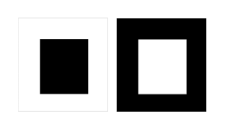

Продолжаем разговор про оптические иллюзии. Начало находится
[здесь](../2017-03-13-оптические-иллюзии-в-одежде-или-стара).

## Эффект иррадиации

Для интересующихся: почему белое полнит, а чёрное стройнит? Ответ кроется в
физике цвета: **черный цвет** объекта - **это отсутствие** отраженного **света**
от объекта, т.е. объект полностью поглощает свет. А сетчатка, не получая света
от объекта, принимает его за объект черного цвета. Если создать полную темноту,
то ни один объект не будет отражать света и все будет черное, как в ванной с
выключенным светом. А **белый цвет** (как и любой другой, кроме черного)
**является отражением света** от объекта. Оптическая система глаза не идеальна,
и при прохождении света через роговицу, хрусталик и стекловидное тело **пучок
света** **несколько рассеивается**, из-за чего белый свет попадает на
пограничные «черные» участки сетчатки, таким образом, получается иллюзия,
которая увеличивает белые объекты и уменьшает черные. Иррадиация (освещаю
лучами, сияю) – это некий выход за пределы допустимого, захват близлежащих
территорий. В медицине – распространение боли за пределы пораженного участка, в
оптике – светлый предмет на темном фоне кажется больше (выходит за пределы
своего реального размера), темный предмет аналогичного размера на светлом фоне
кажется меньше.

Здесь белый квадрат справа кажется больше, чем черный квадрат слева, хотя они
идентичны по размерам:

Однако, посмотрите на эти фотографии:

Заметно, что слева фигура выглядит стройнее, чем справа. Почему так? Несмотря на
то, что внутренний силуэт и там, и там выглядит одинаковым, также известно, что
чёрное стройнит. Обратите внимание на нюансы и поймете почему так:

- на фотографии справа у внутреннего (черного) силуэта платья нет внешней
  светлой «рамочки» в области бёдер, а это делает силуэт более изгибистым,
  округлым (чем больше закругляется линия, тем больше объема она добавляет);
  контрастный вырез под горло внешне приземляет фигуру.
- на фотографии слева есть черная «рамочка», состоящая из вертикальных
  непрерванных линий, что добавляет стройности; черные вертикальные линии на
  светлом фоне кажутся еще тоньше, чем есть на самом деле; цвет внутреннего
  силуэта не контрастирует с цветом кожи (плавно перетекает) в области декольте,
  что опять работает на вытягивание формы по вертикали.

Вывод: черное используем для области, требующей уменьшения объема, а белое - для
области, требующей увеличения объема.

## Иллюзия заполненного пространства

Заполненное пространство (рисунок, декорации) выглядит больше и объемнее, чем
незаполненное (однотонное). Чем крупнее рисунок или детали, тем больше по объему
кажется заполненное пространство.

Для примера используем следующий снимок:

Фигура слева имеет объем в области груди и живота, также горизонтальные полосы
делают шире руки и бедра; справа фигура кажется плоской, только полосы внизу
расширяют бедра.

Поэтому принты, рисунки, декор носим в тех местах, что нуждаются в увеличении
объёма (например, бедра, грудь, ягодицы).

## Иллюзия ассимиляции

Ассимиляция означает уподобление, т.е. быть похожим на кого-то или что-то. В
данном случае здесь не простое подобие, как, например, круглый мысок обуви -
круглые пуговки на пиджаке. Иллюзия ассимиляции показывает, что, если два или
несколько похожих предметов располагаются рядом друг с другом, они ещё больше
подчеркивают схожие между собой моменты.

Здесь мы видим «рассадник» подобных округлых линий: линию подбородка повторяют
прическа (линия челки, укладка), серьги, воротник, ожерелье:

Здесь то же лицо, что и на картинке выше, но посмотрите, как все поменялось:

да, воротник тот же, но добавились острые вытянутые украшения (серьги, кулон),
мягкий треугольник из цепочки-нитки, витиеватая и приподнятая чёлка, прямые
линии в прическе по бокам.

Если хотите усилить эффект от линий или форм, добавляйте рядом похожие предметы,
и, наоборот, для нейтрализации и выравнивания, добавляйте противоположные по
линиям или формам предметы.

## Иллюзия контраста (Иллюзия Дельбёфа и Эббингауза)

Иллюзия Эббингауза. Маленькое рядом с большим, кажется еще меньше, а большое
рядом с маленьким кажется еще больше.

На представленном изображении оранжевые круги одинаковы по размеру, но в каждом
случае размер воспринимается иначе в зависимости от окружения:

Эта «обманка» работает на основе Иллюзии Дельбёфа, т.к. имеет значение
расстояние центрального круга от других кругов, окружающих его, и замкнутость
кольца, что позволяет рассматривать Иллюзию Эббингауза как разновидность Иллюзии
Дельбёфа:

- Если вы хотите увеличить какую-то часть тела, располагайте рядом мелкие
  предметы (например, если у вас маленькая голова, в широкой и большой шляпе она
  потеряется, а в маленькой будет казаться больше, чем есть; в то же время, если
  вы полного строения, то маленькие шляпы только усугубляют положение дела);
- Если хотите уменьшить какую-то часть тела, располагайте рядом крупные предметы
  (при общей полноте ног в изящных босоножках с тонкими каблуками или рядом с
  маленькой сумочкой ноги выглядят еще крупнее, а с большими сумками и в более
  массивной обуви - стройнее).

Если сравнить эти две фотографии Одри Хепберн, где голова кажется меньше, а где
больше?

## Иллюзия глубины

Постепенное уменьшение размера или плотности рисунка/принта, создает Иллюзию
глубины: область с крупным или рассеянным принтом кажется больше, чем область с
наименьшим по размеру рисунком или сплоченным принтом.

Принцип такой же, как, если мы смотрим вдаль.

Возьмём к примеру, леопардовый принт:

Постепенное уменьшение принта от бёдер к лифу создаёт иллюзию, что нижняя часть
тела больше, чем есть на самом деле; грудная клетка кажется меньше, несмотря на
то, что она в центре фотографии, по перспективе ближе к объективу и имеет
большую ложбинку.

Вывод: в той части тела, которая вам кажется очень большой/объёмной и которую вы
не хотите подчеркивать, принт должен быть маленьким, постепенно увеличиваясь к
тому месту, которое вы хотите расширить/увеличить визуально или направить все
внимание на него.

## Иллюзия психологического отвлечения

Все знают, что недостатки фигуры надо скрывать, а достоинства подчёркивать. Для
реализации этого правила служит Иллюзия психологического отвлечения, т.е.
отвлечения внимания. Работает она просто: привлекаем внимание к достоинствам
фигуры с помощью акцентов (декора, украшений, аксессуаров, необычной фурнитуры
ткани, яркого макияжа, рисунка), уводя взгляд от недостатков фигуры или мест,
которые мы не любим в себе/стесняемся.

Здесь главное, не перестараться! Некоторые считают, что все у них прекрасно и
начинают обвешивать себя излишней декорацией по всему телу, как новогоднюю елку.
И тут у зрителя случается конфуз: глаза разбегаются, не зная за что зацепиться;
и эффект, который должен был вызвать фурор, рассеивается.

