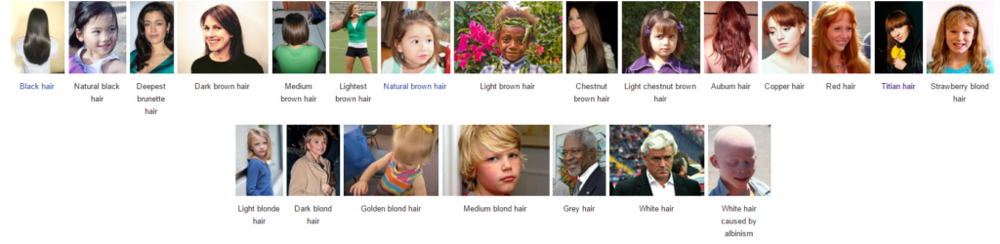
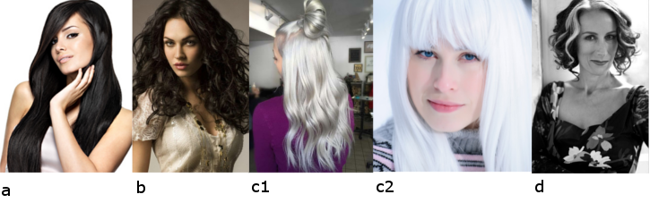
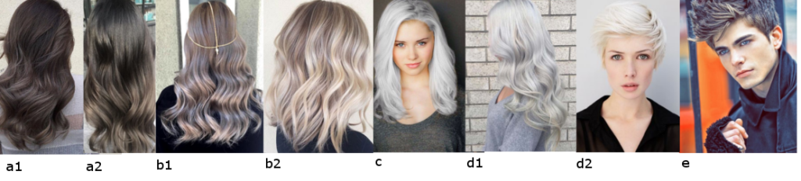
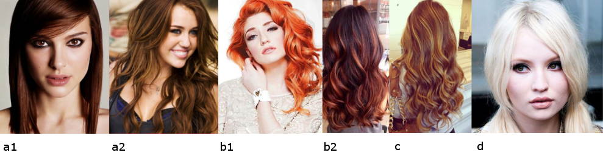
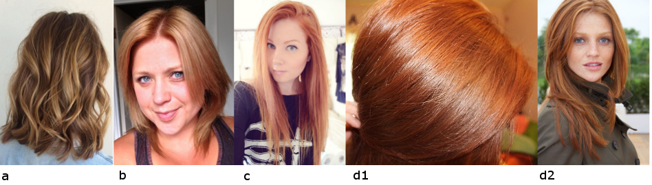

Сегодняшний пост будет про цвет волос для Театрального Романтика (рекомендации
по Кибби).

Кто такой Кибби рассказывать не надо; те, кто интересуется вопросами
собственного стиля уже знакомы с ним, это имя на слуху в России уже лет 5-6 и
его популярность набирает обороты с каждым годом. За что я люблю Кибби? За то,
что он хорош не только в плане подсказки с выбором цвета волос, но и даст советы
по макияжу, по выбору предметов одежды, аксессуаров и как это все совмещать для
каждого типажа.

Для тех, кто первый раз слышит о нем или мало знаком с его интерпретацией
"проявления Инь/Янь во внешнем облике" (пионером была
[Belle Northrup, 1934 г.](../2017-09-05-истоки-теории-о-проявлении-иньян-во-вн)),
но хотел бы побольше узнать про него или определиться со своим типом, предлагаю
заглянуть на любой из сайтов:

- [Эстетическая медицина](http://its-possible.ru/tags-search/?tags=%C4%FD%E2%E8%E4%20%CA%E8%E1%E1%E8);
- [Колор-хармони](http://color-harmony.livejournal.com/);
- [а также группа ВКонтакте](https://vk.com/kibbe?w=wall-76498034_4063).

Если у вас возникло желание изменить цвет волос, но не знаете в какую сторону
идти и с каким цветом экспериментировать? Помощником в этом вопросе может стать
определение цветотипа или воспользоваться советами стилистов. Со своей стороны
могу дать несколько подсказок для решившихся:

1. [**здесь**](../2016-09-18-как-выбрать-правильную-краску-и-что-ну) вы узнаете,
   как окрашивать волосы, чтобы добиться нужного результата, и на какие моменты
   стоит обратить внимание;
2. [**здесь**](../2017-03-29-кое-что-еще-о-цвете-волос-highlights-lights) про
   понятие highlight/light и как его "едят".

Известно всем, что бывают блондины, брюнеты, рыжие, а вот какой оттенок и
светлота/темнота цвета волос не каждый сможет сказать или определить. Какой цвет
у вас?

(Изображение из статьи в Википедии
["разнообразие натуральных оттенков волос человека").](https://en.wikipedia.org/wiki/Human_hair_color)

Если вы знаете свой цветотип, а также типаж Кибби, то его рекомендации вам
помогут выстроить полноценную стилевую фигуру.

#### **Зима (Winter) и Лето (Summer)**

###### _Высокий контраст внешности (High-Contrast coloring)_

a) Черный (Black)  
b) Темный пепельно-коричневый, без мелирования (Dark Ash Brown (no
highlights))  
c) Серебристый/белый (Silver/White)  
d) Серебристые пряди около лица (Silver sprays around the face)  
e) Седину закрашивать, кроме тех случаев, когда появляются седые пряди около
лица (Cover Gray unless it’s sprayed around the face)

###### _Низкий контраст внешности  (Low-Contrast Coloring)_

a) От среднего до мягкого пепельно-коричневого с едва заметными пепельными
бликами (Medium to Soft Ash Brown with subtle Ash lights)  
b) От среднего до бледного пепельного блонда с едва заметными пепельными бликами
(Medium to Pale Ash Blond with subtle Ash lights)  
c) Платиновый (Platinum)  
d) Серебристый/белый (Silver/White)  
e) Седину закрашивать полностью, если только она не проявляется в виде очень
тонких прядок, разбросанных по всей голове ("подернутые инеем") (Cover Gray
unless it’s frosty-looking)

#### Весна (Spring) и  **Осень (Autumn)**

###### _Высокий контраст внешности (High-Contrast coloring)_

a) От темного до интенсивного каштанового с рыжеватым оттенком (Deep to Rich
Chestnut Brown with a Red cast)  
b) Огненно-рыжий/ Красное дерево с интенсивными медными бликами (Fiery Auburn/
Mahogany with rich, coppery lights)  
c) Интенсивный медный с едва заметными золотистыми бликами (Rich Copper with
subtle golden lights)  
d) Теплый белый (с желтоватым тоном) (Warm White)  
e) Седину закрашивать полностью (Cover Gray completely)

###### _Низкий контраст внешности  (Low-Contrast Coloring)_

a) Светлый золотисто-коричневый с интенсивными бликами (Light Golden Brown with
rich lights)  
b) Интенсивный медовый блонд с рыжеватым подтоном (Rich Honey Blond with a Red
cast)  
c) Яркий рыжеватый (с небольшим добавлением розового) (Bright Strawberry)  
d) Светлый/Яркий рыжий (красновато-коричневый) или истинный рыжий (Light/Bright
Auburn or Red)  
e) Седину закрашивать полностью (Cover Gray completely)

Окрашивайте волосы в один интенсивный оттенок, возможно добавление мелирования,
чтобы в целом цвет выглядел богатым, сверкающим. (In general, you need the rich
base from an overall color process, with the possible addition of highlights to
achieve a rich, shimmering color).

* * *

Перевод текста из книги Д. Кибби «Метаморфозы», 1987 г.

Картинки — все, что выдал Google по запросам.
