Начнем с терминологии, чтобы не путаться в понятиях:

**Плечевая одежда (верх)** - одежда, опирающаяся на верхнюю опорную поверхность
тела, т.е. начинается с плеч, груди и идет вниз. Многообразие Плечевой одежды
можно представить так (сюда входят блузки, свитера, жакеты, пальто и пр.):

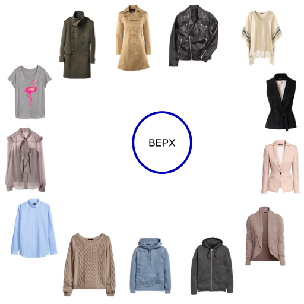

Но по концептуальному применению верх мы можем поделить следующим образом:

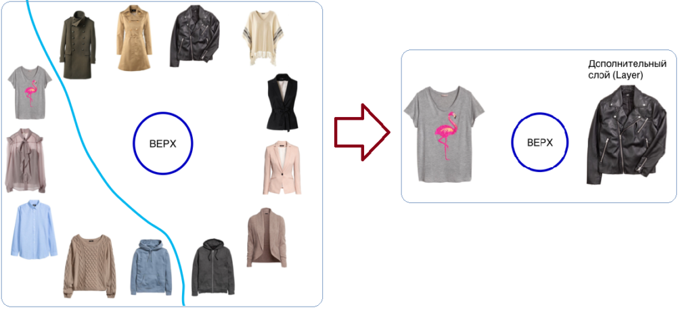

- одежда, с которой начинается "многослойный торт", или базовая одежда
  (футболки, рубашки);
- одежда, используемая в качестве дополнительного слоя для создания тепла или во
  время непогоды (зимняя, демисезонная одежда), иногда может выступать как
  единица творческого комплекта (жилет, например).

Конечно, мы можем и кучу футболок надеть друг на друга, но они не спасут ни от
мороза, ни от дождя. Так же, как и пальто на голое тело (нижнее белье) вы вряд
ли наденете, чтобы выйти в люди или в офис. (В "особом" настроении можно и не
так одеться! Но встает вопрос: куда вы в этом идете и с какой целью?).

**Поясная одежда (низ)** - одежда, опирающаяся на нижнюю опорную поверхность
тела, т.е. которая начинается с талии, бедер (таза) и идет вниз. Штаны, юбки,
шорты и пр.

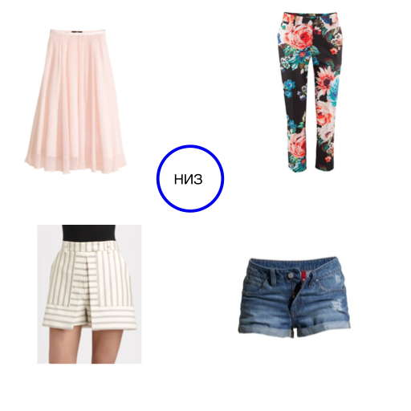

Платья и комбинезоны относятся к Плечевой одежде, но конструктивно это выглядит
как ВЕРХ + НИЗ, т.к. здесь часто углядываются 2 опорные поверхности:

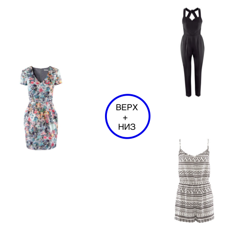

Сегодня мы рассмотрим **Плечевую одежду (верх)** и ее основные элементы (рукав,
ворот, горловина, лацканы) и фасоны (силуэт).

## Как использовать путеводитель

Следующие иллюстрации помогут вам проанализировать, как те или иные линии,
дизайн в одежде будет работать на вашей фигуре. Но для этого нам понадобится уже
[заполненная табличка.](../2017-02-15-определение-особенностей-фигуры-ч-1) В ней
должны быть обведены цифры, соответствующие вашим **Заметным особенностям.**
Примерно так:

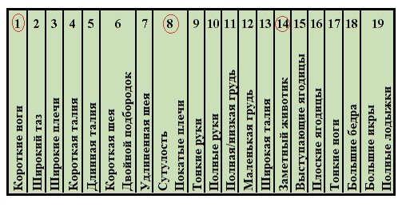

Далее, скачиваете следующие картинки к себе на компьютер и используете Paint или
можно просто распечатать на принтере - как вам удобно. На этих картинках вы
обводите свои цифры, где только их найдете; так же не пропустите советы.

Обратите внимание, что под каждой картинкой есть две строки - поле (+) и поле
(-). В некоторых случаях под одной и той же иллюстрацией может быть обведено
много цифр как в одном поле, так и в разных полях (+) и (-). Пока не
заморачивайтесь, что значат все эти плюсы и минусы, с результатами будем
разбираться позже.

Если вдруг оказалось, что у вас наличествуют только **Незначительные
особенности** (такое бывает), то вам есть чем гордиться, и это дополнительный
повод для радости и улыбок. Только не обводите **Незначительные особенности** в
изображениях**.** Все советы и подсказки для такого типа особенностей были даны
в самом Тесте (в карточках), также далее будет дополнительная статья с теми же
советами, но плюс картинки.

Погнали?

## Вырез горловины, кокетка

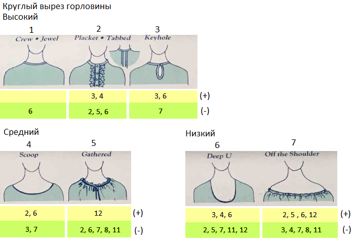

**Вырез горловины (Neckline)**

_Круглый вырез горловины (Round):_

Высокий (High):  
1 - круглый под горло  
2 - с разрезом и с видимой или невидимой на разрезе застежкой  
3 - с разрезом в виде замочной скважины (или капли)

Средний (Medium):  
4 - как часть круга (достаточно широкий) (скуп)  
5 - присборенный (не обязательно собранный на одну ленту)

Низкий (Low):  
6 - как половина овала, виде буквы U  
7 - оголяющий плечи

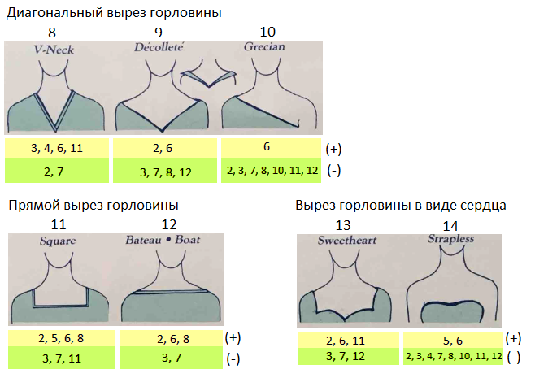

_Диагональный (Diagonal):_  
8 - в виде буквы V  
9 - декольтированный (глубокий и широкий)  
10 - ассиметричный (греческий)

_Прямой (Straight):_  
11 - квадратный (каре)  
12 - лодочка (высокий или средний по глубине, широкий)

_В виде сердца (Heart):_  
13 - в виде сердца с рукавами  
14 - в виде сердца без лямок

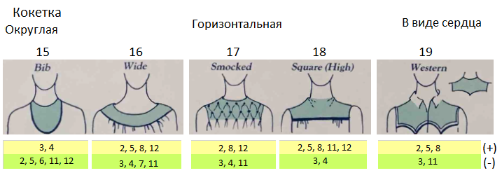

**Кокетка (Yoke):**

_Округлая (Curved):_  
15 - в виде нагрудника (слюнявчика)  
16 - широкая круглая

_Горизонтальная (Horizontal):_  
17 - квадратная со сборками  
18 - квадратная без деталей (под горло)

_В виде сердца (Heart):_  
19 - в западном стиле (вестерн-стайл)

## Воротники, лацканы

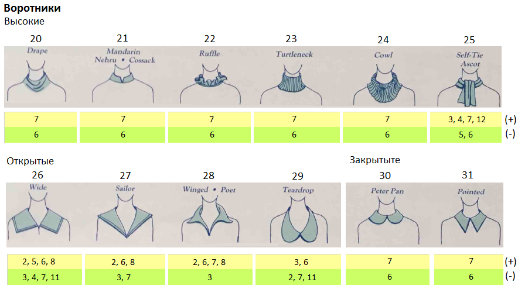

**Воротники (Collars):**

_Высокие (High):_  
20 - драпированный (много складок)  
21 - воротник-стойка (китайский, казачий, неру)  
22 - с оборками  
23 - гольф (водолазка)  
24 - как капюшон, только спереди (драпировка в виде одной складки)  
25 - с завязками, бантом (аскот)

_Открытые (Open):_  
26 - широкий квадратный  
27 - широкий треугольный (морячок)  
28 - рубашечный мягкий треугольный (поэт)  
29 - округлый (каплевидный)

_Закрытые (Closed):_  
30 - рубашечный округлый (Питер Пэн)  
31 - рубашечный с острыми уголками

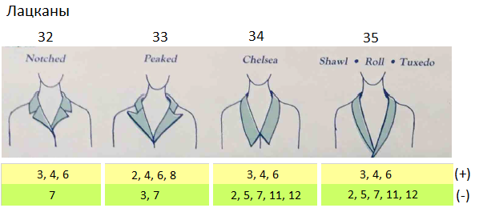

**Лацканы (Lapels):**

32 - зубчатые лацканы  
33 - заостренные лацканы  
34 - челси  
35 - шалевидный (смокинг)

О том, как шейные аксессуары (банты, ожерелья, платки) могут превратить (-) в
(+) мы поговорим попозже, когда коснемся темы аксессуаров.

При двойном подбородке (**особенность 6**): согласно
[Иллюзии ассимиляции](../2017-03-15-оптические-иллюзии-в-одежде-или-стара-2)
рекомендуется избегать округлых линий рядом с лицом (высокие воротники имеют
округлые основания, что подчеркнёт двойной подбородок).

При длинной шее (**особенность 7**): в случаях 26, 27, 29, 32-35 вы можете
поколдовать над глубоким вырезом, добавив украшение под горло, или приподнимите
воротники и лацканы сзади.

## Рукава **(Sleeves)**

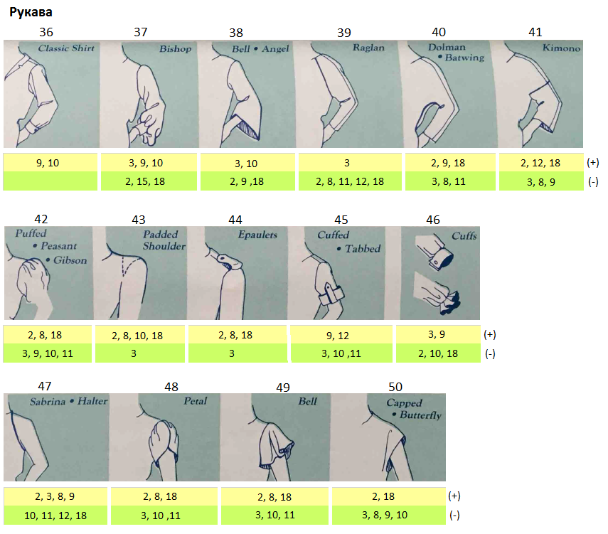

36 - классический рубашечный  
37 - бишоп  
38 - раструб (ангел)  
39 - реглан  
40 - долман (летучая мышь)  
41 - кимоно  
42 - с буфом (крестьянский, гибсон)  
43 - с подплечниками  
44 - с эполетами  
45 - с отворотами  
46 - манжеты  
47 - американская пройма (сабрина)  
48 - лепесток  
49 - колокольчик  
50 - баттерфляй

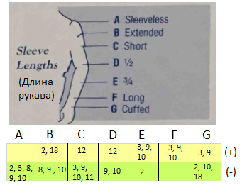

**Длина рукава:**

A - без рукавов  
B - расширенный  
C - короткий  
D - 1/2  
E - 3/4  
F - длинный  
G - с манжетой

Совет для обладателей **особенностей 2 и 8:** всегда используйте подплечники,
где возможно. Совет для обладателей **особенностей 9 и 10:** избегайте
прозрачных или обтягивающих рукавов.

## Топы (базовый верх) (Tops)

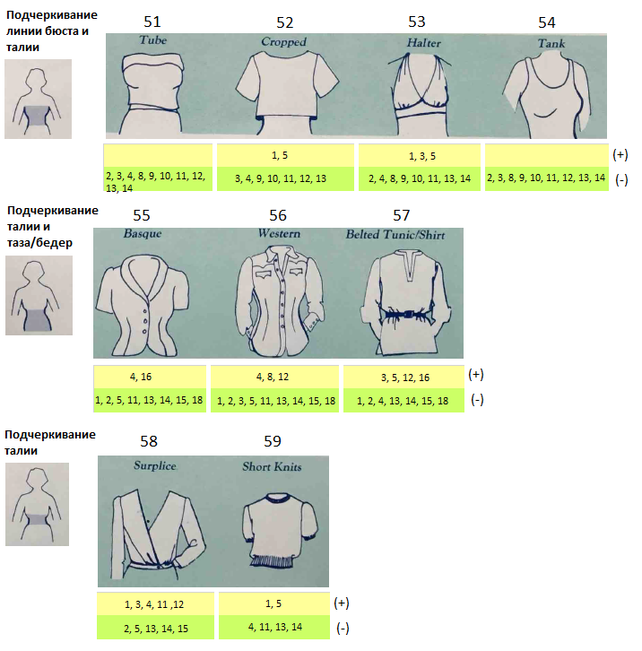

**Подчеркивание линии бюста и талии (Emphasizes bustline and waist):**

51 - цилиндрической формы (туба)  
52 - обрезной  
53 - халтер (американская пройма с подчёркнутым лифом)  
54 - майка

**Подчеркивание талии и таза/бедер (Emphasizes waist and hips):**

55 - корсетного типа с расширением в области таза/бедер  
56 - в западном стиле (вестерн-стайл)  
57 - туника/рубашка с поясом

**Подчеркивание талии (Emphasizes waist):**

58 - с запAхом  
59 - короткие вязаные (трикотажные)

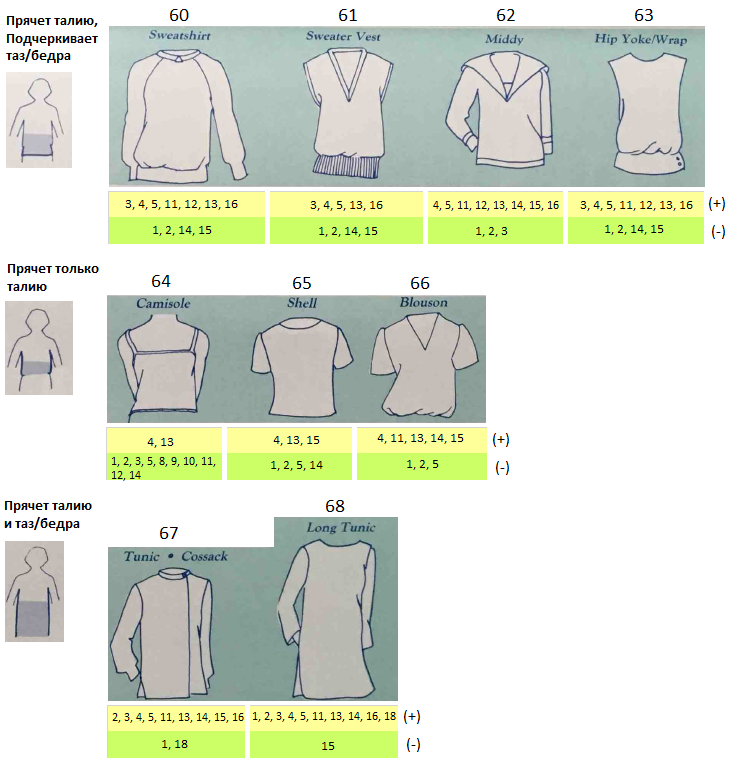

**Прячет талию, подчеркивает таз/бедра (Hides waist, emphasizes hips):**

60 - свитшот  
61 - вязаный жилет  
62 - морячка  
63 - с кокеткой в области таза/бедер  
64 - камисоль (на данном изображении не обтягивающая)

**Прячет только талию, подчеркивает таз/бедра (Hides waist only):**

65 - топ с прямоугольным силуэтом, чаще всего из держащей форму ткани (shell -
панцирь)  
66 - блузон

**Прячет талию и таз/бедра (Hides waist and hips):**

67 - туника (казачья рубашка)  
68 - длинная туника

**Вечная классика:**

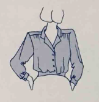

Есть линии и стиль, которые подходят лишь одному типу фигуры. А есть такие линии
и стили, которые хорошо садятся на разные типы фигур. Во втором случае мы
говорим о классике. Независимо, что у нас сейчас в моде, классика всегда будет
уместна и хороша. У блузки вверху к классическому стилю относятся длинные рукава
с манжетами, зубчатый воротник и высокая кокетка со сборками.

**Совет:** одевайте (+) топы поверх (не заправляя) юбок и брюк со знаком (-).

## Дополнительный слой (демисезонная, зимняя одежда и все, что надевается поверх топов) (Layers: Jackets, Coats)

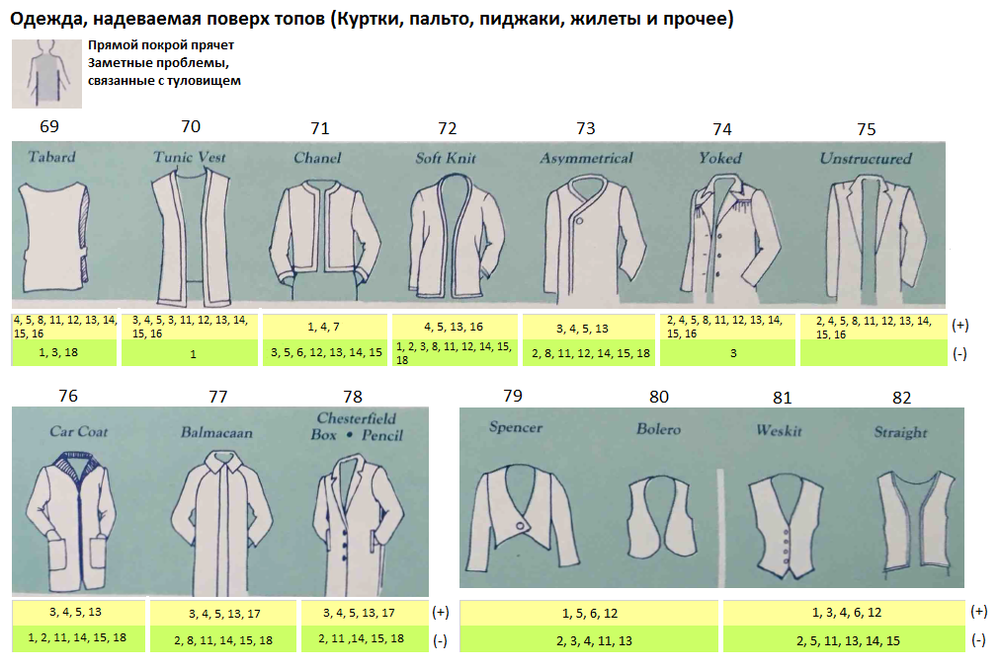 Жилеты (безрукавки) являются
многовариантными предметами одежды: они выступают как дополнительный слой для
тепла, или как гармоничное завершение аутфита (наряда), или используются как
шутливые "нотки" во внешнем облике (те, кто любит поозорничать).

**Прямой покрой (Straight):**  
69 - табард  
70 - удлиненный жилет  
71 - Шанель  
72 - мягкая кофта  
73 - с ассиметричной застежкой  
74 - с кокеткой  
75 - жакет мягкой формы (не подогнанный по фигуре, мало вытачек)  
76 - пальто для водителей авто (каркот)  
77 - балмакан (вид дождевика: свободного покроя, с воротником и рукавами -
реглан)  
78 - честерфилд  
79 - спенсер (что-то типа фрака, в данном варианте без фалды)  
80 - болеро  
81 - жилет с пуговицами  
82 - жилет без пуговиц

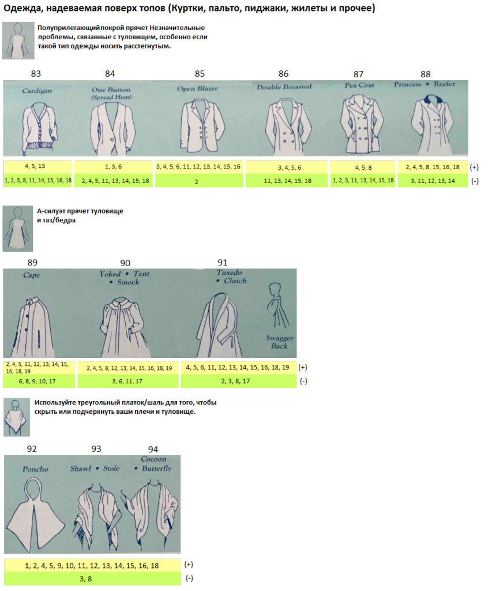

**Полуприлегающий силуэт (Semifitted):**

83 - кардиган  
84 - с одной пуговицей  
85 - блейзер, который носится расстегнутым, или блейзер без застежек  
86 - двубортное (открытая грудь)  
87 - бушлат (закрытая грудь)  
88 - пальто типа шинели (принцесса, рифер) (закрытая грудь)

**А-силуэт (A-line):**

89 - накидка (кейп)  
90 - плащ-палатка  
91 - трапециевидное пальто с шалевидными лацканами. Swagger (напыщенный) back -
сборки сзади на уровне лопаток

**Треугольный покрой (Triangular):**

92 - пончо  
93 - шаль, палантин  
94 - кокон (бабочка)

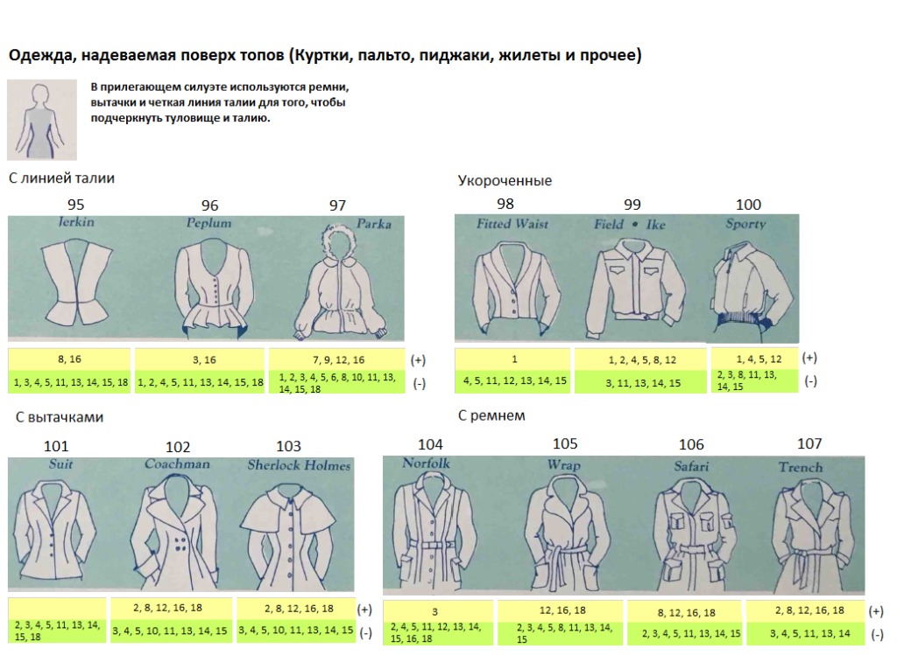

**С линией талии (Waistlines):**

95 - колет (приталенная куртка без рукавов)  
96 - с баской  
97 - парка

**Укороченные (Short):**

98 - приталенный  
99 - армейского стиля (Эйзенхауэр)  
100 - спортивного стиля

**С вытачками (Darts):**

101 - костюм (пиджак)  
102 - приталенное с широкой юбкой (кочмен)  
103 - пальто с накидкой (Шерлок Холмс)

**С ремнем (Belts):**

104 - норфолк  
105 - с запAхом  
106 - сафари  
107 - тренчкот

**Совет:** надевайте пальто, пиджаки, накидки со знаком (+) поверх топов (-).

**Совет:** Чтобы создать интересный аутфит (наряд), комбинируйте короткий верх
(плечевая одежда) с длинным низом (поясная одежда) или наоборот длинный верх и
короткий низ.

**Совет:** Если подол верха (в виде горизонтальной линии) заканчивается на самом
широком месте, то надеваем низ близкий по цвету, контрасту, чтобы уменьшить
влияние горизонтальной линии (
[Иллюзия переоценки вертикали](https://probegalamimo.samoylenko.me/2017/03/13/%D0%BE%D0%BF%D1%82%D0%B8%D1%87%D0%B5%D1%81%D0%BA%D0%B8%D0%B5-%D0%B8%D0%BB%D0%BB%D1%8E%D0%B7%D0%B8%D0%B8-%D0%B2-%D0%BE%D0%B4%D0%B5%D0%B6%D0%B4%D0%B5-%D0%B8%D0%BB%D0%B8-%D1%81%D1%82%D0%B0%D1%80%D0%B0/))
.

## Длина плечевой одежды (Топы и Дополнительный слой (Куртки, Пальто))

В некоторых зарисовках длина изделий является признаком конкретного стиля. Но в
большинстве случаев длина может варьироваться:

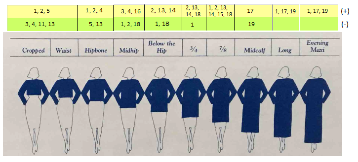

**Croppred** (укороченный) - выше уровня талии  
**Waist** (талия) - на уровне талии  
**Hipbone** (тазовые косточки) - верх тазовых косточек  
**Midhip** (по середине таза) - на уровне середины таза  
**Below the Hip** (ниже таза) - низ таза  
**3/4** - длина три четверти (середина бедра)  
**7/8** - длина семь восьмых (до колена)  
**Midcalf** (середина голени) - середина икры  
**Long** (Длинный) - ниже середины икры и выше щиколотки  
**Evening, Maxi** (вечерний, макси) - на уровне щиколоток и ниже
