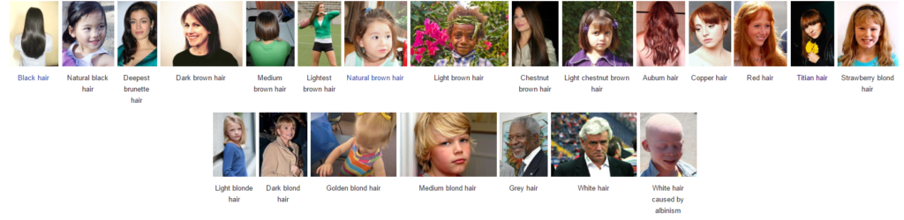

Сегодня выступают на повестке дня Рекомендации по цвету волос для Классиков.

Кто такой Кибби рассказывать не надо; те, кто интересуется вопросами
собственного стиля уже знакомы с ним, это имя на слуху в России уже лет 5-6 и
его популярность набирает обороты с каждым годом. За что я люблю Кибби? За то,
что он хорош не только в плане подсказки с выбором цвета волос, но и даст советы
по макияжу, по выбору предметов одежды, аксессуаров и как это все совмещать для
каждого типажа.

Для тех, кто первый раз слышит о нем или мало знаком с его интерпретацией
"проявления Инь/Янь во внешнем облике" (пионером была
[Belle Northrup, 1934 г.](../2017-09-05-истоки-теории-о-проявлении-иньян-во-вн)),
но хотел бы побольше узнать про него или определиться со своим типом, предлагаю
заглянуть на любой из сайтов:

- [Эстетическая медицина](http://its-possible.ru/tags-search/?tags=%C4%FD%E2%E8%E4%20%CA%E8%E1%E1%E8);
- [Колор-хармони](http://color-harmony.livejournal.com/);
- [а также группа ВКонтакте](https://vk.com/kibbe?w=wall-76498034_4063).

Если у вас возникло желание изменить цвет волос, но не знаете в какую сторону
идти и с каким цветом экспериментировать? Помощником в этом вопросе может стать
определение цветотипа или воспользоваться советами стилистов. Со своей стороны
могу дать несколько подсказок для решившихся:

1. [**здесь**](../2016-09-18-как-выбрать-правильную-краску-и-что-ну) вы узнаете,
   как окрашивать волосы, чтобы добиться нужного результата, и на какие моменты
   стоит обратить внимание;
2. [**здесь**](../2017-03-29-кое-что-еще-о-цвете-волос-highlights-lights) про
   понятие highlight/light и как его "едят".

Известно всем, что бывают блондины, брюнеты, рыжие, а вот какой оттенок и
светлота/темнота цвета волос не каждый сможет сказать или определить. Какой цвет
у вас?

(Изображение из статьи в Википедии
["разнообразие натуральных оттенков волос человека").](https://en.wikipedia.org/wiki/Human_hair_color)

Если вы знаете свой цветотип, а также типаж Кибби, то его рекомендации вам
помогут выстроить полноценную стилевую фигуру.

#### **Зима (Winter) и Лето (Summer)**

###### _Высокий контраст внешности (High-Contrast coloring)_

a) От темного до среднего пепельно-коричневого, без мелирования (Dark to Medium
Ash Brown (no highlights))  
b) Серебристый (Silver)  
c) Белый (White)  
d) Либо не закрашивать седину, оставить как есть, либо использовать тот же цвет,
что и ваш натуральный цвет волос (You may either leave Gray as it comes in, or
cover it by re-creating your original color)

###### _Низкий контраст внешности  (Low-Contrast Coloring)_

a) От среднего до мягкого пепельно-коричневого с едва заметными пепельными
бликами (Medium to Soft Ash Brown with subtle Ash lights)  
b) От среднего до светлого пепельного блонда с едва заметными пепельными бликами
(Medium to Light Ash Blond with subtle Ash lights)  
c) Мягкий серебристый/мягкий белый (Soft Silver/Soft White)  
d) Либо не закрашивать седину, оставить как есть, либо использовать тот же цвет,
что и ваш натуральный цвет волос (You may either leave Gray as it comes in, or
cover it by re-creating your original color)

#### Весна (Spring) и  **Осень (Autumn)**

###### _Высокий контраст внешности (High-Contrast coloring)_

a) Каштановый с едва заметными рыжеватыми бликами (Chestnut Brown with subtle
Red lights)  
b) Средний рыжий (красновато-коричневый) с едва заметными золотистыми бликами
(Medium Auburn with subtle golden lights)  
c) Средний золотисто-коричневый (Medium Golden Brown)  
d) Теплый белый (с желтоватым тоном) (Warm White)  
e) Седину закрашивать полностью, если только она не покрывает всю голову (Cover
Gray unless you’re totally Gray)

###### _Низкий контраст внешности  (Low-Contrast Coloring)_

a) Светлый золотисто-коричневый (Light Golden Brown)  
b) Интенсивный медовый блонд с золотистыми бликами (Rich Honey Blond with subtle
golden lights)  
c) Золотистый блонд (Golden Blond)  
d) Рыжеватый блонд (с небольшим добавлением розового) (Strawberry Blond)  
e) Яркий рыжий (красновато-коричневый) с золотистыми бликами (Light Auburn with
golden lights)  
f) Теплый белый (с желтоватым тоном) (Warm White)  
g) Седину закрашивать полностью, если только она не покрывает всю голову (Cover
Gray unless you’re totally Gray)

Если ваш цвет волос очень темный (каштановый или темный пепельно-коричневый), то
лучше всего окрашивать волосы в один цвет, т.е. без добавления
колорирования/мелирования. Если ваши волосы от среднего до светлого оттенка, то
используйте едва заметное колорирование/мелирование (что достаточно эффектно)
для того, чтобы просто сделать оттенок ваших волос немного светлее. Если вы
начнете закрашивать седину, то выбор должен быть ограничен одним цветом
(колорирование/мелирование не закрасит седину как надо, оно лишь приглушит
натуральный цвет волос и общий эффект от окрашивания будет очень тусклым).

(In general, if your hair is very dark (chestnut or dark ash brown) you will
work best with an overall haircolor as opposed to adding highlights. If your
hair is medium to light, you may find a subtle highlight quite effective to
simply add a little "lift" to your haircolor. As you begin to cover gray, you
will always need to switch to an overall haircolor (the highlights will not
cover the gray properly, they will only mute down the rest of your natural hair
and fade the overall effect of the coloring)).

* * *

Перевод текста из книги Д. Кибби «Метаморфозы», 1987 г.

Картинки — все, что выдал Google по запросам.
