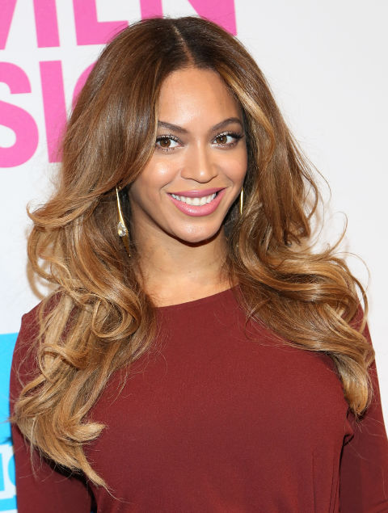

## Понятие Highlights & Lights

Изучая рекомендации по цвету волос для типажей Кибби, часто встречаются слова -
Highlights (мелирование) и lights (блики), а также, что они могут быть и едва
заметными (subtle) и, наоборот, даже очень драматическими (dramatically
streaked).

Highlights (lights) - это **осветление отдельных прядок волос**, в процессе
которого может быть использована фольга, либо - нет (балаяж). Помимо мелирования
существует затемнение прядок (lowlights) или прядки делают разноцветными -
колорирование. Все эти "игры с цветом" прядками не ограничивается, есть еще и
вытягивание цвета по длине волос (омбре). Об этом чуть позже поговорим.

Начнем с того, что Кибби упоминает в своих советах:

- _No highlights._ В рекомендациях у некоторых типажей Кибби предлагает
  воздержаться от мелирования (т.е. красим волосы одной краской):

- _Sweep of color._ Для кого-то и омбре больше подойдёт:

- _Rich lights, streaks_. Кому-то Кибби говорит про яркое, интенсивное
  мелирование (заметные, контрастные пряди на общем фоне):

- _Subtle lights, soft frost_. Есть те, у кого в рекомендациях значатся едва
  заметное мелирование и блики:

- _lights, frost_. Без обычного мелирования тоже не обошлось:

Еще в рекомендациях часто попадалось слово "soften" - смягчение. Например, вы
покрасили волосы и цвет оказался "диким" на ваш взгляд, т.е. слишком яркий или
темный. Понятно, что цвет изменится в течение 3-4 недель, станет светлее и
тусклее, иначе говоря станет таким, как на коробке с краской, или еще больше
вымоется, "смягчится" (чаще всего случается с красками рыжих оттенков). Есть
способы для нетерпеливых натур, которые хотят поскорее "выветрить" всю эту
яркость и уже приблизиться к желаемому цвету и делают это с помощью соды;
погуглите, если интересно и не лень.

Некоторым типажам, в основном c драматическим "налётом" или всевозможным гаминам
(D, TR, G, FG, SG), надо поддерживать яркость цвета постоянно, избегая вот этого
смягчения (таяние цвета). У других персонажей Кибби-типологии в общих
рекомендациях встречается фраза "избегать драматической яркости цвета" (SN, SC),
а смягчение цвета им на руку. Но есть и такие, которым нужно добиваться
натуральных цветов, не выходя за грани - не перебарщивая с яркими цветами, если
только такой цвет не заложен в вас Природой-матушкой, либо чересчур смягчать
оттенок волос (FN, N, DC, C, R). Конкретные рекомендации к своему типажу можно
найти по Тэгу - [`кибби`](/tags/кибби/).

Все что находится в скобках - значит, что данный способ подходит **только** тем,
кто указан в скобках (exc. Dark - всем можно попробовать, кроме темноволосых; P
(lowlights) - можно попробовать **только** затемнить прядки. Высокий контраст
внешности - когда есть ощутимая разница в цвете/светлоте между
волосами/кожей/глазами (Элизабет Тейлор, Шер), низкий контраст внешности - когда
волосы/глаза/кожа сливаются (смешиваются), образуя монохроматический, мягкий
облик (Принцесса Диана, Джейн Фонда).

Самый неясный типаж - это Софт Драматик, т.к. у него рекомендации расходятся в
точке "едва заметное мелирование" :) В общих рекомендациях: "Цвет волос должен
быть интенсивным, ярким, четким. При выборе ненатуральных оттенков, свой взор
направлять на драматические и выделяющиеся цвета (иссиня-черный, огненно-рыжий,
платиновый или яркий желтый блонд). Если использовать мелирование, то выбирать
драматический вид _(яркое мелирование)_. Если седина проявилась в "театральном
_(драматическом)_ ключе" _(т.е. четкими прядками),_ подчеркивать ее балаяжем.
Чем интенсивнее цвет волос, тем лучше. **ИЗБЕГАТЬ:** **Едва заметного
мелирования или деликатного осветления волос.**"

В дополнительных рекомендациях в конце книги (то, что я перевожу и делаю посты):
"В целом, лучше всего красить волосы полностью в один цвет, **можно добавить
после этого едва заметное мелирование для небольшого осветления цвета волос**.
ИЗБЕГАТЬ:
Очень приглушенных (мягких) цветов, а также чрезмерного осветления без
интенсивной или яркой базы (исключая Платиновый).

Подходит ли едва заметное мелирование для такой яркой личности, как Софт
Драматик, как вы думаете? Смущает и тот факт, что для Холодных цветотипов с
низкой контрастностью тот же совет использовать едва заметные блики.

## Немного о разновидностях Highlights & Lights

**Ribboned (ленточное)** - для обладательниц волнистых, кудрявых волос. Цвет
свободно изменяется по длине завивающегося локона, как по спирали (отсюда
сравнение с ленточкой). Цвета любые, в основном мягких оттенков, но могут
использоваться и яркие.

**Lowlights (пряди волос, окрашенные в темный цвет)** - можно сделать как
драматически подчеркнутые темные пряди на светлых волосах, так и вполне
натуральный вид с выгоревшими от жаркого солнца прядками на макушке (ваш цвет
или около того), а внизу около шеи волосы темнее.

**Frosted (покрытый инеем) -** очень тонкие прядки осветляют с разной степенью
выдержки осветлителя: получаются прядки разной светлоты; сюда же входит и
мелирование **"salt & pepper" (соль с перцем)**_._

**Balayage (Балаяж) -** это техника нанесения краски без использования фольги
для более натурального вида окрашенных волос, без четких границ окрашенных
прядок. Окрашивают в основном те места, над которыми солнце и вода работают
летом вместе: кончики волос и прядки у лица.

**Babylights (малыши-светлыши)** \- это тонкие прядки, которые деликатно
осветляются для более натурального вида, как у деток часто бывает (можно вместо
осветления добавить цвет).

**Ombré (омбре) -** слово, позаимствованное из французского языка, которое
означает "затемнение", т.е. цвет растягивается от очень темного оттенка волос на
голове до очень светлого оттенка на концах волос.

**Sombré (сомбре) -** слово, созданное из выражения subtle ombré (едва заметное
омбре). Более мягкий оттенок; неконтрастный переход цвета по насыщенности от
светлого до среднего.

**Slicing (разделение на слои) -** выглядит как "тонкая нарезка", т.е.
осветляются тонюсенькие прядки через равные промежутки.

**Chunky (короткий и толстый) -** осветляются широкие прядки волос.

Избегайте слишком большого контраста в оттенках базы и мелирования
(белый-черный, например), т.к. есть вероятность превратить вашу шевелюру в
ожившего скунса:

Почитать еще о мелировании -
[http://fashion-hairs.net/melirovanie-2017-121-foto/](http://fashion-hairs.net/melirovanie-2017-121-foto/)

***

Про разновидности мелирования информация и картинки взяты из статьи:
[http://www.marieclaire.com/beauty/g2734/celebrity-highlights/?](http://www.marieclaire.com/beauty/g2734/celebrity-highlights/?)

А также верхние картинки - то, что выдал Гугл по запросам.
