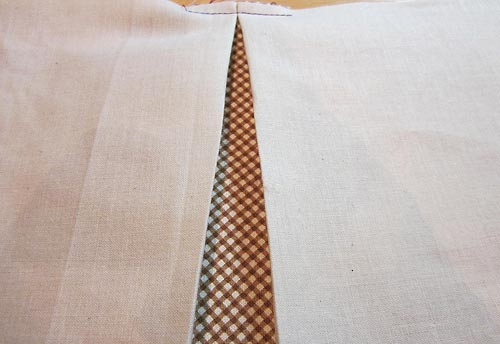

Начало Путеводителя -
[Плечевая одежда, она же верх, она же то, что мы носим, чтобы прикрыть грудь.](../2017-03-23-путеводитель-по-дизайну)

В этой части путеводителя будет Поясная одежда (Юбки, Брюки), совмещенная Низ +
Верх (Комбинезоны, Платья) и Купальники.

## Карманы

**Карманы** (Pockets) используются на: Брюках, Юбках, Платьях, Дополнительном
слое одежды (Куртки, пальто) и Топах.

**Карманы** бывают:

- функциональными (когда можно что-то внутрь положить) или декоративными (ничего
  не положишь, фальш-карман, короче);
- потайными (неочевидными) или бросающимися в глаза (на что обращаешь внимание в
  первую очередь);
- вертикальными и горизонтальными (округлые, прямоугольные и в виде прямой
  линии).

## Юбки (Skirts)

_Юбка - это самостоятельная единица одежды, так и составная часть платьев._

**Модернизированный дирндль**

_Представьте немецкую девушку, которая работает в таверне где-нибудь в Баварии.
На ней: белая блузка с рукавами-фонариками, поверх которой идет корсет, а внизу
широкая юбка и фартучек - этот костюм называется
[**Дирндль**](https://www.google.com/search?q=%D0%B4%D0%B8%D1%80%D0%BD%D0%B4%D0%BB%D1%8C)
. **Модернизированный дирндль** - это только одна юбка, уже не широкая, а прямая,
и из костюма перетащившая сборки у пояса._

Подходит многим. Создает прямой силуэт без подчеркивания Незначительных
особенностей фигуры. В ней удобно как ходить, двигаться, так и сидеть. Подходит
к любому блейзеру (жакету, пиджаку).

_Прямые (Straight):_  
108 - прямая  
109 - с вертикальной застежкой посередине  
110 - ассиметричная  
111 - с бантовыми складками

_Расклешенная (Flared):_  
112 - годе (русалка)

_Сужающиеся книзу (Tapered):_  
113 - зауженные книзу  
114 - саронг

_С плиссировкой (Pleats):_  
115 - с простроченной (в области таза/бедер каждая складочка сшита с соседней в
одно полотно, а ниже начинается "гармошка")  
116 - вывернутая на изнанку, бантовая (складки гармошкой) - проще показать, чем
объяснить, потому что есть отличия:

вывернутая на изнанку (виде треугольника) - внутренняя складка

бантовая (внешняя складка)

117 - складки острой лесенкой

_**Плиссе** может сделать силуэт стройнее в области таза/бедер, если складки
узкие и приглажены (не топорщатся), сшиты. Толстая ткань и широкие складки или
складки, которые очень топорщатся (даже узкие), делают силуэт в области
таза/бедер шире._

_А-силуэта (A-line) - очень хороший фасон, который маскирует многие типы
Особенностей. Хороший комплект получается путем комбинирования данного типа юбок
с короткими жакетами и жакетами до середины таза (short to mid-hip jackets):_  
118 - измененный дирндль (с пуговицами)  
119 - кюлоты, одна складка впереди  
120 - с широкой вставкой (может быть и из другой материи)  
121 - юбка из восьми клиньев  
122 - с запахом, килт (шотландка)

_Широкие (Full):_  
123 - дирндль (пышная, много сборок у пояса)  
124 - многоярусная  
125 - с оборками  
126 - юбка-солнце  
127 - с кокеткой, с заниженной талией

**Совет:** Юбки (-) можно сочетать с топами, куртками, жакетами со знаком (+)
для удачного наряда. Особенно это эффективно при **Особенностях 14, 15, 18.**

## Брюки (Pants)

**Верхняя часть брюк (Pant tops):**

128 - с гладкой поверхностью (без складок, вытачек, ширинок, молний)  
129 - брючный тип (с ширинкой)  
130 - джинсовый тип (с ширинкой и с округлыми карманами)  
131 - плотно облегающие область таза и ягодиц (с заниженной линией талии; в 60,
70 и в начале 80-х штанина была расклешенной от бедра; в 2000-х - штанина была
расклешена от колена - новое название "буткат" (Boot cut))  
132 - с высокой посадкой (с высокой талией)  
133 - ограниченные, со складками, со сборками  
134 - со сборками (пышный верх около талии; пояс-резинка)  
135 - с кокеткой  
136 - драпированные (много свисающих складок)  
137 - панталоны  
138 - широкие шорты (иногда могут выглядеть как юбка (скортс); Skorts = shorts
(шорты) + skirt (юбка))

**Тип штанин:**

139 - джодпуры (штаны для верховой езды, идеально подходящие под сапоги для
верховой езды (jodphur, ridding boots) или штиблеты, офицерки (польск.яз))  
140 - облегающие штаны (легинсы), трико, со штрипками, лыжные  
141 - зауженные книзу  
142 - прямые  
143 - расклешенные от колена, палаццо (я бы их передвинула в пункт 144, т.к.
штанина широкая от талии), брюки-клеш  
144 - широкие (клеш от бедра, брючина расширяется от талии к полу; место, где
штанины соединяются, находится ниже естественной линии промежности), багги
(очень широкая штанина или широкая штанина, сужающаяся от коленки к щиколотке;
линия промежности занижена, бывает доходит до коленей (мотня))  
145 - треники, джоггеры, шаровары

## Платья, Комбинезоны

**Комбинезоны (Jumpsuits)**

146 - боди, юнитард (полностью облегающий тело, комбинезон-трико; для спорта,
для костюмов (человек-паук, женщина-кошка))  
147 - полукомбинезон (штаны с нагрудником)

**Платья (Dresses):**

_По уровню талии (Descending waistlines)_  
148 - летнее платье - под грудью  
149 - в стиле ампир - с завышенной талией  
150 - в виде широкой вставки или широкая вставка с мелкими сборками (сельского
типа) - от талии выше  
151 - с нагрудником (надевается на блузки, свитера, рубашки) - на талии  
152 - блузон (с напускной талией) - чуть ниже линии талии  
153 - обтягивающая заниженная талия - на уровне таза  
154 - табард - на уровне середины таза  
155 - женская сорочка - ниже уровня таза

_С обозначенной талией (Suggested waistlines)_  
156 - облегающее, платье-футляр  
157 - А-силуэт, принцесса  
158 - с запAхом, платье в виде пальто (из демисезонного материала, для
формальных выходов, типа сюртука (редингота))

_Без акцента на талии (No waistlines)_  
159 - без ремня, сорочка  
160 - парящее  
161 - с кокеткой, кафтан, палатка, муу-муу

Платья прямого покроя (№ 159) подходят многим. Узкие платья подчеркивают все
Особенности фигуры.

## Длина поясной одежды

| **Skirt** (Юбки)                                                      | **Pants** (Брюки)                                                                                                       |
|:----------------------------------------------------------------------|:------------------------------------------------------------------------------------------------------------------------|
| **Costume** (Костюмированные) — очень короткие, выше середины бедра   | **Shorts** (шорты) — шорты, выше середины бедра                                                                         |
| **Mini** (Мини) — около середины бедра                                | **Jamaican** (Ямайские) — около середины бедра                                                                          |
| **Above the knee** (Выше колена) — между серединой бедра и коленом    | **Bermuda, Walking** (Бермуды, Прогулочные) — между серединой бедра и коленом                                           |
| **Below the knee** (Ниже колена) — сразу под коленом                  | **Pedal Pushers, Clam Diggers** (Велосипедки, укороченные штаны для поиска и выкапывания моллюсков) — сразу под коленом |
| **Midcalf** (середина голени) — середина икры                         | **Toreador, Capri** (Тореадор, Капри) — середина икры                                                                   |
| **Tea, Waltz** (чай, вальс) — ниже середины голени, но выше щиколотки | **Cropped** (Укороченные) — ниже середины голени, но выше щиколотки                                                     |
|                                                                       | **Cuffed** (с отворотами) — с отворотами, прикрывают щиколотку                                                          |
| **Evening** (вечернее) — ниже щиколотки                               | **Long** (Удлиненные) — ниже щиколотки                                                                                  |

## Купальники (Swimwear)

Ясное дело, тяжело скрывать свои Особенности под купальником, не спрячешь ни
плечи, ни руки, ни ноги, ни бедра, приходится показывать все как есть.

_Верхняя часть (Upper torso):_  
162 - бикини (без лямок, типа бандокини)  
163 - составной купальник (с подкладками, в виде бюстгальтера)  
164 - халтер (американская пройма)  
165 - камисоль (с прямоугольным вырезом горловины, с лямками)  
166 - без лямок (в отличие от бикини закрывает талию)  
167 - с оборочками  
168 - с запAхом

_Нижняя часть (Lower torso):_  
169 - бикини  
170 - типа хипстеров (трусы)  
171 - боксеры  
172 - с юбкой  
173 - викини (с высоко поднятой боковой полоской, в виде буквы V)  
174 - с заниженной талией, с оборками, складками  
175 - саронг

Средняя часть (Mid torso):

176 - слитный  
177 - с ремнем  
178 - блузон

В оптических иллюзиях мы говорили про влияние линий и принта, декора на общее
восприятие, в купальниках это может быть так:

A - на обтягивающей одежде полоски могут изгибаться, создавая объем и
подчеркивая все выпуклости

B - такого рода принты (небольшие и симметричной рябью) хорошо прикрывают
Незначительные Особенности фигуры

C - разбросанный декор, вставки или с вырезанными частями, под которыми видно
тело (cut-outs) привлекают внимание

D - линии создают иллюзию узкой талии

_На этом наш Путеводитель заканчивается, но еще аксессуары не упоминались - все
будет далее. Все пароли и явки по (+) и (-) будут в следующей статье, там мы еще
поговорим про **Блинк-тест.**_
