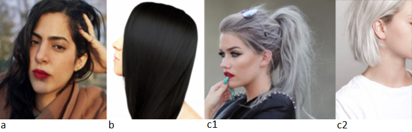
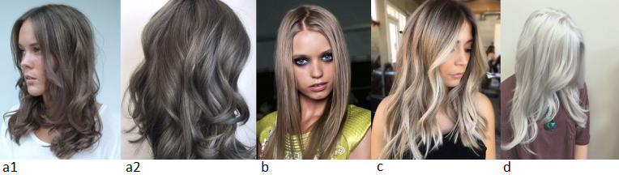
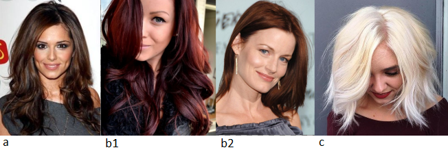
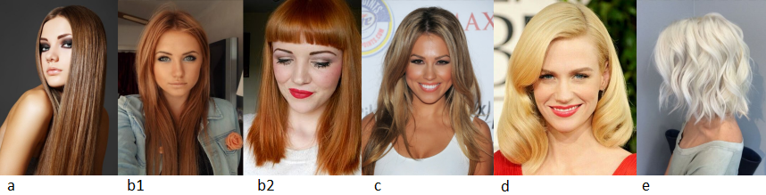

Давненько меня здесь не было :) Сегодняшний пост будет о рекомендациях для
Драматических Классиков в рамках Советов Кибби по цвету волос.

Кто такой Кибби рассказывать не надо; те, кто интересуется вопросами
собственного стиля уже знакомы с ним, это имя на слуху в России уже лет 5-6 и
его популярность набирает обороты с каждым годом. За что я люблю Кибби? За то,
что он хорош не только в плане подсказки с выбором цвета волос, но и даст советы
по макияжу, по выбору предметов одежды, аксессуаров и как это все совмещать для
каждого типажа.

Для тех, кто первый раз слышит о нем или мало знаком с его интерпретацией
"проявления Инь/Янь во внешнем облике" (пионером была
[Belle Northrup, 1934 г.](../2017-09-05-истоки-теории-о-проявлении-иньян-во-вн)),
но хотел бы побольше узнать про него или определиться со своим типом, предлагаю
заглянуть на любой из сайтов:

- [Эстетическая медицина](http://its-possible.ru/tags-search/?tags=%C4%FD%E2%E8%E4%20%CA%E8%E1%E1%E8);
- [Колор-хармони](http://color-harmony.livejournal.com/);
- [а также группа ВКонтакте](https://vk.com/kibbe?w=wall-76498034_4063).

Если у вас возникло желание изменить цвет волос, но не знаете в какую сторону
идти и с каким цветом экспериментировать? Помощником в этом вопросе может стать
определение цветотипа или воспользоваться советами стилистов. Со своей стороны
могу дать несколько подсказок для решившихся:

1. [**здесь**](../2016-09-18-как-выбрать-правильную-краску-и-что-ну) вы узнаете,
   как окрашивать волосы, чтобы добиться нужного результата, и на какие моменты
   стоит обратить внимание;
2. [**здесь**](../2017-03-29-кое-что-еще-о-цвете-волос-highlights-lights) про
   понятие highlight/light и как его "едят".

Известно всем, что бывают блондины, брюнеты, рыжие, а вот какой оттенок и
светлота/темнота цвета волос не каждый сможет сказать или определить. Какой цвет
у вас?

(Изображение из статьи в Википедии
["разнообразие натуральных оттенков волос человека").](https://en.wikipedia.org/wiki/Human_hair_color)

Если вы знаете свой цветотип, а также типаж Кибби, то его рекомендации вам
помогут выстроить полноценную стилевую фигуру.

#### **Зима (Winter) и Лето (Summer)**

###### _Высокий контраст внешности (High-Contrast coloring)_

a) Черный (при условии, что оттенок кожи оливковый) (Black (only if skin tone is
olive))  
b) Темный пепельно-коричневый, без мелирования (Dark Ash Brown (no highlights))  
c) Серебристый/белый (Silver/ White)  
d) Седину закрашивать полностью, если только она не покрывает полностью голову
или если она в виде ярких прядок (Cover Gray unless it’s dramatically streaked
or you’re totally Gray)

###### _Низкий контраст внешности  (Low-Contrast Coloring)_

a) От среднего до мягкого коричневого с пепельным оттенком (Medium to Soft Ash
Brown)  
b) Любой оттенок пепельного блондина (Any shade of Ash Blond)  
c) Крупные пряди светло-пепельного блонда (Bold streaks of Light Ash Blond)  
d) Мягкий, снежно-белый (Soft, snowy White)  
e) Седину закрашивать полностью, если только она не покрывает полностью голову
(Cover Gray unless you’re totally Gray)

#### Весна (Spring) и  **Осень (Autumn)**

###### _Высокий контраст внешности (High-Contrast coloring)_

a) Темный каштановый (Deep Chestnut Brown)  
b) Красное дерево/Темный рыжий (красновато-коричневый) (Mahogany / Deep Auburn)  
c) Теплый оттенок белого (Warm White)  
d) Седину закрашивать полностью (Cover Gray completely)

###### _Низкий контраст внешности  (Low-Contrast Coloring)_

a) Золотистый светло-коричневый (Light Golden Brown)  
b) Светлый рыжий (красновато-коричневый)/Медный (Light Auburn/Copper)  
c) Темный медовый блонд (Deep Honey Blond)  
d) Яркий золотистый блонд (Bright Golden Blond)  
e) Теплый оттенок белого (Warm White)  
f) Седину закрашивать полностью, если только она не покрывает полностью голову
(Cover Gray unless you’re totally Gray)

В целом, вам нужно придерживаться насыщенной базы цветов при процедуре
окрашивания волос. Это обеспечит четко выраженный цвет, который нужно постоянно
поддерживать. Если вы хотите закрасить седину, то оставьте в стороне те оттенки,
что светлее вашего натурального цвета волос; т.к. они смотрятся очень мягкими,
приглушенными на вас и придают вашему лицу уставший, замученный вид или делают
вас великовозрастной матроной, что не вяжется с вашей бесстрашной и в то же
время утонченной элегантностью. (In general, you need the rich base from an
overall haircolor process. This will provide the distinct haircolor that must be
maintained. If you are seeking to cover gray, never choose a shade lighter than
your original haircolor; it will be too soft and muted for you and will give you
a tired, matronly appearance that is not in keeping with your bold and
sophisticated elegance).

ИЗБЕГАТЬ: процедур, которые могут смягчить цвет волос. Не перестарайтесь с
осветлением. (AVOID: All processes designed to “soften” the haircolor. Be
careful not to overlighten the hair).

* * *

Перевод текста из книги Д. Кибби "Метаморфозы", 1987 г.

Картинки - все, что выдал Google по запросам.
