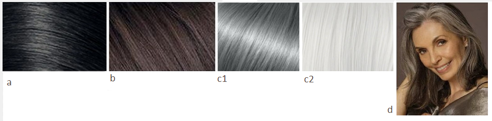

Сегодня пришла очередь рассказать про Софт Классика и какие Рекомендации дает
Кибби по окрашиванию волос.

Кто такой Кибби рассказывать не надо; те, кто интересуется вопросами
собственного стиля уже знакомы с ним, это имя на слуху в России уже лет 5-6 и
его популярность набирает обороты с каждым годом. За что я люблю Кибби? За то,
что он хорош не только в плане подсказки с выбором цвета волос, но и даст советы
по макияжу, по выбору предметов одежды, аксессуаров и как это все совмещать для
каждого типажа.

Для тех, кто первый раз слышит о нем или мало знаком с его интерпретацией
"проявления Инь/Янь во внешнем облике" (пионером была
[Belle Northrup, 1934 г.](../2017-09-05-истоки-теории-о-проявлении-иньян-во-вн)),
но хотел бы побольше узнать про него или определиться со своим типом, предлагаю
заглянуть на любой из сайтов:

- [Эстетическая медицина](http://its-possible.ru/tags-search/?tags=%C4%FD%E2%E8%E4%20%CA%E8%E1%E1%E8);
- [Колор-хармони](http://color-harmony.livejournal.com/);
- [а также группа ВКонтакте](https://vk.com/kibbe?w=wall-76498034_4063).

Если у вас возникло желание изменить цвет волос, но не знаете в какую сторону
идти и с каким цветом экспериментировать? Помощником в этом вопросе может стать
определение цветотипа или воспользоваться советами стилистов. Со своей стороны
могу дать несколько подсказок для решившихся:

1. [**здесь**](../2016-09-18-как-выбрать-правильную-краску-и-что-ну) вы узнаете,
   как окрашивать волосы, чтобы добиться нужного результата, и на какие моменты
   стоит обратить внимание;
2. [**здесь**](../2017-03-29-кое-что-еще-о-цвете-волос-highlights-lights) про
   понятие highlight/light и как его "едят".

Известно всем, что бывают блондины, брюнеты, рыжие, а вот какой оттенок и
светлота/темнота цвета волос не каждый сможет сказать или определить. Какой цвет
у вас?

(Изображение из статьи в Википедии
["разнообразие натуральных оттенков волос человека").](https://en.wikipedia.org/wiki/Human_hair_color)

Если вы знаете свой цветотип, а также типаж Кибби, то его рекомендации вам
помогут выстроить полноценную стилевую фигуру.

### **Зима (Winter) и Лето (Summer)**

###### _Высокий контраст внешности (High-Contrast coloring)_

a) Темный пепельно-коричневый, без мелирования (Dark Ash Brown (no highlights))  
b) Средний пепельно-коричневый, без мелирования (Medium Ash Brown (no
   highlights))  
c) Серебристый/белый (Silver/White)  
d) Прядки приглушенно-серебристого цвета, обрамляющие лицо (Soft Silver sprayed
   around the face)  
e) Оставить ли седину или ее закрасить - все на ваш выбор (You may either leave
   Gray or cover it)

###### _Низкий контраст внешности (Low-Contrast Coloring)_

a) От среднего до мягкого пепельно-коричневого с едва заметными пепельными
   бликами (Medium to Soft Ash Brown with subtle Ash lights)  
b) От среднего до мягкого пепельного блонда с пепельными бликами (Medium to Soft
   Ash Blond with subtle Ash lights)  
c) Очень тонкие светлые прядки мягких оттенков, обрамляющие лицо (Soft frosting
   around the face)  
d) Смягченный оттенок белого (Soft White)  
e) Либо закрасить седину, либо оставить как есть (You may either leave Gray or
   cover it)

### **Весна (****Spring****) и** **Осень (****Autumn****)**

###### _Высокий контраст внешности (High-Contrast coloring)_

a) От среднего до мягко-каштанового с рыжеватыми бликами (Medium to Soft
   Chestnut Brown with subtle Red lights)  
b) Насыщенный рыжий/Медный с едва заметными золотистыми бликами (Rich Auburn/
   Copper with subtle golden lights)  
c) Теплый белый (с желтоватым тоном) (Warm White)  
d) Полностью закрашивать седину (Cover Gray completely)

###### _Низкий контраст внешности (Low-Contrast Coloring)_

a) Теплый оттенок светло-коричневого с золотистыми бликами (Light Warm Brown
   with golden lights)  
b) Медовый блонд с едва заметными рыжеватым оттенком (Honey Blond with a subtle
   Red cast)  
c) Рыжий блонд (с небольшим добавлением розового) (Strawberry Blond)  
d) Светлый рыжий (красновато-коричневый) с золотистыми бликами (Light Auburn
   with golden lights)  
e) Теплый белый (с желтоватым тоном) (Warm White)  
f) Полностью закрашивать седину (Cover Gray completely)

Если ваша внешность высокой контрастности (Зима или Осень), то нужно добиваться
интенсивности и глубины цвета полноценного окрашивания (без мелирования). Если
вы обладательница низкоконтрастной внешности, то едва заметное мелирование
подходит вам больше, т.к. получается переливающийся оттенок волос; но для
закрашивания седины придерживайтесь полного окрашивания волос (без мелирования).
Иначе мелирование будет либо заглушать ваш цвет волос (обесцвечивая вашу
внешность), либо сделает внешность чрезмерно яркой и неестественной
(грубоватой).

(In general, if you’re a high-contrast person (winter or autumn), you’ll need
the richness and depth from an overall color process. If you’re a low-contrast
person, you may find a subtle highlight quite effective to add a little shimmer,
but when covering gray, you must switch to an overall process. Otherwise, the
highlights will either mute down your haircolor (which will fade you) or overly
"brighten" your coloring and give a brassy effect.)

* * *

Перевод текста из книги Д. Кибби «Метаморфозы», 1987 г.

Картинки — все, что выдал Google по запросам.
