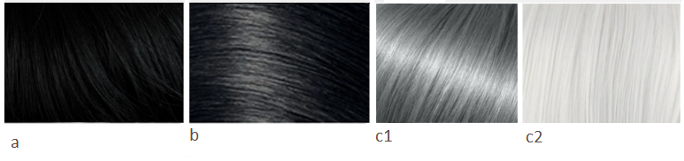
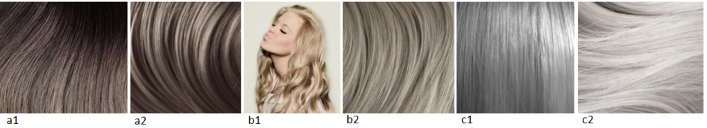
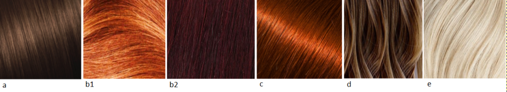
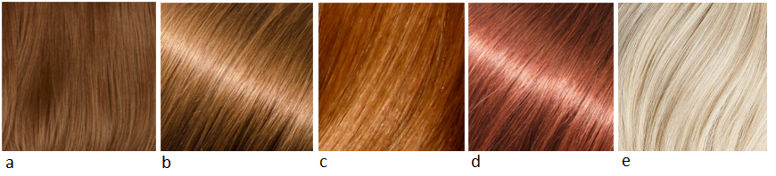

Приступим к семье Натуралов? Сегодня порция советов от Кибби для Натурала,
следующим будет Флэмбоянт (Яркий) Натурал.

Кто такой Кибби рассказывать не надо; те, кто интересуется вопросами
собственного стиля уже знакомы с ним, это имя на слуху в России уже лет 5-6 и
его популярность набирает обороты с каждым годом. За что я люблю Кибби? За то,
что он хорош не только в плане подсказки с выбором цвета волос, но и даст советы
по макияжу, по выбору предметов одежды, аксессуаров и как это все совмещать для
каждого типажа.

Для тех, кто первый раз слышит о нем или мало знаком с его интерпретацией
"проявления Инь/Янь во внешнем облике" (пионером была
[Belle Northrup, 1934 г.](../2017-09-05-истоки-теории-о-проявлении-иньян-во-вн)),
но хотел бы побольше узнать про него или определиться со своим типом, предлагаю
заглянуть на любой из сайтов:

- [Эстетическая медицина](http://its-possible.ru/tags-search/?tags=%C4%FD%E2%E8%E4%20%CA%E8%E1%E1%E8);
- [Колор-хармони](http://color-harmony.livejournal.com/);
- [а также группа ВКонтакте](https://vk.com/kibbe?w=wall-76498034_4063).

Если у вас возникло желание изменить цвет волос, но не знаете в какую сторону
идти и с каким цветом экспериментировать? Помощником в этом вопросе может стать
определение цветотипа или воспользоваться советами стилистов. Со своей стороны
могу дать несколько подсказок для решившихся:

1. [**здесь**](../2016-09-18-как-выбрать-правильную-краску-и-что-ну) вы узнаете,
   как окрашивать волосы, чтобы добиться нужного результата, и на какие моменты
   стоит обратить внимание;
2. [**здесь**](../2017-03-29-кое-что-еще-о-цвете-волос-highlights-lights) про
   понятие highlight/light и как его "едят".

Известно всем, что бывают блондины, брюнеты, рыжие, а вот какой оттенок и
светлота/темнота цвета волос не каждый сможет сказать или определить. Какой цвет
у вас?

(Изображение из статьи в Википедии
["разнообразие натуральных оттенков волос человека").](https://en.wikipedia.org/wiki/Human_hair_color)

Если вы знаете свой цветотип, а также типаж Кибби, то его рекомендации вам
помогут выстроить полноценную стилевую фигуру.

### **Зима (Winter) и Лето (Summer)**

###### _Высокий контраст внешности (High-Contrast coloring)_

a) Черный (при условии, что оттенок кожи оливковый) (Black (only if you’re
   complexion is olive))  
b) Темный пепельно-коричневый, без мелирования (Dark Ash Brown (no highlights))  
c) Серебристый/белый (Silver/ White)  
d) Закрашивать или нет седину - выбор за вами (You may either leave Gray or
   cover as it comes in)

###### _Низкий контраст внешности  (Low-Contrast Coloring)_

a) От среднего до мягкого пепельно-коричневого с едва заметными пепельными
   бликами (Medium to Soft Ash Brown with subtle Ash lights)  
b) От среднего до мягкого пепельного блонда с пепельными бликами (Medium to Soft
   Ash Blond with subtle Ash lights)  
c) Серебристый серый/Смягченный оттенок белого (Silver Gray/ Soft White)  
d) Закрашивать или нет седину - выбор за вами (You may either leave Gray or
   cover it as it comes in)

### **Весна (****Spring****) и** **Осень (****Autumn****)**

###### _Высокий контраст внешности (High-Contrast coloring)_

a) Любой оттенко каштанового (Any shade of Chestnut)  
b) Насыщенный рыжий/Красное дерево (Rich Auburn/ Mahogany)  
c) Насыщеннй медный (Rich Copper)  
d) Золотистый средне-коричневый (Medium Golden Brown)  
e) Теплый белый (Warm White)  
f) Седину закрашивать полностью, если только она не покрывает полностью голову
   (Cover Gray unless you’re totally Gray)

###### _Низкий контраст внешности  (Low-Contrast Coloring)_

a) Золотистый светло-коричневый (Light Golden Brown)  
b) Интенсивный медовый блонд (Rich Honey Blond)  
c) Светлый рыжий (красновато-коричневый) (Light Auburn)  
d) Светло-медный (Light Copper)  
e) Теплый белый (Warm White)  
f) Седину закрашивать полностью, если только она не покрывает полностью голову
   (Cover Gray unless you’re totally Gray)  
g) Возможно, вы захотите добавить парочку почти незаметных "прядок, позолоченных
   солнцем" (NOTE: You may wish to add a few very subtle “sun streaks”)

В общем и целом, вам нужно использовать однотонное окрашивание. Если у вас
внешность низкой контрастности (Весна или Лето), то можно просто слегка
осветлить несколько прядок. Никаких прядок, выглядящих искусственно и вычурно,
предпочтение отдавать только натуральным на вид, т.е. как выгоревшие на солнце.

In general, you will want the richness an overall color process provides. If you
are a low-contrast person (spring or summer), you may simply want to add a few
subtle highlights. Just make sure they always look as if the sun added them, as
opposed to an obviously artificial “streaking.”

* * *

Перевод текста из книги Д. Кибби «Метаморфозы», 1987 г.

Картинки — все, что выдал Google по запросам.
