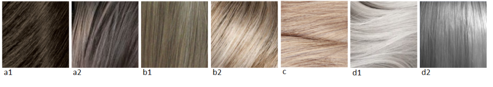

Сегодня выступает в качестве главного героя статьи Флэмбоянт Натурал, он же
Яркий Натурал - это Натурал + немного "драматических" специй. Для того, чтобы
выразить всю красоту данного типажа, воспользуйтесь подсказкой Кибби и по цвету
волос, а не только советами по подходящей одежде, тканям и аксессуарам.

Кто такой Кибби рассказывать не надо; те, кто интересуется вопросами
собственного стиля уже знакомы с ним, это имя на слуху в России уже лет 5-6 и
его популярность набирает обороты с каждым годом. За что я люблю Кибби? За то,
что он хорош не только в плане подсказки с выбором цвета волос, но и даст советы
по макияжу, по выбору предметов одежды, аксессуаров и как это все совмещать для
каждого типажа.

Для тех, кто первый раз слышит о нем или мало знаком с его интерпретацией
"проявления Инь/Янь во внешнем облике" (пионером была
[Belle Northrup, 1934 г.](../2017-09-05-истоки-теории-о-проявлении-иньян-во-вн)),
но хотел бы побольше узнать про него или определиться со своим типом, предлагаю
заглянуть на любой из сайтов:

- [Эстетическая медицина](http://its-possible.ru/tags-search/?tags=%C4%FD%E2%E8%E4%20%CA%E8%E1%E1%E8);
- [Колор-хармони](http://color-harmony.livejournal.com/);
- [а также группа ВКонтакте](https://vk.com/kibbe?w=wall-76498034_4063).

Если у вас возникло желание изменить цвет волос, но не знаете в какую сторону
идти и с каким цветом экспериментировать? Помощником в этом вопросе может стать
определение цветотипа или воспользоваться советами стилистов. Со своей стороны
могу дать несколько подсказок для решившихся:

1. [**здесь**](../2016-09-18-как-выбрать-правильную-краску-и-что-ну) вы узнаете,
   как окрашивать волосы, чтобы добиться нужного результата, и на какие моменты
   стоит обратить внимание;
2. [**здесь**](../2017-03-29-кое-что-еще-о-цвете-волос-highlights-lights) про
   понятие highlight/light и как его "едят".

Известно всем, что бывают блондины, брюнеты, рыжие, а вот какой оттенок и
светлота/темнота цвета волос не каждый сможет сказать или определить. Какой цвет
у вас?

(Изображение из статьи в Википедии
["разнообразие натуральных оттенков волос человека").](https://en.wikipedia.org/wiki/Human_hair_color)

Если вы знаете свой цветотип, а также типаж Кибби, то его рекомендации вам
помогут выстроить полноценную стилевую фигуру.

### **Зима (Winter) и Лето (Summer)**

###### _Высокий контраст внешности (High-Contrast coloring)_

a) Черный (Black)  
b) Темный пепельно-коричневый, без мелирования (Dark Ash Brown (no highlights))  
c) Серебристый/белый (Silver/White)  
d) Четкие серебристые пряди (Bold Silver streaks)  
e) Если появилась седина, вы можете либо оставить все как есть, либо добавить
   контрастные серебристые пряди, либо закрасить полностью седину оттенком
   идентичным вашему натуральному цвету (You may either leave gray as it comes
   in, or cover it by either adding dramatic Silver streaks or re-creating your
   original color)

###### _Низкий контраст внешности  (Low-Contrast Coloring)_

a) От среднего до мягкого пепельно-коричневого с пепельными прядями (Medium to
   Soft Ash Brown with Ash streaks)  
b) От темного до мягкого пепельного блонда с пепельными прядями (Deep to Soft
   Ash Blond with Ash streaks)  
c) Бледный пепельный блонд (Pale Ash Blond)  
d) Смягченный оттенок белого/Серебристый серый (Soft White/Silver Gray)  
e) Седину либо оставлять как есть, либо закрашивать полностью, воспроизводя свой
   натуральный цвет (You may either leave Gray as it comes in, or cover it by
   re-creating your original color)

### **Весна (****Spring****) и** **Осень (****Autumn****)**

###### _Высокий контраст внешности (__High__\-__Contrast_ _coloring__)_

a) Темный, интенсивный каштановый (Deep, Rich Chestnut Brown)  
b) Темно-рыжий/Красное дерево (Deep Auburn/Mahogany)  
c) Средний золотистый коричневый (Medium Golden Brown)  
d) Теплый белый (с желтым подтоном) (Warm White)  
e) Седину закрашивать полностью (Cover Gray completely)

###### _Низкий контраст внешности_ _(__Low__\-__Contrast_ _Coloring__)_

a) Золотистый светло-коричневый с золотыми прядками (Light Golden Brown with
   golden streaks)  
b) Интенсивный медовый блонд с золотыми прядками (Rich Honey Blond with golden
   streaks)  
c) Светлый рыжий/Медный (Light Auburn/Copper)  
d) Теплый белый (с желтым подтоном)(Warm White)  
e) Седину закрашивать полностью (Cover Gray completely)

Если у вас высокий контраст внешности, то вам следует избегать мелирования;
отдайте предпочтение однотонному окрашиванию в глубокие цвета. Если же у вас
низкий контраст внешности, то для придания контрастного (драматического) вида
можно добавить светлые пряди, как будто над ними постаралось солнце. Если
предпочитаете скрыть седину, то однотонное окрашивание является лучшим решением
для этого.

(In general, if you are a high-contrast person, you should avoid highlights;
choose an overall process for the depth of color it will bring. If you are a
low-contrast person, you may find the addition of highlights advisable to add a
dramatic, “sun-streaked” look to your hair. If you are simply seeking to cover
gray, choose an overall process.)

* * *

Перевод текста из книги Д. Кибби «Метаморфозы», 1987 г.

Картинки — все, что выдал Google по запросам.
