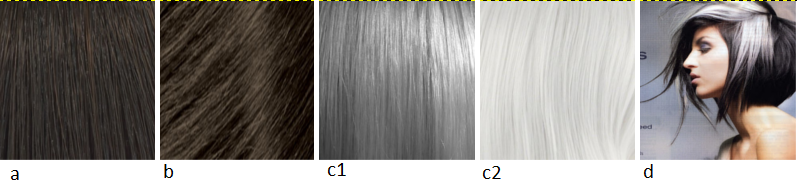
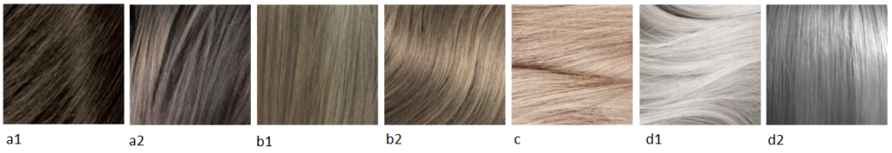
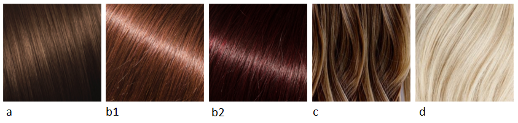
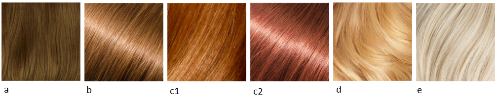

Сегодня у нас Софт Натурал или Мягкий Натурал и рекомендации по цвету волос от
Кибби.

Кто такой Кибби рассказывать не надо; те, кто интересуется вопросами
собственного стиля уже знакомы с ним, это имя на слуху в России уже лет 5-6 и
его популярность набирает обороты с каждым годом. За что я люблю Кибби? За то,
что он хорош не только в плане подсказки с выбором цвета волос, но и даст советы
по макияжу, по выбору предметов одежды, аксессуаров и как это все совмещать для
каждого типажа.

Для тех, кто первый раз слышит о нем или мало знаком с его интерпретацией
"проявления Инь/Янь во внешнем облике" (пионером была
[Belle Northrup, 1934 г.](../2017-09-05-истоки-теории-о-проявлении-иньян-во-вн)),
но хотел бы побольше узнать про него или определиться со своим типом, предлагаю
заглянуть на любой из сайтов:

- [Эстетическая медицина](http://its-possible.ru/tags-search/?tags=%C4%FD%E2%E8%E4%20%CA%E8%E1%E1%E8);
- [Колор-хармони](http://color-harmony.livejournal.com/);
- [а также группа ВКонтакте](https://vk.com/kibbe?w=wall-76498034_4063).

Если у вас возникло желание изменить цвет волос, но не знаете в какую сторону
идти и с каким цветом экспериментировать? Помощником в этом вопросе может стать
определение цветотипа или воспользоваться советами стилистов. Со своей стороны
могу дать несколько подсказок для решившихся:

1. [**здесь**](../2016-09-18-как-выбрать-правильную-краску-и-что-ну) вы узнаете,
   как окрашивать волосы, чтобы добиться нужного результата, и на какие моменты
   стоит обратить внимание;
2. [**здесь**](../2017-03-29-кое-что-еще-о-цвете-волос-highlights-lights) про
   понятие highlight/light и как его "едят".

Известно всем, что бывают блондины, брюнеты, рыжие, а вот какой оттенок и
светлота/темнота цвета волос не каждый сможет сказать или определить. Какой цвет
у вас?

(Изображение из статьи в Википедии
["разнообразие натуральных оттенков волос человека").](https://en.wikipedia.org/wiki/Human_hair_color)

Если вы знаете свой цветотип, а также типаж Кибби, то его рекомендации вам
помогут выстроить полноценную стилевую фигуру.

### **Зима (Winter) и Лето (Summer)**

###### _Высокий контраст внешности (High-Contrast coloring)_

a) Темный пепельно-коричневый, без мелирования (Dark Ash Brown (no highlights))  
b) Средний пепельно-коричневый, без мелирования (Medium Ash Brown (no
   highlights))  
c) Серебристый/белый (Silver/White)  
d) Прядки приглушенно-серебристого цвета, обрамляющие лицо (Soft Silver sprays
   around the face)  
e) Вы можете оставить седину как есть или закрасить цветом близким к вашему
   натуральному оттенку (You may either leave Gray as it comes in, or cover it
   by re-creating your original color)

###### _Низкий контраст внешности  (Low-Contrast Coloring)_

a) От среднего до мягкого пепельно-коричневого с едва заметными пепельными
   бликами (Medium to Soft Ash Brown with subtle Ash lights)  
b) От темного до среднего пепельного блонда с едва заметными пепельными бликами
   (Deep to Medium Ash Blond with subtle Ash lights)  
c) Бледный (светлый, обесцвеченный) пепельный блонд (Pale Ash Blond)  
d) Мягкий оттенок белого/Серебристый серый (Soft White/ Silver Gray)  
e) Вы можете оставить седину как есть или закрасить цветом близким к вашему
   натуральному оттенку (You may either leave Gray as it comes in, or cover it
   by re-creating your original color)

### **Весна (****Spring****) и** **Осень (****Autumn****)**

###### _Высокий контраст внешности (__High__\-__Contrast_ _coloring__)_

a) Насыщенный каштановый с едва заметными рыжеватыми бликами (Rich Chestnut
   Brown with a subtle Red light)  
b) Темно-рыжий/темное красное дерево (Deep Auburn/Mahogany)  
c) Золотистый средне-коричневый с едва заметными золотистыми бликами (Medium
   Golden Brown with a subtle golden light)  
d) Теплый белый (с желтоватым тоном) (Warm White)  
e) Полностью закрашивать седину (Cover Gray completely)

###### _Низкий_ _контраст_ _внешности_ _(Low-Contrast Coloring)_

a) Светлый золотистый коричневый с теплыми бликами (Light Golden Brown with warm
   lights)  
b) Насыщенный медовый блонд с теплыми бликами (Rich Honey Blond with warm
   lights)  
c) Светлый рыжий/медный с золотистыми бликами (Light Auburn/ Copper with golden
   lights)  
d) Насыщенный золотистый блонд с желтыми бликами (Rich Golden Blond with Yellow
   lights)  
e) Теплый белый (с желтоватым тоном) (Warm White)  
f) Полностью закрашивать седину (Cover Gray completely)

Все что вам нужно - это однотонное окрашивание волос в интенсивный цвет. Однако,
если контрастность вашей внешности низкая, то едва заметное мелирование добавит
красивое сияние вашим волосам, а также немного осветлит их. (In general, you
will require the rich base from an overall haircolor process. However, if you
are a low-contrast person, you may find the addition of a very subtle highlight
adds a lovely shimmer and "lifts" your haircolor slightly).

* * *

Перевод текста из книги Д. Кибби «Метаморфозы», 1987 г.

Картинки — все, что выдал Google по запросам.
