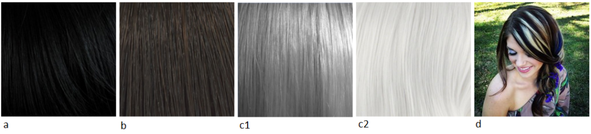
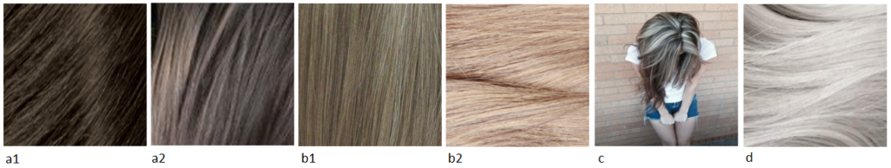
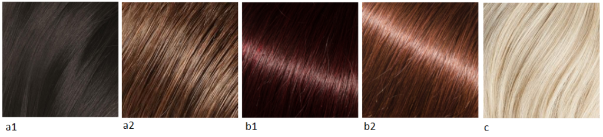
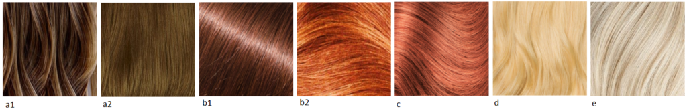

Мы уже почти подошли к концу рубрики Киббиевских рекомендаций по цвету волос.

Сегодня у нас будет Гамин.

Кто такой Кибби рассказывать не надо; те, кто интересуется вопросами
собственного стиля уже знакомы с ним, это имя на слуху в России уже лет 5-6 и
его популярность набирает обороты с каждым годом. За что я люблю Кибби? За то,
что он хорош не только в плане подсказки с выбором цвета волос, но и даст советы
по макияжу, по выбору предметов одежды, аксессуаров и как это все совмещать для
каждого типажа.

Для тех, кто первый раз слышит о нем или мало знаком с его интерпретацией
"проявления Инь/Янь во внешнем облике" (пионером была
[Belle Northrup, 1934 г.](../2017-09-05-истоки-теории-о-проявлении-иньян-во-вн)),
но хотел бы побольше узнать про него или определиться со своим типом, предлагаю
заглянуть на любой из сайтов:

- [Эстетическая медицина](http://its-possible.ru/tags-search/?tags=%C4%FD%E2%E8%E4%20%CA%E8%E1%E1%E8);
- [Колор-хармони](http://color-harmony.livejournal.com/);
- [а также группа ВКонтакте](https://vk.com/kibbe?w=wall-76498034_4063).

Если у вас возникло желание изменить цвет волос, но не знаете в какую сторону
идти и с каким цветом экспериментировать? Помощником в этом вопросе может стать
определение цветотипа или воспользоваться советами стилистов. Со своей стороны
могу дать несколько подсказок для решившихся:

1. [**здесь**](../2016-09-18-как-выбрать-правильную-краску-и-что-ну) вы узнаете,
   как окрашивать волосы, чтобы добиться нужного результата, и на какие моменты
   стоит обратить внимание;
2. [**здесь**](../2017-03-29-кое-что-еще-о-цвете-волос-highlights-lights) про
   понятие highlight/light и как его "едят".

Известно всем, что бывают блондины, брюнеты, рыжие, а вот какой оттенок и
светлота/темнота цвета волос не каждый сможет сказать или определить. Какой цвет
у вас?

(Изображение из статьи в Википедии
["разнообразие натуральных оттенков волос человека").](https://en.wikipedia.org/wiki/Human_hair_color)

Если вы знаете свой цветотип, а также типаж Кибби, то его рекомендации вам
помогут выстроить полноценную стилевую фигуру.

#### **Зима (Winter) и Лето (Summer)**

###### _Высокий контраст внешности (High-Contrast coloring)_

a) Черный (Black)  
b) Темный пепельно-коричневый, без мелирования (Dark Ash Brown (no highlights))  
c) Серебристый/белый (Silver/White)  
d) Четкие пряди серебристого/белого цвета (Bold streaks of Silver/White)  
e) Седину можно оставить, если она в виде драматических (ярких) прядок (You may
leave Gray as it comes in if it’s dramatically streaked)

###### _Низкий контраст внешности  (Low-Contrast Coloring)_

a) От среднего до мягкого коричневого с пепельным оттенком (Medium to Soft Ash
Brown)  
b) От насыщенного до бледного (обесцвеченного) пепельного блондина (Deep to Pale
Ash Blond)  
c) Четкие пряди пепельного блонда (Bold streaks of Ash Blond)  
d) Мягкий белый (Soft White)  
e) Седину закрашивать полностью, если только она не покрывает всю голову (Cover
Gray completely unless you’re totally Gray)

#### **Весна (****Spring****) и** **Осень (****Autumn****)**

###### _Высокий контраст внешности (__High__\-__Contrast_ _coloring__)_

a) От темного до средне-каштанового (Deep to Medium Chestnut Brown)  
b) Темное красное дерево/Темный рыжий (Deep Mahogany/Deep Auburn)  
c) Теплый белый (с желтоватым тоном) (Warm White)  
d) Седину закрашивать полностью (Cover Gray completely)

###### _Низкий_ _контраст_ _внешности_ _(Low-Contrast Coloring)_

a) От среднего до светло-коричневого с золотистым отливом (Medium to Light
Golden Brown)  
b) От темного до яркого рыжего (с коричневатым оттенком) (Deep to Bright Auburn)  
c) Яркий рыжеватый (с небольшим добавлением розового) (Bright Strawberry)  
d) Яркий золотистый блонд (Bright Golden Blond)  
e) Теплый белый (с желтоватым тоном) (Warm White)  
f) Седину закрашивать полностью (Cover Gray completely)

Однотонное окрашивание лучшее решение для вас, если использовать мелирование, то
только драматическое (яркие выделенные прядки), либо оставьте все как есть, если
ваш натуральный цвет волос очень светлый или бледный.

(In general, overall haircolor processes are best for you unless you are using a
highlight to achieve a very dramatic sweep, or your natural haircolor is fairly
pale or light to begin with.)

Избегать: всякого смягчения цвета волос. Цвет должен быть всегда четкий; мягкие
цвета придадут уставший вид и добавят несколько лет вашей внешности.

(Avoid: Haircolors designed to “soften” your look. Your haircolor should always
be distinct; a ”softened” color will be very tiring and aging on you.)

* * *

Перевод текста из книги Д. Кибби "Метаморфозы", 1987 г.

Картинки - все, что выдал Google по запросам.
