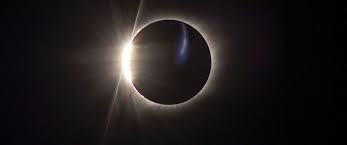
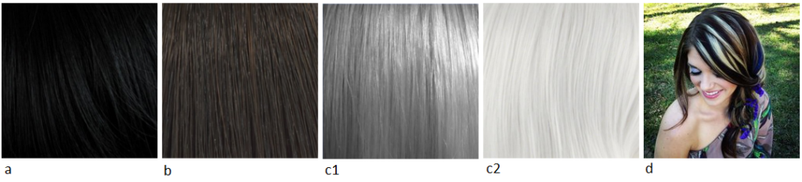
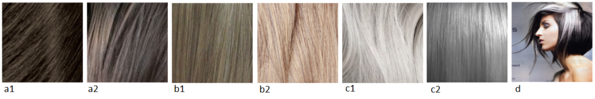
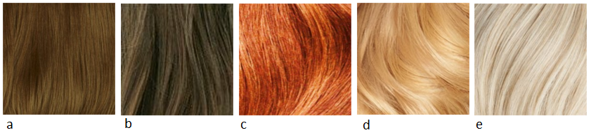

Тра-та-та-тааа!!! У меня прекрасное настроение, я вчера (21го августа 2017) в
первый раз в моей жизни наблюдала самое красивое и необычное событие на мой
взгляд - почти полное солнечное затмение. Был яркий, солнечный и безоблачный
день; и тут дневной свет начал медленно потухать - оставалось светло, но не так
как обычно, или как при сумерках, или как при облачной погоде. Создавалось
ощущение, что мягкий приглушенный солнечный свет проходит сквозь тебя, не
обжигая (ты как будто плаваешь в чем-то необычном), не оставляя четкую тень (вы
помните контраст и плотность тени в солнечный день на ровных светло-серых плитах
тротуара?). Тени от крон деревьев были витиеватые, пушистые и резные, очень
красивые, а от окон отражались длинные и извилистые ромбовидные блики. Очень
надеюсь, что мне выпадет еще один шанс увидеть такую красоту!

А сегодня я представляю вашему вниманию рекомендации Д.Кибби по подходящему
цвету волос для Яркого Гамина.

Кто такой Кибби рассказывать не надо; те, кто интересуется вопросами
собственного стиля уже знакомы с ним, это имя на слуху в России уже лет 5-6 и
его популярность набирает обороты с каждым годом. За что я люблю Кибби? За то,
что он хорош не только в плане подсказки с выбором цвета волос, но и даст советы
по макияжу, по выбору предметов одежды, аксессуаров и как это все совмещать для
каждого типажа.

Для тех, кто первый раз слышит о нем или мало знаком с его интерпретацией
"проявления Инь/Янь во внешнем облике" (пионером была
[Belle Northrup, 1934 г.](../2017-09-05-истоки-теории-о-проявлении-иньян-во-вн)),
но хотел бы побольше узнать про него или определиться со своим типом, предлагаю
заглянуть на любой из сайтов:

- [Эстетическая медицина](http://its-possible.ru/tags-search/?tags=%C4%FD%E2%E8%E4%20%CA%E8%E1%E1%E8);
- [Колор-хармони](http://color-harmony.livejournal.com/);
- [а также группа ВКонтакте](https://vk.com/kibbe?w=wall-76498034_4063).

Если у вас возникло желание изменить цвет волос, но не знаете в какую сторону
идти и с каким цветом экспериментировать? Помощником в этом вопросе может стать
определение цветотипа или воспользоваться советами стилистов. Со своей стороны
могу дать несколько подсказок для решившихся:

1. [**здесь**](../2016-09-18-как-выбрать-правильную-краску-и-что-ну) вы узнаете,
   как окрашивать волосы, чтобы добиться нужного результата, и на какие моменты
   стоит обратить внимание;
2. [**здесь**](../2017-03-29-кое-что-еще-о-цвете-волос-highlights-lights) про
   понятие highlight/light и как его "едят".

Известно всем, что бывают блондины, брюнеты, рыжие, а вот какой оттенок и
светлота/темнота цвета волос не каждый сможет сказать или определить. Какой цвет
у вас?

(Изображение из статьи в Википедии
["разнообразие натуральных оттенков волос человека").](https://en.wikipedia.org/wiki/Human_hair_color)

Если вы знаете свой цветотип, а также типаж Кибби, то его рекомендации вам
помогут выстроить полноценную стилевую фигуру.

#### **Зима (Winter) и Лето (Summer)**

###### _Высокий контраст внешности (High-Contrast coloring)_

a) Черный (Black)  
b) Темный пепельно-коричневый, без мелирования (Dark Ash Brown (no highlights))  
c) Серебристый/белый (Silver/ White)  
d) Четкие пряди серебристого, белого цвета или любого яркого цвета (Bold streaks
of Silver, White, or vivid colors)  
e) Седину можно оставить, если она в виде драматических (ярких) прядок (You may
leave Gray as it comes in if it’s dramatically streaked)

###### _Низкий контраст внешности  (Low-Contrast Coloring)_

a) От среднего до мягкого пепельно-коричневого с пепельными прядками (Medium to
Soft Ash Brown with Ash streaks)  
b) От насыщенного до бледного (обесцвеченного) пепельного блондина с пепельными
прядками (Deep to Pale Ash Blond with Ash streaks)  
c) Мягкий белый/Серебристый серый (Soft White/Silver Gray)  
d) Четкие пряди Серебристого/белого цвета (Bold streaks of Silver/White)  
e) Седину закрашивать полностью до тех пор, пока голова не покроется полностью
сединой (Cover Gray until you’ve completely turned)

#### **Весна (****Spring****) и** **Осень (****Autumn****)**

###### _Высокий контраст внешности (__High__\-__Contrast_ _coloring__)_

a) От темного до средне-каштанового (Deep to Medium Chestnut Brown)  
b) Темное красное дерево/Темный рыжий (Deep Mahogany/Deep Auburn)  
c) Теплый белый (с желтоватым тоном) (Warm White)  
d) Седину закрашивать полностью (Cover Gray completely)

###### _Низкий_ _контраст_ _внешности_ _(Low-Contrast Coloring)_

a) Светлый золотисто-коричневый с прядками теплых оттенков (Light Golden Brown
with warm streaks)  
b) Темный медовый блонд с прядками теплых оттенков (Deep Honey Blond with warm
streaks)  
c) Яркий рыжий (с коричневатым оттенком) (Bright Auburn)  
d) Яркий золотистый блонд с желтыми прядками (Bright Golden Blond with Yellow
streaks)  
e) Теплый белый (с желтоватым тоном) (Warm White)  
f) Седину закрашивать полностью (Cover Gray completely)

Четкий однотонный цвет волос - это ваша основная задача в процессе окрашивания
волос. Однако, если ваша внешность низко-контрастная (весна и лето), то возможно
вы бы предпочли добавить мелирование в "драматическом" (ярком) исполнении, чтобы
осветлить немного цвет волос. Если вы хотите закрасить седину, то лучше всего
полностью в один цвет (без мелирования).

(In general, you will require the distinct color an overall process gives.
However, if you are a low-contrast person (spring and summer), you may wish to
add high lights in a more dramatically streaked manner to “lift” your haircolor.
If you are seeking to cover gray, switch to an overall process.)

**Избегать**: любых процессов окраски волос, которые дают "смягчающий" цвет
волос. Ваша задача - получить четкий цвет волос, иначе ваша внешность будет
изрядно бледной и бесцветной.

(AVOID: Haircolor processes designed to give a “soft” haircolor. You need a
distinct color; otherwise your look will be considerably washed out.)

* * *

Перевод текста из книги Д. Кибби "Метаморфозы", 1987 г.

Картинки - все, что выдал Google по запросам.
