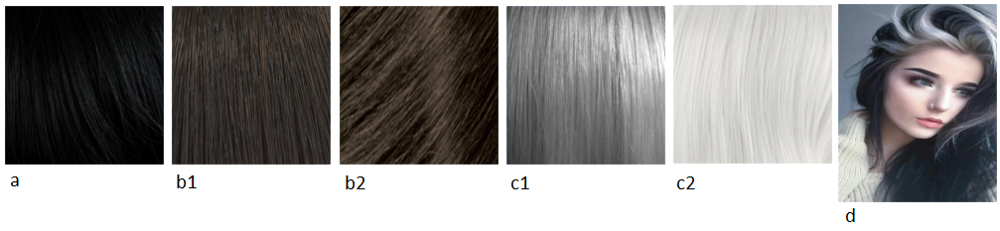
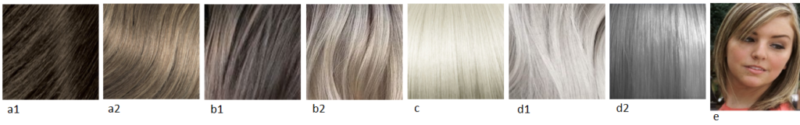
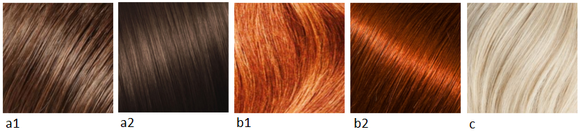
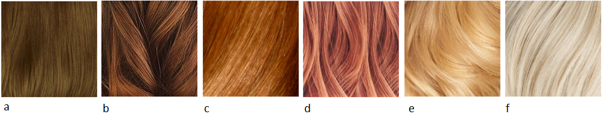

Today is Soft Gamine day! :)

Кто такой Кибби рассказывать не надо; те, кто интересуется вопросами
собственного стиля уже знакомы с ним, это имя на слуху в России уже лет 5-6 и
его популярность набирает обороты с каждым годом. За что я люблю Кибби? За то,
что он хорош не только в плане подсказки с выбором цвета волос, но и даст советы
по макияжу, по выбору предметов одежды, аксессуаров и как это все совмещать для
каждого типажа.

Для тех, кто первый раз слышит о нем или мало знаком с его интерпретацией
"проявления Инь/Янь во внешнем облике" (пионером была
[Belle Northrup, 1934 г.](../2017-09-05-истоки-теории-о-проявлении-иньян-во-вн)),
но хотел бы побольше узнать про него или определиться со своим типом, предлагаю
заглянуть на любой из сайтов:

- [Эстетическая медицина](http://its-possible.ru/tags-search/?tags=%C4%FD%E2%E8%E4%20%CA%E8%E1%E1%E8);
- [Колор-хармони](http://color-harmony.livejournal.com/);
- [а также группа ВКонтакте](https://vk.com/kibbe?w=wall-76498034_4063).

Если у вас возникло желание изменить цвет волос, но не знаете в какую сторону
идти и с каким цветом экспериментировать? Помощником в этом вопросе может стать
определение цветотипа или воспользоваться советами стилистов. Со своей стороны
могу дать несколько подсказок для решившихся:

1. [**здесь**](../2016-09-18-как-выбрать-правильную-краску-и-что-ну) вы узнаете,
   как окрашивать волосы, чтобы добиться нужного результата, и на какие моменты
   стоит обратить внимание;
2. [**здесь**](../2017-03-29-кое-что-еще-о-цвете-волос-highlights-lights) про
   понятие highlight/light и как его "едят".

Известно всем, что бывают блондины, брюнеты, рыжие, а вот какой оттенок и
светлота/темнота цвета волос не каждый сможет сказать или определить. Какой цвет
у вас?

(Изображение из статьи в Википедии
["разнообразие натуральных оттенков волос человека").](https://en.wikipedia.org/wiki/Human_hair_color)

Если вы знаете свой цветотип, а также типаж Кибби, то его рекомендации вам
помогут выстроить полноценную стилевую фигуру.

#### **Зима (Winter) и Лето (Summer)**

###### _Высокий контраст внешности (High-Contrast coloring)_

a) Черный, без мелирования (Black (no highlights))  
b) От темного до среднего пепельно-коричневый, без мелирования (Dark to Medium
Ash Brown (no highlights))  
c) Серебристый/белый (Silver/White)  
d) Прядки серебристого цвета, обрамляющие лицо (Silver sprays around the face)  
e) Седину закрашивать полностью, если только она не проявляется в виде тонких
седых прядок, обрамляющих лицо (Cover Gray unless it’s sprayed softly around the
face)

###### _Низкий контраст внешности  (Low-Contrast Coloring)_

a) От среднего до мягкого пепельно-коричневого с пепельными бликами (Medium to
Soft Ash Brown with Ash lights)  
b) От среднего до мягкого пепельного блонда с пепельными бликами (Medium to Soft
Ash Blond with Ash lights)  
c) Платиновый блонд (Platinum Blond)  
d) Мягкий белый/Серебристый серый (Soft White/ Silver Gray)  
e) Мелированные тонкие прядки около лица (Frosting around the face)  
f) Седину закрашивать, если только она не проявляется в виде тонких прядок в
области лица (Cover Gray unless it frosts the area around the face)

#### **Весна (****Spring****) и** **Осень (****Autumn****)**

###### _Высокий контраст внешности (__High__\-__Contrast_ _coloring__)_

a) От темного до мягкого оттенка каштанового с едва заметным рыжим оттенком
(Medium to Soft Chestnut Brown with a subtle Red cast)  
b) Насыщенный рыжий (с коричневатым оттенком)/Огненно-медный (Rich Auburn/Fiery
Copper)  
c) Теплый белый (с желтоватым тоном) (Warm White)  
d) Седину закрашивать полностью (Cover Gray completely)

###### _Низкий_ _контраст_ _внешности_ _(Low-Contrast Coloring)_

a) Светлый золотистый коричневый с рыжими бликами (Light Golden Brown with Red
lights)  
b) Насыщенный медовый коричневый с рыжими бликами (Rich Honey Brown with a Red
cast)  
c) Светлый рыжий (с коричневатым оттенком) (Light Auburn)  
d) Яркий рыжеватый блонд (с небольшим добавлением розового) (Bright Strawberry
Blond)  
e) Яркий золотистый блонд (Bright Golden Blond)  
f) Теплый белый (с желтоватым тоном) (Warm White)  
g) Седину закрашивать полностью (Cover Gray completely)

Если ваша внешность высокой контрастности (Зима или Осень), то нужно добиваться
интенсивности и глубины цвета полноценного окрашивания (без мелирования). Если
контрастность вашей внешности низкая (Лето и Весна), то едва заметное
мелирование добавит красивое сияние вашим волосам. Однако, если вы ищете вариант
как закрасить вашу седину, то выбирайте однотонное окрашивание (без
мелирования).

(In general, if you are a high-contrast person (winter and autumn), you will
require the richness an overall color process provides. If you are a
Iow-contrast person (summer and spring); you may find the addition of subtle
highlights provides a lovely shimmer to "lift" the hair slightly. However, if
you are seeking to cover gray, always choose an overall process.)

* * *

Перевод текста из книги Д. Кибби "Метаморфозы", 1987 г.

Картинки - все, что выдал Google по запросам
