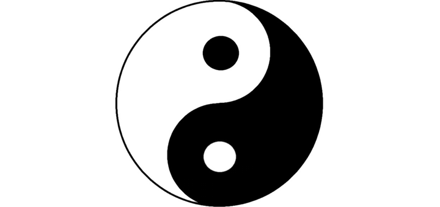

**Почему искала истоки теории Инь/Ян?**

Изучая теорию Кибби, я часто замечала, что в его системе есть противоречия,
непонятки, мало иллюстраций (почему многие толкуют слова Кибби по-своему), не
все могут найти себя в этой системе, система не гибкая. Поэтому я не
останавливалась только на Кибби и искала все, что связано с Инь/Ян во внешности.
Таким образом, я нашла много всего интересного в данном направлении. Существует
много систем, авторы которых используют Инь/Ян концепцию; классификация и имя
типажей у всех почти совпадают: кто-то переименовывает некоторые типажи, кто-то
добавляет новых, а кто-то и выбрасывает ненужных. Но самое главное, что
получилось найти первооткрывателя Инь и Ян во внешности. И я считаю, мы должны
знать имя этого человека, и это не Дэвид Кибби, а - Бэлл Нортрап! Ознакомившись
с теорией Нортрап в оригинале, решила перевести ее для тех, кто интересуется при
каких условиях и с чего все началось, какая концепция была вложена. Это очень
вдохновляющая теория, иначе бы не было столько последователей. Итак,

###### Антураж

Без музыки нам не обойтись. Она нужна, чтобы погрузиться в атмосферу того
времени, про которое я буду повествовать (привет игрокам Fallout и Bioshock):



_Теория о проявлении Инь/Ян во внешнем облике (1934-1936гг.)_ появилась в период
Великой депрессии. Когда мир погрузился в пучину кризиса из-за Биржевого краха в
США, больше всех пострадала экономика Канады, Франции, Великобритании, Германии,
и особенно досталось США. 30-е годы - это время перед Второй Мировой войной,
которая началась в 1939 г. (в России парой годами позже).

В Америке миллионам людей нечего было есть и не на что жить. Богатство не
выставлялось на всеобщее обозрение, как это было принято в 20-е годы. В то время
банкиры стали настолько непопулярны, что грабители банков становились
национальными героями, как Бонни и Клайд
[(источник)](https://ru.wikipedia.org/wiki/%D0%92%D0%B5%D0%BB%D0%B8%D0%BA%D0%B0%D1%8F_%D0%B4%D0%B5%D0%BF%D1%80%D0%B5%D1%81%D1%81%D0%B8%D1%8F).

Несмотря на экономические проблемы, мода не замерла в одной точке и нашла свое
развитие благодаря кино. Женщины же хотели выглядеть достойно и красиво всегда,
несмотря на бедность (мы не говорим про самое бедное население, которому
действительно не на что было жить, а про тех, кто мог себе позволить копировать
стиль известных голливудских звезд). "Модными" иконами кинематографа были: Джоан
Кроуфорд, Марлен Дитрих, Джинджер Роджерс, Джин Харлоу, Грета Гарбо, Джанет
Гейнор.

Кстати, популярными актерами 30х гг. были: Кларк Гейбл, Кэри Грант, Хамфри
Богарт, Фрэд Астер.

Знаковым же фильмом того времени стал "Унесенные ветром" (1939 г), культовыми
персонажами - Микки Маус и Кинг-Конг.

30-е - это время открытия нейтронов и позитронов, а также изобретения шариковой
ручки и таких тканей, как неопрен и нейлон. Эх, нейлоновые чулочки... Надо же и
про моду тех лет поговорить кратенько, выделив основные моменты. Итак, стильные
"мадамы" Америки носили:

1. накладные плечи, кокетки и вставки в виде треугольников, узкие юбки в бедрах
   расширяющиеся от колен книзу (короче, форма треугольника, присутствующая в
   силуэте и покрое, широкие плечи и узкие бедра),
2. клатчи в виде конвертов или кошелька с рамочкой и защелкой,
3. уличный костюм из английского твида,
4. головной убор, сумка и обувь - в одной цветовой гамме,
5. брюки и брючный костюм Марлен Дитрих,
6. солнечные очки
7. и женственность, которая пришла на смену популярным в 20х годах простому по
   крою платью, укороченному подолу и коротким женским стрижкам:
   - мягкие, текучие и качественные ткани (шелк, атлас, хлопок);
   - сложный крой, интересная фактура, отделки, воланы, рюши, драпировки, банты;
   - обозначенная талия;
   - подол сначала удлинился до середины икры, потом - до щиколотки;
   - приподнималась и подчеркивалась грудь, вернулись корсеты (только уже не
     такие тугие, как в прошлом);
   - мех песца, лисы или бархатная пелерина;
   - высокий каблук, танкетка;
   - броши, колье, искусственные цветы из ткани и искусственных камней;
   - фантазийные и разнообразные формы головных уборов;
   - перчатки не только зимой, но и летом;
   - волосы отращивали, красили в блонд, завивали и тщательно укладывали.

###### Теперь вернемся к истории Инь-Ян теории.

Вы спросите: что я тут все про Америку пишу, потому что _Теория Инь/Ян_
появилась в США. Её автором является **Бэлл Нортрап.**

К сожалению, очень мало информации о Нортрап в интернете, ничего нет о годах
жизни, творческом или жизненном пути. Известно, что она в 1914 закончила
Academie Moderne в Париже и в 1917 Колумбийский университет (г.Нью-Йорк, США),
была профессором в Педагогическом колледже при Колумбийском университете по
дисциплинам: "Дизайн и история костюма" и "Файн-арт" (fine art).
[Файн-арт - это любой продукт творчества, имеющий целью исключительно эстетическое наслаждение и не предназначенный для утилитарного использования](https://fineart-school.ru/blog/articles/chto_takoe_Fine_Art_/).
В декабре 1946 участвовала в Ярмарке мастеров в качестве учителя и консультанта
по "искусству современной вышивки". Еще, пошуршав интернетными страницами в
поисках ее публикаций, кое-что обнаружилось на амазоне и в архивах старых газет
(много статей). Также была анонсирована книга по Инь и Ян, но ее нигде нет,
возможно, свет ее так и не увидел. Итого мы имеем:

- "Краткое описание исторической моды: с указателями и с рекомендациями по
  использованию сопутствующих 30ти иллюстраций костюмов прошлого" (A short
  description of historic fashion: With index and suggestions for using the
  accompanying thirty historic costume plates, 1925), книга - здесь ничего не
  говориться об Инь и Ян;

- Статьи в архивах газет, одна из известных - "Мадам, вы инь или ян?" (Are You
  Yin, Madam, Or Are You Yang? 1934) в Laredo Times, а также в 1939 вышло много
  статей Б.Нортрап: в феврале 1939г - Old Chinese Idea Helps Miss '39 Pick
  Clothes, весной выходили статьи про цвета для девушек Инь и Ян - Color To Fit
  Your Personality (с фотографией Нортрап), China's Colors Tint Spring Mode и
  про цветоанализ - COLOR ANALYST IS CONDUCTING CLINIC (это про сам цветоанализ,
  как он проходил тогда - драпинг-машин);

- "История костюма, рассказанная в картинках" (The Story of Costume Told in
  Pictures, 1935), книга - тут тоже ничего про Инь и Ян;

- "Подход к решению проблемы "одежда и личность" (AN APPROACH TO THE PROBLEM OF
  COSTUME AND PERSONALITY, 1936), статья в журнале по искусству Art Education
  Today.

###### Почему именно Инь и Ян?

Хочу я начать с перевода статьи "Подход к решению проблемы "одежда и личность",
где автор поясняет, почему она использует Инь и Ян:

_"В прошлом не было адекватных общепринятых стандартов измерения, позволяющих
судить о наших общих характеристиках внешнего вида (как нас видят люди вокруг) и
как окружающие воспринимают одежду на нас. Вопрос, который редко рассматривался:
Как одежда влияет на ее носителя - на его достоинство, утонченность,
серьезность, душевные качества... Все аспекты личности и каждая деталь внешнего
вида, сотканные в единое целое, должны быть приняты во внимание._

_Трудно адекватно описывать качества людей и одежды. В нашем языке нет точных
терминов, которые могут выразить это ясно и образно, в сравнение с теми, что мы
находим в китайской философии. И поэтому я взяла из китайской философии два
описательных слова. Это «Инь» и «Ян». Они будут служить для более точной связки
множества значений и характеристик, используемых для критического разбора или
оценки. Инь и Ян можно использовать как шкалу, на которой указаны всеобъемлющие
противоположности, так и как способ оценки всех бесконечных возможностей костюма
и характеристик личности._

_Давно еще в Китае почувствовали это четкое разделение сил жизни. За столетия до
рождения Христа символы света и тьмы были вырезаны на огромных каменных
барабанах Китая и постепенно через века толкование их менялось. Инь, ранее
ассоциировавшаяся с миром тьмы, стала означать покой, поглощение, мягкость. Ян
был тождественен небесному свету, но превратился в энергию, проникновение, силу.
В Инь отражаются такие качества, как нежность, податливость воды, мягкость мха
или изящество морозного узора на окнах. Луна - Великая Инь, а также Инь -
плодородные долины вдоль русла реки. Ян, наоборот, выражает силу - тяжесть
гранита, твердость металла, могущество пламени. Великий Ян - это Солнце, яркое и
дарующее жизнь._

_С точки зрения культуры Китая существует постоянная игра Инь и Ян во всех
вещах, и их легко можно найти во всем, что видит, слышит и думает человек.
Западники признают эти универсальные противоположности, но не могут предложить
значимых терминов для них, нет слов, которые суммируют качество этих двух
великих поляризованных сил"._

Как Ян и Инь проявляется в природе, жизни, во внешности человека и о
представителях чистого Инь и Ян, можно почитать перевод в статьях по тэгу
[`бэлл-нортрап`](/tags/бэлл-нортрап/).
