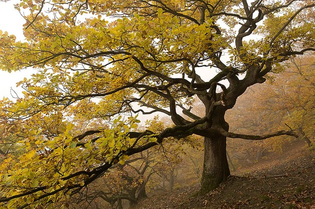
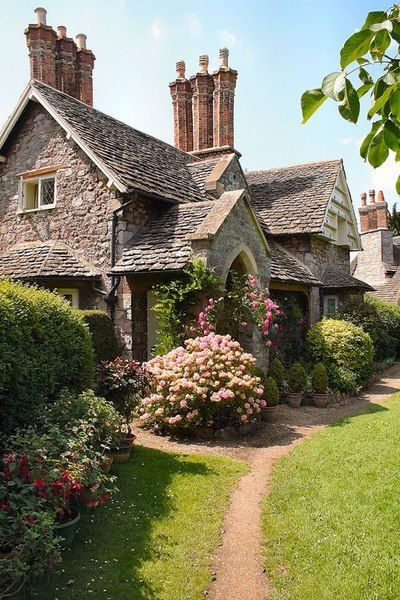

[**Вернуться к началу Теории**.](../2017-09-05-истоки-теории-о-проявлении-иньян-во-вн)

Мы остановились на том, что Инь и Ян есть во всем. Инь - это покой, поглощение,
мягкость; Ян - энергия, проникновение, сила. Этот пост и следующий будут
состоять в основном из картинок, чтобы лучше прочувствовать и понять ту
концепцию, которую вложила Б.Нортрап в свою теорию Инь/Ян. Готовы?

_Мы можем легко увидеть Инь и Ян во всех элементах природы - в деревьях, цветах,
животных, и конечно же в людях._

_Сравните меж собой попарно представителей инь и ян_ (каждая пара занимает
строку в таблице):

##### **Растения**

| ИНЬ                                              | ЯН                                        |
|:-------------------------------------------------|:------------------------------------------|
|                |          |
|            |      |
|     |    |
|  |  |

##### Животный мир:

| ИНЬ                                            | ЯН                                                |
|:-----------------------------------------------|:--------------------------------------------------|
|            |               |
|          |                     |
|         |             |
|  |  |
|             |                   |

##### **Архитектура:**

_Легко найти Инь и Ян и в архитектуре. Восточноазиатские пагоды, изгибистые арки
мавританских дверных проемов, декоративные стены и балюстрады Альгамбры, резьба
по мрамору и нежная мозаика в Тадж-Махале - это Инь в архитектуре._

_Дорические храмы или массивные колонны Большого зала в Карнаке, Египет,
Масонские арки в романском стиле или нормандские строения, т.е. там, где
встречаются крепкие, неразрывные линии, - это Ян._

_Сравните: маленький домик с зелеными ставнями на северо-востоке США (Инь) с
белоснежным особняком на юге США (Ян)._

_Возвышающиеся над прериями зерновые элеваторы и промышленные здания с
громадными стенами, незаполненные каким-либо орнаментом, выражают суть Ян._

_Некоторые здания совмещают в себе и Инь и Ян элементы. Готический собор -
пример проявления возвышенной творческой идеи человечества. Здесь переплетены в
прекрасном союзе легкость и массивность. Основная структура собора и своды
внутри - это Ян._

| ЯН                                                      | ЯН                                          |
|:--------------------------------------------------------|:--------------------------------------------|
|  |  |

_Остроконечные башенки и кружевная резьба - это Инь._

| ИНЬ                                    | ИНЬ                                |
|:---------------------------------------|:-----------------------------------|
|  |  |

[**Читать далее...**](../2017-09-09-инь-и-ян-в-окружающем-нас-мире-ч-2)
