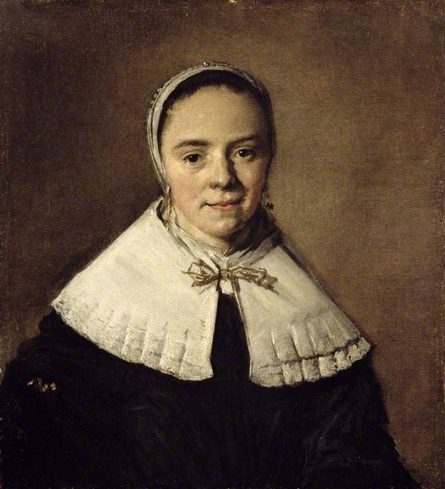
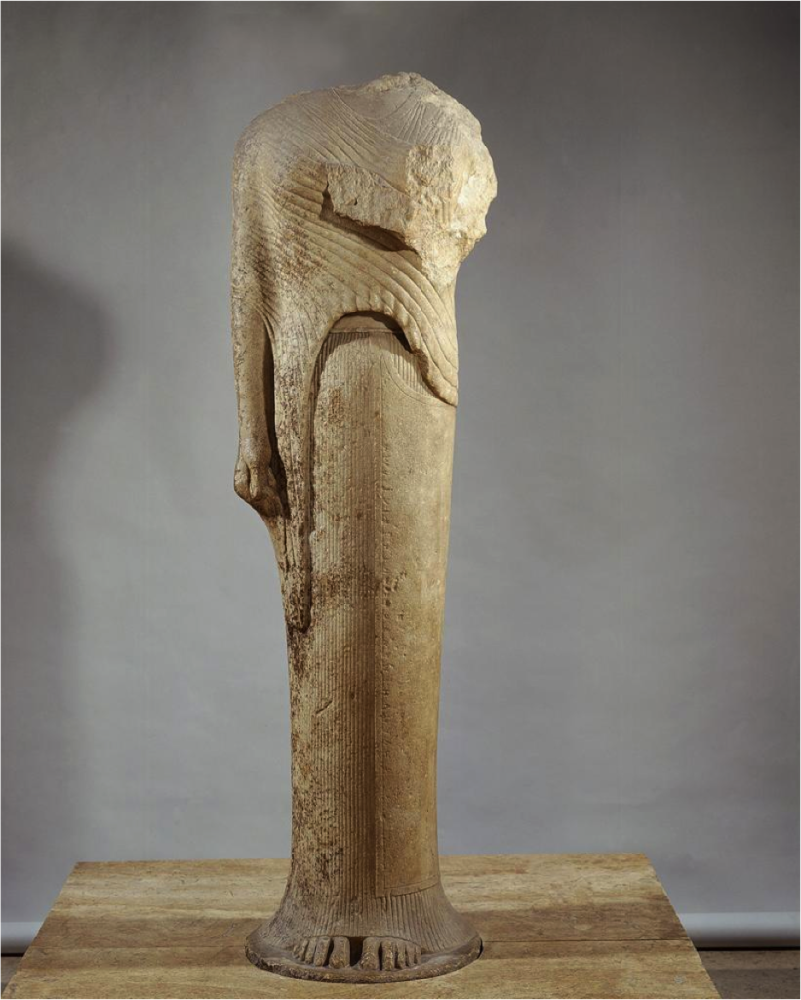
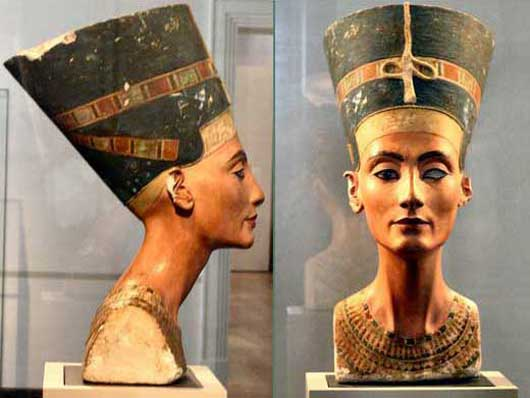

[**Вернуться к началу Теории**.](../2017-09-05-истоки-теории-о-проявлении-иньян-во-вн)

##### **Живопись и** Скульптура:

_Больше примеров Инь и Ян элементов можно увидеть в живописи и скульптуре.
Живопись сама по себе склоняется к Инь в искусстве из-за текучих свойств краски
и мягкости кисти. Мы вспоминаем картины, в которых присутствуют инь-женщины:
хрупкие фигуры
[Боттичелли](https://www.google.com/search?hl=ru&tbm=isch&source=hp&biw=1920&bih=974&q=%D0%91%D0%BE%D1%82%D1%82%D0%B8%D1%87%D0%B5%D0%BB%D0%BB%D0%B8&oq=%D0%91%D0%BE%D1%82%D1%82%D0%B8%D1%87%D0%B5%D0%BB%D0%BB%D0%B8&gs_l=img.3..0l10.784.784.0.1510.2.2.0.0.0.0.290.290.2-1.1.0....0...1.1.64.img..1.1.289.0.Gtm4ebIrce0),
тонкие и нежные лица в творчестве
[Леонардо](https://www.google.com/search?hl=ru&biw=1920&bih=974&tbm=isch&sa=1&q=%D0%BB%D0%B5%D0%BE%D0%BD%D0%B0%D1%80%D0%B4%D0%BE+%D0%B4%D0%B0+%D0%B2%D0%B8%D0%BD%D1%87%D0%B8&oq=%D0%BB%D0%B5%D0%BE%D0%BD%D0%B0%D1%80%D0%B4%D0%BE+%D0%B4%D0%B0+%D0%B2%D0%B8%D0%BD%D1%87%D0%B8&gs_l=psy-ab.3...0.0.0.17942.0.0.0.0.0.0.0.0..0.0....0...1..64.psy-ab..0.0.0.y7wNFWVS5uo)
и в работах
[Мари Лорансен](https://www.google.com/search?hl=ru&biw=1920&bih=974&tbm=isch&sa=1&q=%D0%9C%D0%B0%D1%80%D0%B8+%D0%9B%D0%BE%D1%80%D0%B0%D0%BD%D1%81%D0%B5%D0%BD&oq=%D0%9C%D0%B0%D1%80%D0%B8+%D0%9B%D0%BE%D1%80%D0%B0%D0%BD%D1%81%D0%B5%D0%BD&gs_l=psy-ab.3..0l2j0i24k1l2.29042.29042.0.29626.1.1.0.0.0.0.284.284.2-1.1.0....0...1.1.64.psy-ab..0.1.283.K68JAxyVTKA),
и картины, где есть бледные девушки с детскими лицами. Большой вклад в общее
впечатление от мягкости и деликатности изображения вносит цвет. Никаких резких
контрастов, никаких тяжелых или сверкающих оттенков; только едва заметные,
приглушенные, светлые тона._

_Однако, цвет может выражать и Ян, если находится в руках таких мужественных
художников, как
[Тинторетто](https://www.google.com/search?hl=ru&biw=1920&bih=974&tbm=isch&sa=1&q=%D0%A2%D0%B8%D0%BD%D1%82%D0%BE%D1%80%D0%B5%D1%82%D1%82%D0%BE&oq=%D0%A2%D0%B8%D0%BD%D1%82%D0%BE%D1%80%D0%B5%D1%82%D1%82%D0%BE&gs_l=psy-ab.3..0l4.593958.593958.0.594552.1.1.0.0.0.0.238.238.2-1.1.0....0...1.1.64.psy-ab..0.1.237.XK0o7ChcoLM),
[Рубенс](https://www.google.com/search?hl=ru&biw=1920&bih=974&tbm=isch&sa=1&q=%D0%A0%D1%83%D0%B1%D0%B5%D0%BD%D1%81&oq=%D0%A0%D1%83%D0%B1%D0%B5%D0%BD%D1%81&gs_l=psy-ab.3..0l4.12082.12082.0.12830.1.1.0.0.0.0.164.164.0j1.1.0....0...1.1.64.psy-ab..0.1.162.muJUn15bBe0),
[Халс](https://www.google.com/search?hl=ru&biw=1920&bih=974&tbm=isch&sa=1&q=%D0%A5%D0%B0%D0%BB%D1%81&oq=%D0%A5%D0%B0%D0%BB%D1%81&gs_l=psy-ab.3..0l4.10514.10514.0.11957.1.1.0.0.0.0.164.164.0j1.1.0....0...1.1.64.psy-ab..0.1.163.VAzD-vIytoA)
и многих из
[модернистов](https://www.google.com/search?hl=ru&biw=1920&bih=974&tbm=isch&q=%D0%BC%D0%BE%D0%B4%D0%B5%D1%80%D0%BD%D0%B8%D0%B7%D0%BC&sa=X&ved=0ahUKEwi0nq2hvZ3WAhVK04MKHeksA7UQhyYILg)._

_Посмотрите на портреты женщин эпохи Возрождения (Ренессанс). Начиная с левой
картины, Инь переходит в Ян (правая картина), обратите внимание как меняется
выражение лица, взгляд, наклон головы, характер одежды._

_В восточном искусстве мы видим совершенство красоты в непревзойденных линиях,
цветах и формах. В китайской живописи периода Сун (960 - 1279 гг.) художники
стремились объединить Инь и Ян для достижения сущности великолепия природы,
которое выражалось в резонирующих скалах, величественных деревьях, мощных
водопадах, т.е. в элементах неба. Человек - элемент земли, всегда присутствовал
для контраста в той или иной форме._

_Баланс противоположных качеств присутствует и в скульптуре. В древнегреческих
скульптурах элементы Инь и Ян четко выкристаллизовываются, а не смешиваются, как
в китайском искусстве._

_"Танцовщица", светлая и плавная, невысокого роста, с изящными изгибами, - это в
основном Инь, а в "Юноне, Гера Самос" точные, контролируемые, величественные
линии, - это Ян, глубоко укоренившийся в ее молчаливом достоинстве._

| ИНЬ                                                      | ЯН                                                                            |
|:---------------------------------------------------------|:------------------------------------------------------------------------------|
|  |  |

_Камень является символ женской власти, которая таится в молчаливом и спокойном
достоинстве, возможно, потому что камень, его среда, по сути Ян. Если бы
"Танцовщица", изящно вырезанная в барельефе, была бы нарисована красками на
стене или холсте, то привносила бы еще больше грации и легкости. Тогда бы и цвет
повысил значение изображения (добавил легкости), как музыка, что сопровождает ее
быстрый и изящный ритм._

##### **Костюмы прошлых лет:**

_Костюм, раскрытый в картинах, резьбе и гобеленах прошлого, тоже рассказывает
историю Инь и Ян. Чаще всего это был Ян, который доминировал в образе.
Правительницы Египта были одеты в царские длинные одежды с широкими ожерельями и
браслетами из драгоценных камней. Скульптурный портрет Нефертити дает
представление о том, как выражался Ян в костюме тех времен._

_Одежда женщин Средневековья отличалась насыщенностью красок и, хотя она менее
строгая и формальная, также подчеркивала благородство (Ян). Прекрасные мантии,
вуали, свисающие с золотых корон, и длинные рукава, дают представление о грации
и царственной осанке носивших их особ._

_В дверных проемах Шартрского собора можно увидеть правителей Иудеи в
средневековой одежде, вырезанных из камня в виде колонн (Ян в строгой форме), и
длинные мантии, выполненные в смягченном виде резьбы._

_Впрочем, в таких маленьких резных фигурках, как "Дева" (XIV в), кажется, что
художники Средневековья показывали величественный костюм и в Инь-манере. Если бы
у "Нефертити" была мантия с жесткими складками, то она добавила бы ещё больше
янского влияния в образ правительницы Египта, мантия же "Девы" с изящной,
изогнутой драпировкой, которая перекликается с природой самой Девы._

_Мягкость Инь и сила Ян четко представлены в выражении лиц и в головных уборах:_

| ИНЬ                                                      | ЯН                                                         |
|:---------------------------------------------------------|:-----------------------------------------------------------|
|  |  |

_Пока в общей картине костюм Средневековья, Ренессанса и древних времен
преобладал Ян, в деталях же открывается Инь-влияние. Мягкая вуаль - это Инь по
цвету и текстуре. В эпоху позднего Возрождения Инь отчетливо проступает в
прическах, а также в разнообразии изогнутых или присборенных форм горловины,
украшенных вышивкой._

_В девятнадцатом веке Инь господствовал в полной мере. Фишю (кружевная косынка),
кружева, ленты, форма рукавов, чепчики и пышные юбки времен Марии-Антуанетты
добавляли женщинам больше пикантности и деликатности, чем в дни Карла Великого._

| ИНЬ                                                            | ЯН                                                                                                                        |
|:---------------------------------------------------------------|:--------------------------------------------------------------------------------------------------------------------------|
|  |  |

_В девятнадцатом веке на юге США люди носили Инь-костюмы (Роялисты
придерживались светлых, веселых стилей Франции и Англии), а на севере -
Ян-костюмы (Пуритане предпочитали строгость)._

| ИНЬ                                                             | ЯН                                                             |
|:----------------------------------------------------------------|:---------------------------------------------------------------|
|  |  |

_Сегодня нам нужно разнообразие Инь и Ян элементов в модном секторе. Каждый
сезон мы видим и мягкость и строгость, одежду для юных особ и для благородных
дам, все это призвано расширить и выразить в полной мере индивидуальность._
(ничего не изменилось с 30х годов прошлого столетия :))

##### Музыка:

_Музыка раскрывает нам отчетливые доказательства присутствия Инь и Ян.
Деликатная странность ритма у
[Дебюсси](https://www.youtube.com/watch?v=CvFH_6DNRCY) и мощный размах темпа у
[Бетховена](https://www.youtube.com/watch?v=_4IRMYuE1hI), оба представляют нам
два противоположных полюса музыки.
[Бах](https://www.youtube.com/watch?v=GMkmQlfOJDk),
[Брамс](https://www.youtube.com/watch?v=3X9LvC9WkkQ) и
[Вагнер](https://www.youtube.com/watch?v=lC87_tX9738) - это Ян по своему
масштабу и концепции, а
[Шопен](https://www.youtube.com/watch?v=g2r7skqSkNM&list=PLE273B4A5F17FEBD1&index=6),
[Григ](https://www.youtube.com/watch?v=dyM2AnA96yE) и
[Мак-Доуэлл](https://www.youtube.com/watch?v=2V3HV3RBw6s) - утонченные образчики
Инь._

_Если вспомнить театральные или опереточные образы, то Инь - это Миньон (Т.
Амбруаз) и Мими (Богема, Дж. Пуччини), а Ян - Аида (Дж.Верди) и Брюнхильда
(Кольцо нибелунга, Р.Вагнер)._

**Окружающие вещи:**

_Распознавание Инь и Ян в скором времени станет квестом, который будет дарить
вечный интерес и удовольствие в повседневной жизни. Инь и Ян элементы могут быть
найдены и в вещах, построенных человеком и для человеческих нужд: в изящных
яхтах и крепких буксирах, в искусных часовых механизмах и мощных генераторах._

| ИНЬ                                                          | ЯН                                                    |
|:-------------------------------------------------------------|:------------------------------------------------------|
|           |  |
|  |   |

_В мебели тоже встречается Инь и Ян:_

| ЯН                              | ИНЬ                             |
|:--------------------------------|:--------------------------------|
|  |  |

Надеюсь вы поняли концепцию и определили к какому элементу относится диванчик, а
к какому элементу - кресла.

[**Читать далее...**](../2017-09-09-истоки-теории-о-проявлении-иньян-во-вн-2)
