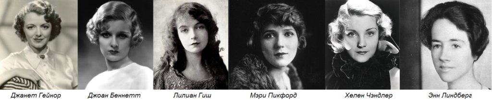

[**Вернуться к началу Теории**.](../2017-09-05-истоки-теории-о-проявлении-иньян-во-вн)

_"А что, если мы применим Инь и Ян к людям? Мы посмотрели на природу,
архитектуру, искусство и музыку под углом Инь-Ян, теперь поняли идею и у нас
есть некая шкала, по которой мы можем определять себя и окружающих._ _Ниже
список женщин, которые выражают крайний Инь и Ян. Большинство из них известные
актрисы театра и кино._

**Инь -
[Джанет Гейнор](https://www.google.com/search?hl=ru&tbm=isch&source=hp&biw=1920&bih=974&q=%D0%94%D0%B6%D0%B0%D0%BD%D0%B5%D1%82+%D0%93%D0%B5%D0%B9%D0%BD%D0%BE%D1%80&oq=%D0%94%D0%B6%D0%B0%D0%BD%D0%B5%D1%82+%D0%93%D0%B5%D0%B9%D0%BD%D0%BE%D1%80&gs_l=img.3..35i39k1j0i24k1.6992.6992.0.7673.3.3.0.0.0.0.176.176.0j1.1.0....0...1.1.64.img..2.1.175.0.zlbnegdfyYw),
[Джоан Беннетт](https://www.google.com/search?hl=ru&biw=1920&bih=925&tbm=isch&sa=1&q=%D0%94%D0%B6%D0%BE%D0%B0%D0%BD+%D0%91%D0%B5%D0%BD%D0%BD%D0%B5%D1%82%D1%82&oq=%D0%94%D0%B6%D0%BE%D0%B0%D0%BD+%D0%91%D0%B5%D0%BD%D0%BD%D0%B5%D1%82%D1%82&gs_l=psy-ab.3..0l2j0i24k1.41870.41870.0.42362.1.1.0.0.0.0.163.163.0j1.1.0....0...1.1.64.psy-ab..0.1.162.suBicD8vBHo),
[Лилиан Гиш](https://www.google.com/search?hl=ru&biw=1920&bih=925&tbm=isch&sa=1&q=%D0%9B%D0%B8%D0%BB%D0%B8%D0%B0%D0%BD+%D0%93%D0%B8%D1%88&oq=%D0%9B%D0%B8%D0%BB%D0%B8%D0%B0%D0%BD+%D0%93%D0%B8%D1%88&gs_l=psy-ab.3..0j0i30k1j0i24k1.29229.29229.0.30334.1.1.0.0.0.0.158.158.0j1.1.0....0...1.1.64.psy-ab..0.1.157.TQAgWnHG1R4),
[Мэри Пикфорд](https://www.google.com/search?hl=ru&biw=1920&bih=925&tbm=isch&sa=1&q=%D0%9C%D1%8D%D1%80%D0%B8+%D0%9F%D0%B8%D0%BA%D1%84%D0%BE%D1%80%D0%B4&oq=%D0%9C%D1%8D%D1%80%D0%B8+%D0%9F%D0%B8%D0%BA%D1%84%D0%BE%D1%80%D0%B4&gs_l=psy-ab.3..0l4.17909.17909.0.18616.1.1.0.0.0.0.156.156.0j1.1.0....0...1.1.64.psy-ab..0.1.154.XQHrAafH6Fs),
[Хелен Чандлер](https://www.google.com/search?hl=ru&tbm=isch&q=%D0%A5%D0%B5%D0%BB%D0%B5%D0%BD+%D0%A7%D0%B0%D0%BD%D0%B4%D0%BB%D0%B5%D1%80&spell=1&sa=X&ved=0ahUKEwjzq7GNj5nWAhUFw4MKHY3pCIkQBQgjKAA&biw=1920&bih=925&dpr=1),
[Энн Линдберг](https://www.google.com/search?hl=ru&biw=1920&bih=925&tbm=isch&sa=1&q=%D0%AD%D0%BD%D0%BD+%D0%9B%D0%B8%D0%BD%D0%B4%D0%B1%D0%B5%D1%80%D0%B3&oq=%D0%AD%D0%BD%D0%BD+%D0%9B%D0%B8%D0%BD%D0%B4%D0%B1%D0%B5%D1%80%D0%B3&gs_l=psy-ab.3..0i30k1j0i24k1l3.14839.14839.0.15368.1.1.0.0.0.0.179.179.0j1.1.0....0...1.1.64.psy-ab..0.1.178.XKwNOUEFioo).**

**Ян -
[Грета Гарбо](https://www.google.com/search?hl=ru&biw=1920&bih=925&tbm=isch&sa=1&q=%D0%93%D1%80%D0%B5%D1%82%D0%B0+%D0%93%D0%B0%D1%80%D0%B1%D0%BE&oq=%D0%93%D1%80%D0%B5%D1%82%D0%B0+%D0%93%D0%B0%D1%80%D0%B1%D0%BE&gs_l=psy-ab.3..0l4.14710.14710.0.15210.1.1.0.0.0.0.162.162.0j1.1.0....0...1.1.64.psy-ab..0.1.161.VlpjB9bOx3s),
[Алла Назимова](https://www.google.com/search?hl=ru&biw=1920&bih=925&tbm=isch&sa=1&q=%D0%90%D0%BB%D0%BB%D0%B0+%D0%9D%D0%B0%D0%B7%D0%B8%D0%BC%D0%BE%D0%B2%D0%B0&oq=%D0%90%D0%BB%D0%BB%D0%B0+%D0%9D%D0%B0%D0%B7%D0%B8%D0%BC%D0%BE%D0%B2%D0%B0&gs_l=psy-ab.3..0l2j0i24k1l2.13213.13213.0.14334.1.1.0.0.0.0.158.158.0j1.1.0....0...1.1.64.psy-ab..0.1.157.yC4s4p8wqOs),
[Кэтрин Корнелл](https://www.google.com/search?hl=ru&tbm=isch&q=Katharine+Cornell&spell=1&sa=X&ved=0ahUKEwjwmq7Wj5nWAhWi0YMKHVDgCscQBQgjKAA&biw=1920&bih=925&dpr=1),
[Хелен Уиллз-Муди](https://www.google.com/search?hl=ru&biw=1920&bih=925&tbm=isch&sa=1&q=Helen+Wills&oq=Helen+Wills&gs_l=psy-ab.3..0i19k1l4.8671.8671.0.9046.1.1.0.0.0.0.169.169.0j1.1.0....0...1.1.64.psy-ab..0.1.167.fvDSOQ0jT0E),
[Кэй Фрэнсис](https://www.google.com/search?hl=ru&biw=1920&bih=925&tbm=isch&sa=1&q=%D0%9A%D1%8D%D0%B9+%D0%A4%D1%80%D1%8D%D0%BD%D1%81%D0%B8%D1%81&oq=%D0%9A%D1%8D%D0%B9+%D0%A4%D1%80%D1%8D%D0%BD%D1%81%D0%B8%D1%81&gs_l=psy-ab.3..0i10k1.9332.9332.0.10023.1.1.0.0.0.0.168.168.0j1.1.0....0...1.1.64.psy-ab..0.1.166.BOk3ZsWhQpE),
[Джейн Аддамс](https://www.google.com/search?hl=ru&biw=1920&bih=925&tbm=isch&sa=1&q=%D0%94%D0%B6%D0%B5%D0%B9%D0%BD+%D0%90%D0%B4%D0%B4%D0%B0%D0%BC%D1%81&oq=%D0%94%D0%B6%D0%B5%D0%B9%D0%BD+%D0%90%D0%B4%D0%B4%D0%B0%D0%BC%D1%81&gs_l=psy-ab.3..0i24k1.9103.9103.0.9697.1.1.0.0.0.0.162.162.0j1.1.0....0...1.1.64.psy-ab..0.1.161.9TVCZS_v8h4).**

_Представительниц Инь и Ян можно сравнить с растениями, музыкой, постройками:
Инь-женщины похожи на березы, аккуратные и изысканные; Инь-детки, нежные и
похожи на такие цветы, как сладкий горошек или цветы дикой моркови (кружево
королевы Анны). По сравнению с ними Ян девочки и женщины похожи на сосну, дуб
или на каллу, они подобны маршу (а не менуэту) или кафедральному собору (а не
маленькому коттеджу)._

| ИНЬ                                                                                                                                        | ЯН                                                                                                                             |
|:-------------------------------------------------------------------------------------------------------------------------------------------|:-------------------------------------------------------------------------------------------------------------------------------|
|                                                                             |    |
|    |                                                                             |
|                                                                                      |                                                                   |

_В списках Инь и Ян есть представители экстремального Инь (Джанет Гейнор) и
экстремального Ян (Грета Гарбо), они находятся во главе списков. Идя слева на
право по списку, сильное качество Инь или Ян слегка теряет свою силу, тем не
менее перечисленные лица остаются яркими представителями своего типа. Это
говорит о том, что можно оценивать себя и окружающих по шкале Инь-Ян и размещать
каждого в своем диапазоне этой шкалы._

| ИНЬ                                                                          | ЯН                                                          |
|:-----------------------------------------------------------------------------|:------------------------------------------------------------|
|  |  |

_Для более ясной картины, что есть Инь и Ян в людях, ниже приведена таблица с
описательными характеристиками внешних данных и личных качеств:_

**Личные качества**:

| Инь                                                                                         | Ян                                                                                         |
|:--------------------------------------------------------------------------------------------|:-------------------------------------------------------------------------------------------|
| нежность, хрупкость, скромность, легкомыслие, любезность, пикантность, наивность, молодость | крепость, сила, чувство собственного достоинства, власть, строгость, напор, опыт, зрелость |

**Характеристики внешности**:

|                | Инь                                              | Ян                                     |
|:---------------|:-------------------------------------------------|:---------------------------------------|
| Телосложение   | маленький рост, хрупкое, изящное                 | высокий рост, выносливое, выпрямленное |
| Цвет           | белокурые, светлые волосы                        | тёмные волосы и глаза                  |
| Голова         | слегка держит равновесие (деликатно балансирует) | уверенно держится на твёрдых плечах    |
| Черты лица     | маленькие, округлые                              | большие, полные, удлиненные            |
| Выражение лица | ласковое, располагающее к себе                   | четкий взгляд (с прицелом), волевое    |
| Голос          | мягкий, чистый, тихий                            | глубокий, чёткий                       |
| Походка        | быстрая, легкая                                  | громкая, устойчивая                    |

_Надо заметить, что элементы Инь и Ян всегда имеют положительное толкование. Инь
в своём ключе обозначает доброту, мягкость, чуткость (никак не слабость,
болезненность, покорность), а Ян в свою очередь - силу, уравновешенность,
достоинство (никак не агрессивность, грубость, властную мужеподобность)._

_Должны ли мы согласиться с тем, что Ян-люди - высокие, темноволосые, с
выносливым телом? Их голоса глубокие, черты лица волевые и хорошо
сформированные, никак не маленькие, и их взгляд пристальный?_ _В контрасте с
ними, Инь-представители - низкого роста, светлые и белокурые, с маленькими
чертами в лице, с мягкими голосами, с нежным выражением лица, с легкой походкой
и непринуждёнными движениями._

_Посмотрите, как понятия Инь и Ян легко и просто упорядочивают, группируют и
систематизируют существующий хаос описательных характеристик внешности и личных
качеств. Установив что относится к Инь и что к Ян, мы можем лучше объяснять и
подтверждать свойства не только чистых представителей (как Гейнор и Гарбо), но и
людей, которые находятся где-то в середине шкалы, таких большинство._

_Внутри каждой женщины, как в искусстве или природе, происходит в разной степени
смешивание Инь и Ян. У каждой есть свой набор Инь и Ян качеств, который может
быть интересен для изучения. Наша основная цель состоит не в простом типировании
девушек и женщин в типажи Инь-Янь, а в том, чтобы пристально изучить, какие есть
возможности и ограничения с их типом внешности, и что можно надеть в
соответствии с их внешними данными._

_Если мы беремся оценивать Инь и Ян в человеке, то мы смотрим на человека, как
на что-то целое. Известно, что каждая особенность зависит от других
особенностей, и что все вместе они составляют общую сумму личности. Нельзя
прийти быстро к определенным выводам. Поэтому мы не будем оценивать человека как
конкретный «типаж» только по светлым волосам или по высокому росту и изгибистой
фигуре, т.к. все это неполные и неадекватные суждения, зато сможем нарисовать
его завершенный портрет. Ни одна черта не будет чрезмерно подчеркнута, и будет
создана справедливая, широкая база по выбору одежды._

_Благодаря этому всеохватывающему процессу, мы находим в человеке
привлекательные и прежде неожиданные черты, которые указывают что из одежды
нужно выбирать. Сокровища вашего темперамента и личности часто скрыты под
холодной сдержанностью или мучительной застенчивостью, при первом взгляде на
человека иногда упускаются из вида его необычные черты. Благодаря подходу Инь-Ян
мы можем проникнуть глубже в интересный и ценный внутренний мир человека.
Проблемы с одеждой будут разрешены, как только мы научимся оценивать, «видеть»
индивидуальность в окружающих или в нас самих. Поскольку мы знаем, к чему мы
стремимся, то выбор одежды или её создание становятся очень интригующими и
важными вещами."_

И напоследок я оставлю файл с параметрами знаменитостей из списка Б.Нортрап -
[Northrup Celebrity Measurements](./images/Nortrup-Celebrity-Measurements.xlsx)

**THE END.**

